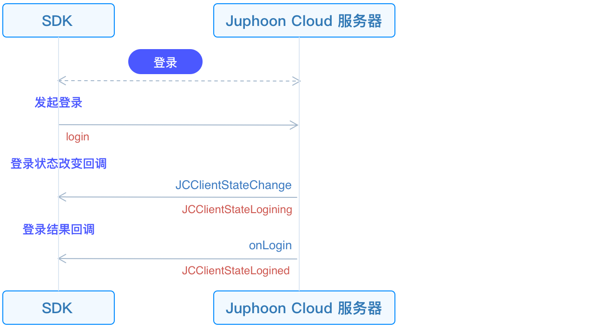

# 登录

本章节介绍如何初始化 JC SDK 并登录。

## 初始化

在主线程调用 [JCClient
create](https://developer.juphoon.com/portal/reference/V2.1/ios/Classes/JCClient.html#//api/name/create:callback:creatParam:)
接口创建
[JCClient](https://developer.juphoon.com/portal/reference/V2.1/ios/Classes/JCClient.html)
实例对象。传入获取到的 `appKey` ，即可初始化
[JCClient](https://developer.juphoon.com/portal/reference/V2.1/ios/Classes/JCClient.html)

::: tip

由于 JC SDK 功能以模块为基础，且模块实例将被频繁使用，建议使用单例对 JC SDK 中的类进行管理。

:::

``````objectivec
//初始化
-(bool)initialize {
   JCClient *client = [JCClient create:"创建应用获取的 AppKey" callback:self creatParam:nil];
   return client.state == JCClientStateIdle;
}
``````

其中，callback 为 JCClientCallback 协议的代理对象，该协议用于将 client 的状态变化通知给上层。因此需要先指定
callback 的代理对象，然后在该代理对象中实现 JCClientCallback 的方法。

JCClientCallback 中的主要方法如下

``````objectivec
//登陆结果回调
-(void)onLogin:(bool)result reason:(JCClientReason)reason;

//登出回调
-(void)onLogout:(JCClientReason)reason;

//登陆状态变化通知
-(void)onClientStateChange:(JCClientState)state oldState:(JCClientState)oldState;
``````

初始化成功后，JCClientState 状态从 JCClientStateNotInit（未初始化） 变为
JCClientStateIdle（未登录）。

## 发起登录

SDK 初始化之后，即可进行登录的集成。

登录接口调用流程如下所示



先创建
[JCClientLoginParam](https://developer.juphoon.com/portal/reference/V2.1/ios/Classes/JCClientLoginParam.html)
实例以调整登录参数。后调用
[login](https://developer.juphoon.com/portal/reference/V2.1/ios/Classes/JCClient.html#//api/name/login:password:loginParam:)
，发起登录:

``````objectivec
JCClientLoginParam* loginParam = [[JCClientLoginParam alloc] init];
// 1. 设置服务器环境
loginParam.serverAddress = @"服务器地址";

// 2. 发起登录
[client login:userID password:password loginParam:loginParam];
``````

::: tip

1. 环境设置：

      - 国内环境 `http:cn.router.justalkcloud.com:8080` （默认）

      - 国际环境 `http:intl.router.justalkcloud.com:8080`

2. userID 不能为空，可由英文、数字和 `+` 、 `-` 、 `_` 、 `.`
    组成（特殊字符不能作为第一个字符），大小写不敏感，长度不能超过
    64 个字符。

3. password 不能超过 128 个字符。

4. 调用该接口返回 true 时只代表调用接口成功，并不代表登录成功。登录的结果会通过 onLogin 回调上报。

:::

调用发起登录接口成功后，会触发 JCClientCallback 回调中的方法将 client 的状态通知给上层。具体逻辑如下：

首先会触发 JCClientCallback 中的登录状态改变回调
[onClientStateChange](https://developer.juphoon.com/portal/reference/V2.1/ios/Protocols/JCClientCallback.html#//api/name/onClientStateChange:oldState:)
。您可以在上层实现
[onClientStateChange](https://developer.juphoon.com/portal/reference/V2.1/ios/Protocols/JCClientCallback.html#//api/name/onClientStateChange:oldState:)
方法并处理相关的逻辑。

``````objectivec
-(void)onClientStateChange:(JCClientState)state oldState:(JCClientState)oldState
{
    if (state == JCClientStateIdle) { // 未登录
    ...
    } else if (state == JCClientStateLogining) { // 登录中
    ...
    } else if (state == JCClientStateLogined) {  // 登录成功
    ...
    } else if (state == JCClientStateLogouting) {  // 登出中
    ...
    }
}
``````

之后会触发 JCClientCallback 中的
[onLogin](https://developer.juphoon.com/portal/reference/V2.1/ios/Protocols/JCClientCallback.html#//api/name/onLogin:reason:)
回调。您可以在上层实现
[onLogin](https://developer.juphoon.com/portal/reference/V2.1/ios/Protocols/JCClientCallback.html#//api/name/onLogin:reason:)
方法并处理相关的逻辑。

``````objectivec
-(void)onLogin:(bool)result reason:(JCClientReason)reason {
    if (result) {// 登录成功
        ...
    }
    if (reason == JCClientReasonAuth) {// 账号密码错误
        ...
    }
}
``````

登录成功后，JCClientState 状态从 JCClientStateIdle（未登录）变为
JCClientStateLogined（登录成功）。 SDK
会自动保持与服务器的连接状态，直到用户主动调用登出接口，或者因为帐号在其他设备登录导致该设备登出。
登录成功/失败原因 参考
[JCClientClientReason](https://developer.juphoon.com/portal/reference/V2.1/ios/Constants/JCClientReason.html)。

## 登出

登出接口调用流程如下所示：


调用
[logout](https://developer.juphoon.com/portal/reference/V2.1/ios/Classes/JCClient.html#//api/name/logout)
可以发起登出，登出后不能进行平台上的各种业务操作

``````objectivec
[client logout];
``````

登出同样会触发登录状态改变(onClientStateChange)回调，之后将通过 onLogout 回调上报登出结果。

``````objectivec
-(void)onLogout:(JCClientReason)reason {
    if (reason == JCClientReasonServerLogout) {// 强制登出
        ...
    }
}
``````

更多登出原因参考：[JCClientClientReason](https://developer.juphoon.com/portal/reference/V2.1/ios/Constants/JCClientReason.html)

登出成功后，JCClientState 状态从 JCClientStateLogined（登录成功） 变为
JCClientStateIdle（未登录）。
