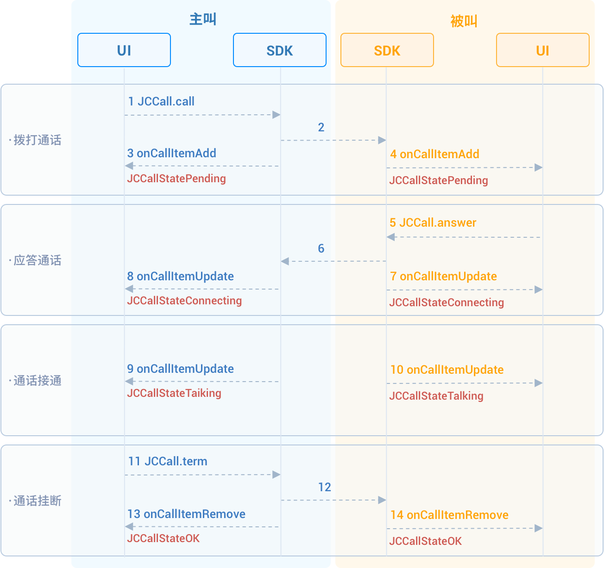

# 实现一对一通话

本章将介绍如何实现一对一语音通话，一对一语音通话的 API 调用时序见下图：



## 初始化

调用
[JCMediaDevice.create()](https://developer.juphoon.com/portal/reference/V2.1/android/com/juphoon/cloud/JCMediaDevice.html#create-com.juphoon.cloud.JCClient-com.juphoon.cloud.JCMediaDeviceCallback-)
和
[JCCall.create()](https://developer.juphoon.com/portal/reference/V2.1/android/com/juphoon/cloud/JCCall.html#create-com.juphoon.cloud.JCClient-com.juphoon.cloud.JCMediaDevice-com.juphoon.cloud.JCCallCallback-)
以初始化实现一对一通话需要的模块。

``````java
// 声明对象
JCMediaDevice mMediaDevice;
JCCall mCall;

// 初始化函数
public boolean initialize(Context context) {
    //1. 媒体类
    mMediaDevice = JCMediaDevice.create(mClient, new JCMediaDeviceCallback() {
        @Override
        public void onCameraUpdate() {

        }
        @Override
        public void onAudioOutputTypeChange(int i) {

        }
        @Override
        public void onRenderReceived(JCMediaDeviceVideoCanvas jcMediaDeviceVideoCanvas) {

        }
        @Override
        public void onRenderStart(JCMediaDeviceVideoCanvas jcMediaDeviceVideoCanvas) {

        }
    });
    //2. 通话类
    mCall = JCCall.create(mClient, mMediaDevice, new JCCallCallback() {
        @Override
        public void onCallItemAdd(JCCallItem jcCallItem) {

        }

        @Override
        public void onCallItemRemove(JCCallItem jcCallItem, int i, String s) {

        }

        @Override
        public void onCallItemUpdate(JCCallItem jcCallItem, JCCallItem.ChangeParam changeParam) {

        }

        @Override
        public void onMessageReceive(String s, String s1, JCCallItem jcCallItem) {

        }

        @Override
        public void onMissedCallItem(JCCallItem jcCallItem) {

        }
    });
}
``````

## 拨打通话

调用
[call()](https://developer.juphoon.com/portal/reference/V2.1/android/com/juphoon/cloud/JCCall.html#call-java.lang.String-boolean-java.lang.String-)
发起语音通话，需要填写的参数有：

- `userID` 填写对方的用户ID。

- `video` 选择是否为视频通话， true 表示拨打视频通话， false 表示拨打语音通话。

- `extraParam` 为自定义透传字符串， 可通过
    [getExtraParam()](https://developer.juphoon.com/portal/reference/V2.1/android/com/juphoon/cloud/JCCallItem.html#getExtraParam--)
    方法获取该属性。

``````java
// 发起语音呼叫
mCall.call(userID, isVideo, extraParam);
``````

拨打通话后，主叫和被叫均会收到新增通话的回调
[onCallItemAdd()](https://developer.juphoon.com/portal/reference/V2.1/android/com/juphoon/cloud/JCCallCallback.html#onCallItemAdd-com.juphoon.cloud.JCCallItem-)
，此时通话状态变为
[STATE\_PENDING](https://developer.juphoon.com/portal/reference/V2.1/android/com/juphoon/cloud/JCCall.html#STATE_PENDING)
。您可以通过重写
[onCallItemAdd()](https://developer.juphoon.com/portal/reference/V2.1/android/com/juphoon/cloud/JCCallCallback.html#onCallItemAdd-com.juphoon.cloud.JCCallItem-)
执行逻辑操作。

示例代码

``````java
// 1. 发起语音通话
mCall.call(userID, false, null);

// 2. 重写回调
@Override
public void onCallItemAdd(JCCallItem item) {
    // 业务逻辑
    if (item.direction == JCCall.DIRECTION_IN) {
        // 如果是被叫
        ...
    }else{
        // 如果是主叫
        ...
    }
}
``````

::: tip

如果主叫想取消通话，可以直接转到挂断通话部分。调用挂断接口后，通话状态变为 STATE\_CANCEL。

:::

## 应答通话

1. 被叫收到
    [onCallItemAdd()](https://developer.juphoon.com/portal/reference/V2.1/android/com/juphoon/cloud/JCCallCallback.html#onCallItemAdd-com.juphoon.cloud.JCCallItem-)
    回调，在回调中调用
    [JCCallItem](https://developer.juphoon.com/portal/reference/V2.1/android/com/juphoon/cloud/JCCallItem.html)
    中的
    [getVideo()](https://developer.juphoon.com/portal/reference/V2.1/android/com/juphoon/cloud/JCCallItem.html#getVideo--)
    方法获取 `video` 属性来判断是视频呼入还是语音呼入，从而做出相应的处理。

    ``````java
    @Override
    public void onCallItemAdd(JCCallItem item) {
        // 1. 如果是语音呼入且在振铃中
        if (item.getDirection() == JCCall.DIRECTION_IN && !item.getVideo()) {
            // 2. 做出相应的处理，如在界面上显示“振铃中”
            ...
        }
    }
    ``````

2. 调用
    [answer()](https://developer.juphoon.com/portal/reference/V2.1/android/com/juphoon/cloud/JCCall.html#answer-java.lang.String-boolean-java.lang.String-)
    接听通话。

    ``````java
    mCall.answer(item, false);
    ``````

通话接听后，通话状态变为 STATE\_CONNECTING。

::: tip

如果被叫要在此时拒绝通话，请调用挂断通话的接口。这种情况下调用挂断后，通话状态变为 STATE\_CANCELED。

:::

## 挂断通话

主叫或者被叫均可以挂断通话。

1. 调用
    [getActiveCallItem()](https://developer.juphoon.com/portal/reference/V2.1/android/com/juphoon/cloud/JCCall.html#getActiveCallItem--)
    获取当前活跃的通话对象:

    ``````java
    mCall.getActiveCallItem();
    ``````

2. 调用
    [term()](https://developer.juphoon.com/portal/reference/V2.1/android/com/juphoon/cloud/JCCall.html#term-com.juphoon.cloud.JCCallItem-int-java.lang.String-)
    挂断当前活跃通话:

    ``````java
    mCall.term(item, reason, description);
    ``````

示例代码

``````java
// 1. 获取当前活跃通话
JCCallItem item = mCall.getActiveCallItem();
// 2. 挂断当前活跃通话
mCall.term(item, JCCall.REASON_NONE, null);
``````
