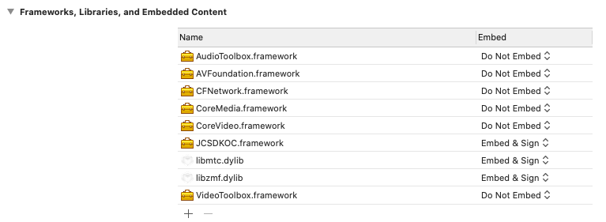

# 准备开发环境

本章将介绍如何将 SDK 集成到您自己创建的项目中。

## 前提条件

- 支持 macOS 10.10 或以上版本的 macOS 设备

- 有效的菊风开发者账号（[免费注册](http://developer.juphoon.com/signup) ）

- 有效的菊风 [AppKey](/cn/document/V2.1/create-application.php)

## 创建 macOS 项目

参考以下步骤创建一个 macOS 项目。若已有 macOS 项目，可以直接查看集成 JC SDK。

- 打开 **Xcode** 并点击 **Create a new Xcode project**。

- 选择项目类型为 **Cocoa App**，并点击 **Next**。

- 输入项目信息，如项目名称、开发团队信息、组织名称和语言，并点击 **Next**。

::: tip

如果您没有添加过开发团队信息，点击 **Xcode \Preferences… \Accounts**，点击左下角加号并按照屏幕提示登入
Apple ID，完成后即可选择您的账户作为开发团队。

:::

- 选择项目存储路径，并点击 **Create**。

- 进入 **TARGETS \Project Name \Signing & Capabilities** 菜单，勾选
    **Automatically manage signing**。

## 集成 SDK

mac 端使用动态库集成 SDK。

1. 解压并打开下载的 JC SDK 动态库，在 sdk 文件目录下包含 JCSDKOC.framework、include 和 lib
    三个文件夹。

2. 将 **sdk** 文件夹拷贝到您工程所在的目录下。

3. 打开 Xcode，进入 **TARGETS \Project Name \General** ，在 Embedded
    Binaries 一栏，点击 **+** 符号，然后导入 JCSDK 文件夹下的 JCSDKOC.framework。

4. 继续点击 **+** 符号，导入如下系统依赖的库。

    
    - AudioToolbox.framework
    - VideoToolBox.framework
    - AVFoundation.framework
    - CFNetwork.framework
    - CoreMedia.framework
    - CoreVideo.framework
    ``````

    导入完后的效果如下图：

    

5. 点击 Build Settings，找到 Search Paths，设置 Framework Search Paths：

- Framework Search Paths：`$(PROJECT_DIR)/../sdk`

- Header Search Paths：`$(PROJECT_DIR)/../sdk/include`

- Library Search Paths：`$(PROJECT_DIR)/../sdk/lib/ios`

::: tip

在完成第 1 步导入 JCSDKOC.framework 和两个 .dylib 文件后，Xcode 会自动生成该路径，如果 Xcode
没有自动生成路径，用户要根据 `JCSDKOC.framework` 、`include` 和 `lib`
文件所在目录，手动设置路径。

:::

6. 进入工程中的 **Target \Build Settings \Other Linker Flags**，在此项中添加
    -ObjC。

7. 点击 Build Settings，找到 Preprocessor Macros，在右侧输入
    ZPLATFORM=ZPLATFORM\_OSX。

## 添加项目权限

1. 若您的项目已启用 App Sandbox 或 Hardened Runtime 设置，则需勾选如下内容，获取相应的设备权限：

    
    

    ::: tip

    根据 Apple 官方要求：

      - 对于在 Mac App Store 发布的软件，需要启用 App Sandbox 设置。详见 [Apple
        官方声明](https://developer.apple.com/app-sandboxing/)。

      - 对于不在 Mac App Store 发布的软件，需要启用 Hardened Runtime 设置。详见 [Apple
        官方声明](https://developer.apple.com/news/?id=09032019a)。

      - Hardened Runtime 设置中的 Library Validation 会阻止 app
        加载框架、插件或库，除非框架、插件或库是由 Apple 或是与
        app 相同的团队 ID 签名的。当遇到需要取消该安全限制的场景（例如无法枚举到第三方虚拟摄像头）时，请勾选
        Hardened Runtime -\Runtime Exceptions -\Disable Library
        Validation。

    :::

2. 在工程的 info.plist 中添加如下键值:

<table style="width:99%;">
<colgroup>
<col style="width: 33%" />
<col style="width: 33%" />
<col style="width: 33%" />
</colgroup>
<thead>
<tr class="header">
<th><p>Key</p></th>
<th><p>Type</p></th>
<th><p>Value</p></th>
</tr>
</thead>
<tbody>
<tr class="odd">
<td><p>Privacy - Microphone Usage Description</p></td>
<td><p>String</p></td>
<td><p>使用麦克风的目的，如语音通话。</p></td>
</tr>
<tr class="even">
<td><p>Privacy - Camera Usage Description</p></td>
<td><p>String</p></td>
<td><p>使用摄像头的目的，如视频通话。</p></td>
</tr>
</tbody>
</table>
