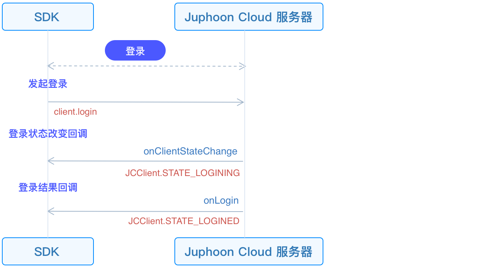

# 登录

本章节将介绍如何初始化 JC SDK 并登录。

## 初始化

在主线程调用
[JCClient.create()](https://developer.juphoon.com/portal/reference/V2.1/windows/html/04eda8ae-87ca-50c7-5b35-97c067466d0c.htm)
，创建
[JCClient](https://developer.juphoon.com/portal/reference/V2.1/windows/html/a01b672a-1c8a-18a7-b550-727bbcad2f52.htm)
实例对象。传入获取到的 `appKey` ，即可初始化
[JCClient](https://developer.juphoon.com/portal/reference/V2.1/windows/html/a01b672a-1c8a-18a7-b550-727bbcad2f52.htm)
。

``````csharp
/// JCClient 对象
JCClient mClient;

public bool initialize(Application app) {
    mClient = JCClient.create(app, "用户 appKey", this);
    /// 获取初始化状态（用来判断初始化状态）
    mInit = mClient.state == JCClientState.Idle;
    return mInit;
}
``````

其中，this 是指实现
[JCClientCallback](https://developer.juphoon.com/portal/reference/V2.1/windows/html/329abfbc-bd28-8240-16ce-1c039e4ecea8.htm)
接口的对象，JCClientCallback 用于将 client 的状态变化通知给上层。

JCClientCallback 中的主要方法如下

``````csharp
//登录结果回调
public void onLogin(bool result, JCClientReason reason)
{
}
//登出结果回调
public void onLogout(JCClientReason reason)
{
}
//登录状态变化回调
public void onClientStateChange(JCClientState state, JCClientState oldState)
{
}
``````

## 发起登录

SDK 初始化之后，即可进行登录的集成。登出接口调用流程如下所示：



先创建
[JCClient.LoginParam](https://developer.juphoon.com/portal/reference/V2.1/windows/html/bf49d392-d1f9-d885-36e5-4af282fdf4b8.htm)
实例以调整登录参数。后调用
[login()](https://developer.juphoon.com/portal/reference/V2.1/windows/html/62440094-63ab-7aa8-981d-2c2337419914.htm)
，发起登录:

``````csharp
JCClient.LoginParam loginParam = new JCClient.LoginParam();
/// 1. 设置服务器环境。
loginParam.serverAddress = "服务器地址";
/// 2. 发起登录
mClient.login(userID, password, loginParam);
``````

::: tip

1. 环境设置

      - 国内环境 `http:cn.router.justalkcloud.com:8080` （默认）

      - 国际环境 `http:intl.router.justalkcloud.com:8080`

2. userID 不能为空，可由英文、数字和 `+` 、 `-` 、 `_` 、 `.`
    组成（特殊字符不能作为第一个字符），大小写不敏感，长度不能超过
    64 个字符。

3. password 不能超过 128 个字符。

4. 调用该接口返回 true 时只代表调用接口成功，并不代表登录成功。登录的结果会通过 onLogin 回调上报。

:::

调用接口成功后，首先会触发登录状态改变回调
[onClientStateChange()](https://developer.juphoon.com/portal/reference/V2.1/windows/html/91ac4180-d727-d901-a06b-3ed4a675f4fb.htm)
。您可以通过重写
[onClientStateChange()](https://developer.juphoon.com/portal/reference/V2.1/windows/html/91ac4180-d727-d901-a06b-3ed4a675f4fb.htm)
执行逻辑操作。

``````csharp
public void onClientStateChange(JCClientState state, JCClientState oldState) {
     if (state == JCClientState.Idel) { /// 未登录
        ...
    } else if (state == JCClientState.Logining) { /// 正在登录
        ...
    } else if (state == JCClientState.Logined) { /// 登录成功
        ...
    } else if (state == JCClientState.Logouting) { /// 登出中
        ...
    }
}
``````

之后触发
[onLogin()](https://developer.juphoon.com/portal/reference/V2.1/windows/html/98254a36-6a0c-4495-3254-5dc93cd52f52.htm)
回调。您可以通过重写
[onLogin()](https://developer.juphoon.com/portal/reference/V2.1/windows/html/98254a36-6a0c-4495-3254-5dc93cd52f52.htm)
执行逻辑操作。

``````csharp
public void onLogin(bool result, JCClientReason reason) {
    if (result) {/// 登录成功
        ...
    }
    if (reason == JCClientReason.AUTH) {/// 账号密码错误
        ...
    }

}
``````

登录成功之后，SDK 会自动保持与服务器的连接状态，直到用户主动调用登出接口，或者因为帐号在其他设备登录导致该设备登出。登录成功/失败原因 参考
[JCClient.ClientReason](https://developer.juphoon.com/portal/reference/V2.1/windows/html/9d6e6243-1b3f-55a6-7d0a-3158812dfc6f.htm)
。

## 登出

登出接口调用流程如下所示：


调用
[logout()](https://developer.juphoon.com/portal/reference/V2.1/windows/html/4b7a3fd4-f6bf-fc4e-8cf9-78023f69b459.htm)
可以发起登出。更多登出原因参考：[JCClient.ClientReason](https://developer.juphoon.com/portal/reference/V2.1/windows/html/9d6e6243-1b3f-55a6-7d0a-3158812dfc6f.htm)
。

登出同样会触发登录状态改变(onClientStateChange)回调，之后将通过 onLogout 回调上报登出结果。

``````csharp
public void onLogout(JCClientReason reason) {
    if (reason == JCClientReason.ServerLogout) {/// 强制登出
        ...
    }
}
``````
