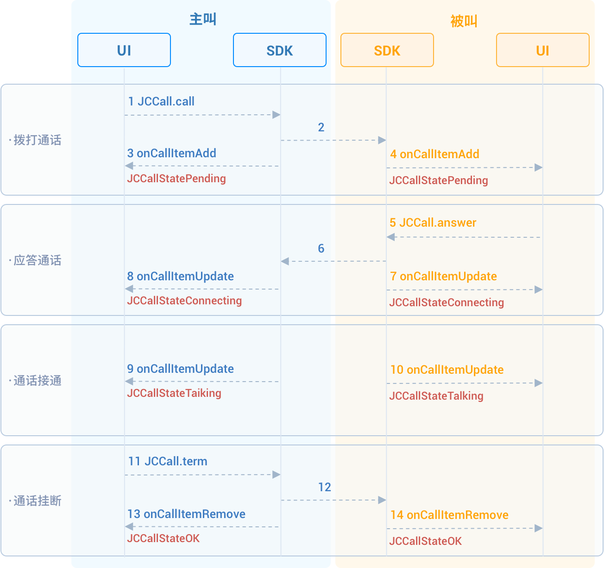

# 实现一对一通话

本章将介绍如何实现一对一视频通话，一对一视频通话的 API 调用时序见下图：



## 初始化

调用
[JCMediaDevice.create()](https://developer.juphoon.com/portal/reference/V2.1/windows/html/cb59bc27-6528-9dbf-c996-de857096f847.htm)
和
[JCCall.create()](https://developer.juphoon.com/portal/reference/V2.1/windows/html/eef10110-a3f7-b505-26fa-4b9ec1e2b998.htm)
以初始化实现一对一通话需要的模块。

```csharp
/// 声明对象
JCMediaDevice mMediaDevice;
JCCall mCall;

/// 初始化函数
public bool initialize() {

    /// 1. 媒体类
    mMediaDevice = JCMediaDevice.create(mClient, this);
    /// 2. 通话类
    mCall = JCCall.create(mClient, mMediaDevice, this);
}
```

其中：

- JCMediaDevice create 方法中的 this 为实现
    [JCMediaDeviceCallback](https://developer.juphoon.com/portal/reference/V2.1/windows/html/3a00aa12-4e18-cf90-4610-b2c9c63b7a7b.htm)
    接口的对象，用于将媒体设备相关的事件通知给上层。

JCMediaDeviceCallback 中的主要方法如下

```csharp
//摄像头变化
public void onCameraUpdate()
{
}
//音频输出变化
public void onAudioOutputTypeChange(string audioOutputType)
{
}
```

- JCCall create 方法中的 this 为实现
    [JCCallCallback](https://developer.juphoon.com/portal/reference/V2.1/windows/html/25bca4ea-ad43-2cbb-42a8-b4e626739711.htm)
    接口的对象，用于将通话相关的事件通知给上层。

JCCallCallback 中的主要方法如下

```csharp
//新增通话回调
public void onCallItemAdd(JCCallItem item)
{
}
//移除通话
public void onCallItemRemove(JCCallItem item, JCCallReason reason)
{
}
//通话状态更新回调（当上层收到此回调时，可以根据 JCCallItem 对象获得该通话的所有信息及状态，从而更新该通话相关UI）
public void onCallItemUpdate(JCCallItem item, JCCallItem.ChangeParam changeParam)
{
}
//通话中收到消息回调
public void onMessageReceive(string type, string content, JCCallItem item)
{
}
//未接通话回调
public void onMissedCallItem(JCCallItem item)
{
}
```

## 拨打通话

调用
[call()](https://developer.juphoon.com/portal/reference/V2.1/windows/html/613adf03-d597-8221-86d5-0056c1b4d2a0.htm)
发起视频通话，需要填写的参数有：

- `userID` 填写对方的用户ID。

- `video` 选择是否为视频通话， true 表示拨打视频通话， false 表示拨打语音通话。

- [extraParam()](https://developer.juphoon.com/portal/reference/V2.1/windows/html/e0226cbc-1ca1-ef9c-5e8e-d3dc853d618d.htm)
    为自定义透传字符串， 可通过 `item.extraParam` 获取该属性。

```csharp
/// 发起语音呼叫
mCall.call(userID, isVideo, null);
```

拨打通话后，主叫和被叫均会收到新增通话的回调
[onCallItemAdd()](https://developer.juphoon.com/portal/reference/V2.1/windows/html/5e605b62-c8dc-4dde-2480-8fdcbbfc2f48.htm)
，此时通话状态变为
[STATE\_PENDING](https://developer.juphoon.com/portal/reference/V2.1/windows/html/2134e734-614d-4a19-f411-5fe1a81d3ccd.htm)
。您可以通过重写
[onCallItemAdd()](https://developer.juphoon.com/portal/reference/V2.1/windows/html/5e605b62-c8dc-4dde-2480-8fdcbbfc2f48.htm)
执行逻辑操作。

```csharp
public void onCallItemAdd(JCCallItem item) {
    /// 业务逻辑
    if (item.direction == JCCall.DIRECTION_IN) {
        /// 如果是被叫
        ...
    }else{
        /// 如果是主叫
        ...
    }
}
```

::: tip

如果主叫想取消通话，可以直接转到挂断通话部分。调用挂断接口后，通话状态变为 Cancel。

:::

## 创建本地视频画面

发起通话后，调用
[JCCallItem](https://developer.juphoon.com/portal/reference/V2.1/windows/html/0267696e-79ee-8d46-c086-3c071a2b2b3a.htm)
类中的
[startSelfVideo()](https://developer.juphoon.com/portal/reference/V2.1/windows/html/d399b6b1-b822-b6aa-de75-f35d6815e93b.htm)
方法打开本地视频预览。需要填入参数
[JCMediaDevice.RenderType](https://developer.juphoon.com/portal/reference/V2.1/windows/html/44604552-33eb-5a81-6b10-6c512d127a4b.htm)
以选择渲染模式。

示例代码:

```csharp
/// 1. 发起视频呼叫
mCall.call("222", true, null);
/// 2. 获取当前活跃通话
JCCallItem mCallItem = mCall.getActiveCallItem();
/// 3. 打开本地视频预览，这里选择的是自适应模式
mCallItem.startSelfVideo(JCMediaDevice.RENDER_FULL_AUTO);
```

## 应答通话

被叫收到
[onCallItemAdd()](https://developer.juphoon.com/portal/reference/V2.1/windows/html/5e605b62-c8dc-4dde-2480-8fdcbbfc2f48.htm)
回调，在回调中根据
[JCCallItem](https://developer.juphoon.com/portal/reference/V2.1/windows/html/0267696e-79ee-8d46-c086-3c071a2b2b3a.htm)
属性来判断是视频呼入还是语音呼入，从而做出相应的处理。

```csharp
public void onCallItemAdd(JCCallItem item) {
    /// 1. 如果是视频呼入且在振铃中
    if (item.direction == JCCall.DIRECTION_IN && item.video) {
        /// 2. 做出相应的处理，如在界面上显示“振铃中”
        ...
    }
}
```

调用
[answer()](https://developer.juphoon.com/portal/reference/V2.1/windows/html/7211e914-c311-4457-4b0e-bc4ef46c7733.htm)
接听通话。

```csharp
mCall.answer(item, true);
```

通话接听后，通话状态变为 Connecting。

::: tip

如果被叫要在此时拒绝通话，请调用挂断通话的接口。这种情况下调用挂断后，通话状态变为 Canceled。

:::

## 创建远端视频画面

被叫接听通话后，双方将建立连接，此时，主叫和被叫都将会收到通话更新的回调（onCallItemUpdate），通话状态变为 Talking。

调用
[JCCallItem](https://developer.juphoon.com/portal/reference/V2.1/windows/html/0267696e-79ee-8d46-c086-3c071a2b2b3a.htm)
类中的
[startOtherVideo()](https://developer.juphoon.com/portal/reference/V2.1/windows/html/a4bdbd97-6a97-002f-9c9e-6e4774e4e708.htm)
获取远端视频画面。返回对象为
[JCMediaDeviceVideoCanvas](https://developer.juphoon.com/portal/reference/V2.1/windows/html/6a5b853c-d890-c30e-d236-5728d789ace1.htm)。

示例代码:

```csharp
public void onCallItemUpdate(JCCallItem item) {
    /// 如果对端在上传视频流（uploadVideoStreamOther）
    /// mRemoteCanvas 为 JCMediaDeviceVideoCanvas 对象实例，请在方法前声明。
    if (item.state == JCCall.STATE_TALKING && mRemoteCanvas == null && item.getUploadVideoStreamOther()) {
        /// 获取远端视频画面，renderId来源JCCallItem对象
        JCMediaDeviceVideoCanvas mRemoteCanvas = item.startOtherVideo(JCMediaDevice.RENDER_FULL_CONTENT);
        ...
    }
}
```

## 挂断通话

主叫或者被叫均可以挂断通话。

1. 调用
    [getActiveCallItem()](https://developer.juphoon.com/portal/reference/V2.1/windows/html/6df31ff9-272f-c7cc-1da6-2755c5aad5e0.htm)
    获取当前活跃的通话对象:

    ```csharp
    mCall.getActiveCallItem();
    ```

2. 调用
    [term()](https://developer.juphoon.com/portal/reference/V2.1/windows/html/70758778-1450-172d-8684-3dd2818f2a84.htm)
    挂断当前活跃通话:

    ```csharp
    mCall.term(item, reason, description);
    ```

示例代码:

```csharp
/// 1. 获取当前活跃通话
JCCallItem item = mCall.getActiveCallItem();
/// 2. 挂断当前活跃通话
mCall.term(item, JCCall.REASON_NONE, null);
```

## 销毁本地和远端视频画面

通话挂断后，收到移除通话的回调
[onCallItemRemove()](https://developer.juphoon.com/portal/reference/V2.1/windows/html/c6de8b41-37d7-a303-7761-0a3bc1caf18b.htm)
，通话状态变为 Ok ，此时您需要分别调用
[stopSelfVideo()](https://developer.juphoon.com/portal/reference/V2.1/windows/html/d51a3870-b54f-5149-3b9a-a1d017721d00.htm)
和
[stopOtherVideo()](https://developer.juphoon.com/portal/reference/V2.1/windows/html/4cc26d8d-a4d4-1b2c-8917-b5ed4e048a28.htm)
销毁本地和远端视频画面。

示例代码:

```csharp
public void onCallItemRemove(JCCallItem item, JCCallReason reason, String description) {
    /// 销毁本地视频画面
    item.stopSelfVideo();
    /// 销毁远端视频画面
    item.stopOtherVideo();
}
```
