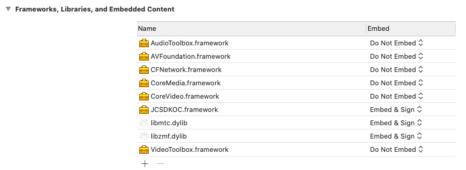
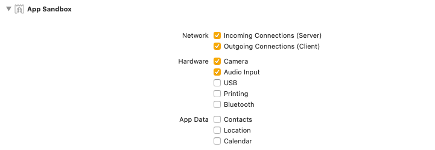

# 一分钟集成 SDK

本章将介绍如何将 SDK 集成到您自己创建的项目中。

## 前提条件

- 支持 macOS 10.10 或以上版本的 macOS 设备

- 有效的菊风开发者账号（[免费注册](http://developer.juphoon.com/signup) ）

- 有效的菊风 [AppKey](https://developer.juphoon.com/cn/document/V2.1/create-application.php)

## 创建 macOS 项目

参考以下步骤创建一个 macOS 项目。若已有 macOS 项目，可以直接查看集成 JC SDK。

- 打开 Xcode 并点击 Create a new Xcode project。

- 选择项目类型为 Cocoa App，并点击 Next。

- 输入项目信息，如项目名称、开发团队信息、组织名称和语言，并点击 Next。

::: tip

如果您没有添加过开发团队信息，点击 Xcode \> Preferences… \> Accounts，点击左下角加号并按照屏幕提示登入
Apple ID，完成后即可选择您的账户作为开发团队。

:::

- 选择项目存储路径，并点击 Create。

- 进入 TARGETS \> Project Name \> Signing & Capabilities 菜单，勾选
    Automatically manage signing。

## 集成SDK

mac 端使用的动态库集成 SDK。

1. 解压并打开下载的 JC SDK 动态库，在 sdk 文件目录下包含 JCSDKOC.framework、include 和 lib
    三个文件夹。

2. 将 `sdk` 文件夹拷贝到您工程所在的目录下。

3. 导入 SDK

    >
    >
    >
    >
    > 点击 ‘General’，在 “Embedded Binaries” 一栏，点击 ‘+’ 符号，然后导入 sdk 文件夹下的
    > JCSDKOC.framework 和 lib 文件夹下的 libmtc.dylib、libzmf.dylib。
    >
    >

4. 导入 SDK 依赖的库

    >
    >
    >
    >
    > 继续点击 ‘+’ 符号，导入如下系统依赖的库：
    >
    >   - AudioToolbox.framework
    >
    >   - VideoToolBox.framework
    >
    >   - AVFoundation.framework
    >
    >   - CFNetwork.framework
    >
    >   - CoreMedia.framework
    >
    >   - CoreVideo.framework
    >
    > 导入完后的效果如下图：
    >
    > 
    >
    >

5. 设置路径

    >
    >
    >
    >
    > 点击 ‘Build Settings’，找到 Search Paths，设置 Framework Search Paths
    > 、Header Search Paths（头文件路径） 和 Library Search Paths（库文件路径）：
    >
    >   - Framework Search Paths：$(PROJECT\_DIR)/../sdk
    >
    >   - Header Search Paths：$(PROJECT\_DIR)/../sdk/include
    >
    >   - Library Search Paths：$(PROJECT\_DIR)/../sdk/lib/ios
    >
    > ::: tip
    >
    >
    >
    > 在完成第 1 步导入 JCSDKOC.framework 和两个 .dylib 文件后，Xcode 会自动生成该路径，如果
    > Xcode 没有自动生成路径，用户要根据 `JCSDKOC.framework` 、`include` 和 `lib`
    > 文件所在目录，手动设置路径。
    >
    >
    >
    >

6. 设置 Enable Bitcode 为 NO

    >
    >
    >
    >
    > 进入工程中 Target -\> Build Settings -\> Enable Bitcode，将此项设置为 NO。
    >
    >

7. 设置 Other Linker Flags 的参数为 -ObjC

    >
    >
    >
    >
    > 点击 ‘Build Settings’，找到 Other Linker Flags 并添加参数 -ObjC。
    >
    >

8. 设置预处理宏定义

    >
    >
    >
    >
    > 点击 ‘Build Settings’，找到 Preprocessor Macros，在右侧输入
    > ZPLATFORM=ZPLATFORM\_OSX。
    >
    >

:::

## 添加项目权限

1. 获取设备权限

    >
    >
    >
    >
    > 若您的项目已启用 App Sandbox 或 Hardened Runtime 设置，则需勾选如下内容，获取相应的设备权限：
    >
    > 
    > 
    >
    > ::: tip
    >
    >
    >
    > 根据 Apple 官方要求：
    >
    >   - 对于在 Mac App Store 发布的软件，需要启用 App Sandbox 设置。详见 [Apple
    >     官方声明](https://developer.apple.com/app-sandboxing/)。
    >
    >   - 对于不在 Mac App Store 发布的软件，需要启用 Hardened Runtime 设置。详见 [Apple
    >     官方声明](https://developer.apple.com/news/?id=09032019a)。
    >
    >   - Hardened Runtime 设置中的 Library Validation 会阻止 app
    >     加载框架、插件或库，除非框架、插件或库是由 Apple 或是与
    >     app 相同的团队 ID 签名的。当遇到需要取消该安全限制的场景（例如无法枚举到第三方虚拟摄像头）时，请勾选
    >     Hardened Runtime -\> Runtime Exceptions -\> Disable Library
    >     Validation。
    >
    >
    >
    >

2. 在工程的 info.plist 中添加如下键值:

<table style="width:99%;">
<colgroup>
<col style="width: 33%" />
<col style="width: 33%" />
<col style="width: 33%" />
</colgroup>
<thead>
<tr class="header">
<th>
Key
</th>
<th>
Type
</th>
<th>
Value
</th>
</tr>
</thead>
<tbody>
<tr class="odd">
<td>
Privacy - Microphone Usage Description
</td>
<td>
String
</td>
<td>
使用麦克风的目的，如语音通话。
</td>
</tr>
<tr class="even">
<td>
Privacy - Camera Usage Description
</td>
<td>
String
</td>
<td>
使用摄像头的目的，如视频通话。
</td>
</tr>
</tbody>
</table>

:::
