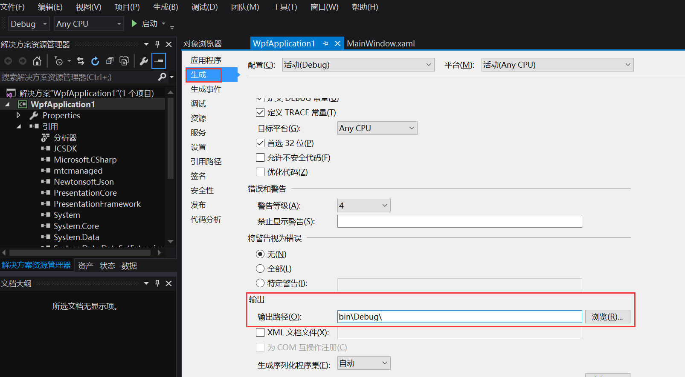

# 准备开发环境

本章将介绍如何将 JC SDK 集成到您自己创建的项目中。

## 前提条件

- Microsoft Visual Studio 2013 或以上版本

- 支持 Windows 7 或以上版本的 Windows 设备

- 有效的菊风开发者账号（[免费注册](http:///developer.juphoon.com/signup) ）

- 有效的菊风 [AppKey](../../../../cn/juphoon_platform/03_console_description/03_应用管理.md)

## 创建 WPF 项目

参考以下步骤创建一个 Winform 项目。若已有 Winform 项目，可以直接查看集成 SDK。

1. 在 **开始** 窗口上，选择 **创建新项目** 。

2. 在 **创建新项目** 屏幕上，搜索 **WPF** ，选择 **WPF 应用(.NET Core)** ，然后选择 **下一步** 。

3. 在下一个界面中，为项目指定名称 **项目名称** ，然后选择 **创建** 。

## 集成 SDK

1. 将 bin 目录中的 **zmfmanaged.dll, zmf.dll, Newtonsoft.Json.dll,
    mtcwrap.dll, mtcmanaged.dll, mtc.dll, jssmme.dll, JCSDK.dll,
    bzip2.dll** 九个文件放到应用程序 `../bin/Debug/` 下。（这是默认路径）

2. 点击 **项目** \> **添加引用** \> **浏览** \> **选择dll放置路径** 后点击 **确定** 。

3. 确认输出路径与 **dll** 库所在文件夹一致。

编译成功则完成集成内容。
