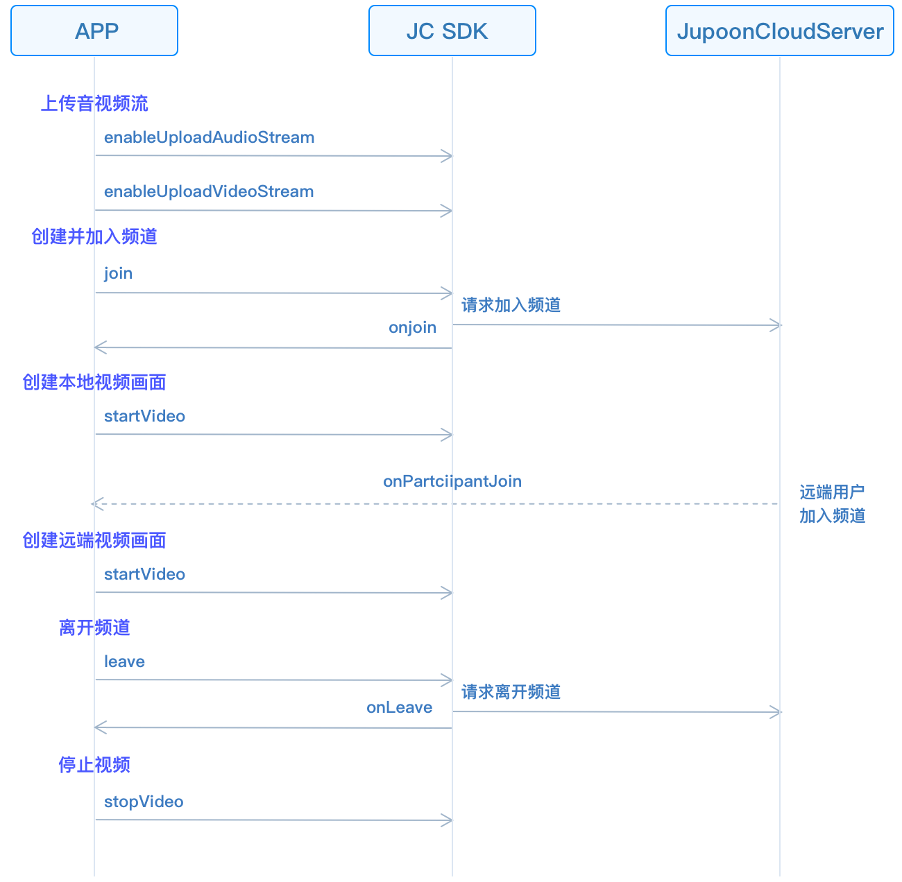

# 实现多方视频通话

本章将介绍如何实现多方视频通话，多方视频通话的 API 调用时序见下图：



## 初始化

调用
[JCMediaDevice.create()](https://developer.juphoon.com/portal/reference/V2.1/android/com/juphoon/cloud/JCMediaDevice.html#create-com.juphoon.cloud.JCClient-com.juphoon.cloud.JCMediaDeviceCallback-)
和
[JCMediaChannel.create()](https://developer.juphoon.com/portal/reference/V2.1/android/com/juphoon/cloud/JCMediaChannel.html#create-com.juphoon.cloud.JCClient-com.juphoon.cloud.JCMediaDevice-com.juphoon.cloud.JCMediaChannelCallback-)
以初始化实现多方通话需要的模块。

``````java
// 声明对象
JCMediaDevice mMediaDevice;
JCMediaChannel mMediaChannel;

// 初始化函数
public boolean initialize(Context context) {

    //1. 媒体类
    mMediaDevice = JCMediaDevice.create(mClient, new JCMediaDeviceCallback() {
        @Override
        public void onCameraUpdate() {

        }
        @Override
        public void onAudioOutputTypeChange(int i) {

        }
        @Override
        public void onRenderReceived(JCMediaDeviceVideoCanvas jcMediaDeviceVideoCanvas) {

        }
        @Override
        public void onRenderStart(JCMediaDeviceVideoCanvas jcMediaDeviceVideoCanvas) {

        }
    });
    // 2. 媒体通道类
    mMediaChannel = JCMediaChannel.create(client, mediaDevice, new JCMediaChannelCallback() {
        @Override
        public void onMediaChannelStateChange(int i, int i1) {

        }
        @Override
        public void onMediaChannelPropertyChange(JCMediaChannel.PropChangeParam propChangeParam) {

        }
        @Override
        public void onJoin(boolean b, int i, String s) {

        }
        @Override
        public void onLeave(int i, String s) {

        }
        @Override
        public void onStop(boolean b, int i) {

        }
        @Override
        public void onQuery(int i, boolean b, int i1, JCMediaChannelQueryInfo jcMediaChannelQueryInfo) {

        }
        @Override
        public void onParticipantJoin(JCMediaChannelParticipant jcMediaChannelParticipant) {

        }
        @Override
        public void onParticipantLeft(JCMediaChannelParticipant jcMediaChannelParticipant) {

        }
        @Override
        public void onParticipantUpdate(JCMediaChannelParticipant jcMediaChannelParticipant, JCMediaChannelParticipant.ChangeParam changeParam) {

        }
        @Override
        public void onMessageReceive(String s, String s1, String s2) {

        }
        @Override
        public void onInviteSipUserResult(int i, boolean b, int i1) {

        }
        @Override
        public void onParticipantVolumeChange(JCMediaChannelParticipant jcMediaChannelParticipant) {

        }
    });
}
``````

## 加入频道

1. 调用
    [enableUploadAudioStream()](https://developer.juphoon.com/portal/reference/V2.1/android/com/juphoon/cloud/JCMediaChannel.html#enableUploadAudioStream-boolean-)
    开启音频流。若要开启视频，调用
    [enableUploadVideoStream()](https://developer.juphoon.com/portal/reference/V2.1/android/com/juphoon/cloud/JCMediaChannel.html#enableUploadVideoStream-boolean-)
    开启视频流。

    ``````java
    // 1. 开启音频流
    mMediaDeviceChannel.enableUploadAudioStream(true);
    // 2. 开启视频流（语音无需调用此方法）
    mMediaDeviceChannel.enableUploadVIdeoStream(true);
    ``````

2. 创建并加入频道，需要传入 `channelIdOrUri` 和
    [JCMediaChannel.JoinParam](https://developer.juphoon.com/portal/reference/V2.1/android/com/juphoon/cloud/JCMediaChannel.JoinParam.html)
    。

      - `channelIdOrUri` 表示频道 ID 或频道 Uri。

      - `JCMediaChannelJoinParam` 中 `uriMode` 参数设置为 true 时表示传入频道
        Uri，设置其他参数时表示传入频道 ID。传入相同的频道 ID 或相同的频道 Uri 的用户会进入同一个频道。

    ``````java
    mMediaChannel.join("222", null);
    ``````

3. 加入频道后收到
    [onJoin()](https://developer.juphoon.com/portal/reference/V2.1/android/com/juphoon/cloud/JCMediaChannelCallback.html#onJoin-boolean-int-java.lang.String-)
    回调。

    ``````java
    @Override
    public void onJoin(boolean result, @JCMediaChannel MediaChannelReason int reason, String channelId) {
        if (result) {
            // 加入频道成功
        } else {
            // 加入频道失败
        }
    }
    ``````

## 创建本地视频画面

加入频道后，调用
[JCMediaChannel](https://developer.juphoon.com/portal/reference/V2.1/android/com/juphoon/cloud/JCMediaChannel.html)
中的
[getSelfParticipant()](https://developer.juphoon.com/portal/reference/V2.1/android/com/juphoon/cloud/JCMediaChannel.html#getSelfParticipant--)
获取频道内自身对象， 然后调用
[JCMediaChannelParticipant](https://developer.juphoon.com/portal/reference/V2.1/android/com/juphoon/cloud/JCMediaChannelParticipant.html)
中的
[startVideo()](https://developer.juphoon.com/portal/reference/V2.1/android/com/juphoon/cloud/JCMediaChannelParticipant.html#startVideo-int-int-)
方法打开本地视频预览。返回对象为
[JCMediaDeviceVideoCanvas](https://developer.juphoon.com/portal/reference/V2.1/android/com/juphoon/cloud/JCMediaDeviceVideoCanvas.html)。（调用此方法会打开摄像头）

``````java
// 打开本地视频预览
mMediaChannel.getSelfParticipant().startVideo(JCMediaDevice.RENDER_FULL_CONTENT, JCMediaChannel.PICTURESIZE_NONE);
``````

## 创建远端视频画面

视频通话中，通常需要看到其他用户。加入频道后，调用
[JCMediaChannel](https://developer.juphoon.com/portal/reference/V2.1/android/com/juphoon/cloud/JCMediaChannel.html)
中的
[getParticipants()](https://developer.juphoon.com/portal/reference/V2.1/android/com/juphoon/cloud/JCMediaChannel.html#getParticipants--)
获取频道内所有成员对象。

然后调用
[JCMediaChannelParticipant](https://developer.juphoon.com/portal/reference/V2.1/android/com/juphoon/cloud/JCMediaChannelParticipant.html)
类中的
[startVideo()](https://developer.juphoon.com/portal/reference/V2.1/android/com/juphoon/cloud/JCMediaChannelParticipant.html#startVideo-int-int-)
获取远端视频画面。返回对象为
[JCMediaDeviceVideoCanvas](https://developer.juphoon.com/portal/reference/V2.1/android/com/juphoon/cloud/JCMediaDeviceVideoCanvas.html)。

[startVideo()](https://developer.juphoon.com/portal/reference/V2.1/android/com/juphoon/cloud/JCMediaChannelParticipant.html#startVideo-int-int-)
方法调用后，还需要调用
[JCMediaChannel](https://developer.juphoon.com/portal/reference/V2.1/android/com/juphoon/cloud/JCMediaChannel.html)
中的
[requestVideo()](https://developer.juphoon.com/portal/reference/V2.1/android/com/juphoon/cloud/JCMediaChannel.html#requestVideo-com.juphoon.cloud.JCMediaChannelParticipant-int-)
方法请求频道中其他用户的视频流。

``````java
// 获取所有成员对象
List<JCMediaChannelParticipantparticipants = mMediaChannel.getSelfParticipant();
// 调用创建视频画面的方法
participants.get(0).startVideo(JCMediaDevice.RENDER_FULL_CONTENT, JCMediaChannel.PICTURESIZE_NONE);
// 请求远端视频流, 此处调用大尺寸视频窗口
mMediaChannel.requestVideo(participants.get(0), PICTURESIZE_LARGE);
``````

## 离开频道

调用
[leave()](https://developer.juphoon.com/portal/reference/V2.1/android/com/juphoon/cloud/JCMediaChannel.html#leave--)
方法可以离开当前频道。

``````java
mMediaChannel.leave();
``````

在多方视频通话中，离开频道还需要调用
[stopVideo()](https://developer.juphoon.com/portal/reference/V2.1/android/com/juphoon/cloud/JCMediaChannelParticipant.html#stopVideo--)
移除视频画面。

``````java
mParticipant.stopVideo();
``````

离开频道后，自身收到
[onLeave()](https://developer.juphoon.com/portal/reference/V2.1/android/com/juphoon/cloud/JCMediaChannelCallback.html#onLeave-int-java.lang.String-)
回调，其他成员同时收到
[onParticipantLeft()](https://developer.juphoon.com/portal/reference/V2.1/android/com/juphoon/cloud/JCMediaChannelCallback.html#onParticipantLeft-com.juphoon.cloud.JCMediaChannelParticipant-)
回调。

## 销毁本地和远端视频画面

调用
[JCMediaChannelParticipant](https://developer.juphoon.com/portal/reference/V2.1/android/com/juphoon/cloud/JCMediaChannelParticipant.html)
里的
[stopVideo()](https://developer.juphoon.com/portal/reference/V2.1/android/com/juphoon/cloud/JCMediaChannelParticipant.html#stopVideo--)
销毁本地和远端视频画面。

``````java
// 离开频道结果回调
@Override
public void onLeave(@JCMediaChannel.MediaChannelReason int reason, String channelId) {
    ...
    // 销毁视频画面
    mParticipant.stopVideo();
}
``````

## 解散频道

如果想解散频道，可以调用下面的接口，此时所有成员都将被退出。

``````java
// 结束频道
mMediaChannel.stop();
``````

在多方视频通话中，离开频道还需要调用
[stopVideo()](https://developer.juphoon.com/portal/reference/V2.1/android/com/juphoon/cloud/JCMediaChannelParticipant.html#stopVideo--)
移除视频画面。

``````java
mParticipant.stopVideo();
``````

解散频道后，发起结束的成员收到
[onStop()](https://developer.juphoon.com/portal/reference/V2.1/android/com/juphoon/cloud/JCMediaChannelCallback.html#onStop-boolean-int-)
回调，其他成员同时收到
[onLeave()](https://developer.juphoon.com/portal/reference/V2.1/android/com/juphoon/cloud/JCMediaChannelCallback.html#onLeave-int-java.lang.String-)
回调。 解散失败原因枚举值请参考
[MediaChannelReason](https://developer.juphoon.com/portal/reference/V2.1/android/com/juphoon/cloud/JCMediaChannel.html#REASON_ALREADY_JOINED)
。

``````java
@Override
public void onStop(boolean result, @JCMediaChannel.MediaChannelReason int reason) {
    // 销毁视频， canvas 为 JCMediaDeviceVideoCanvas 对象实例
    mParticipant.stopVideo();
    canvas = null;
}
``````
