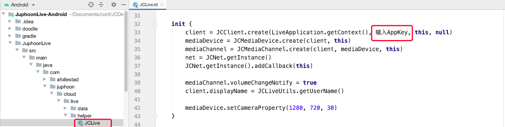

# 一分钟跑通 Demo

想要快速体验 Demo，请按以下步骤操作：

## 获取 AppKey

请参考 [AppKey](https://developer.juphoon.com/cn/document/V2.1/create-application.php) 来获取您的 AppKey 。

::: tip

同一个账号下创建的应用属于同一个域，同域中的应用可以互通。

:::

## Demo 源码下载

请点击
[Demo](http://developer.juphoon.com/portal/cn/downloadsdk/download_demo.php?filename=JuphoonLive-Android.tar.gz)
进行 Demo 源码下载。

## 编译运行

1. 解压下载的 Demo 源码压缩包，并打开工程。

2. 设置自己的 AppKey：在下图红框标记的代码中输入自己的 AppKey：

3. 连接安卓真机，编译运行 Demo 。
