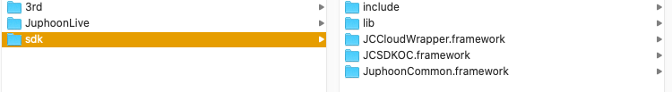
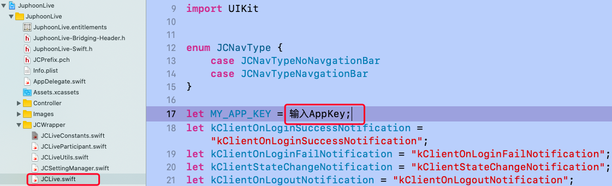

# 一分钟跑通 Demo

想要快速体验 Demo，请按以下步骤操作：

## 获取 AppKey

请参考 [AppKey](https://developer.juphoon.com/cn/document/V2.1/create-application.php) 来获取您的 AppKey 。

::: tip

同一个账号下创建的应用属于同一个域，同域中的应用可以互通。

:::

## 下载 Demo 源码

请点击
[Demo](http://developer.juphoon.com/portal/cn/downloadsdk/download_demo.php?filename=JuphoonLive-iOS.tar.gz)
进行 Demo 源码下载。

## 编译运行

### 解压下载的 Demo 源码压缩包，并打开工程

解压后的目录如下：

JuphoonCommon.framework 为工程提供 http 账号管理功能。

### 设置自己的 AppKey

在下图红框标记的代码中输入自己的 AppKey

### 运行 Demo

连接 iOS 真机，点击 run，编译运行 Demo 程序。

::: tip

当前 RealmSwift 版本为使用 Swift 5.1 编译器编译的，开发者需要根据自己当前的 Xcode 版本下载对应的
RealmSwift 库进行替换。

:::

-----

