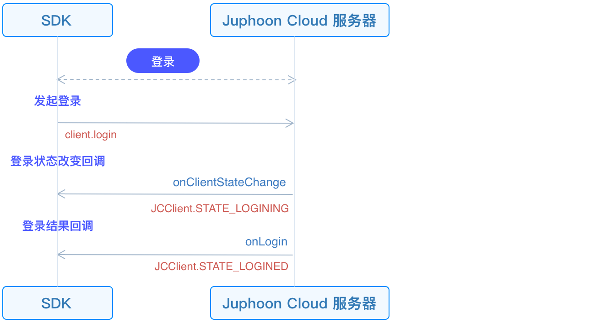
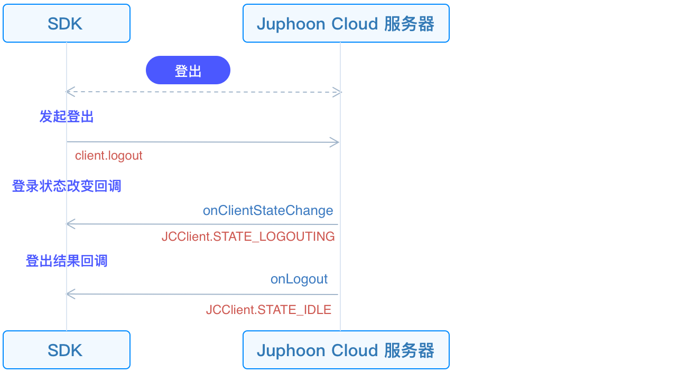

# 登录

本章节将介绍如何初始化 JC SDK 并登录。

## 初始化

在主线程调用
[JCClient.create()](https://developer.juphoon.com/portal/reference/V2.1/android/com/juphoon/cloud/JCClient.html#create-android.content.Context-java.lang.String-com.juphoon.cloud.JCClientCallback-com.juphoon.cloud.JCClient.CreateParam-)
，创建
[JCClient](https://developer.juphoon.com/portal/reference/V2.1/android/com/juphoon/cloud/JCClient.html)
实例对象。传入获取到的 `appKey` ，即可初始化
[JCClient](https://developer.juphoon.com/portal/reference/V2.1/android/com/juphoon/cloud/JCClient.html)
。

``````java
// JCClient 对象
JCClient mClient;

// 初始化函数
public boolean initialize(Context context) {
    // 登录类
    mClient = JCClient.create(context, "用户 appKey", new JCClientCallback() {
        @Override
        public void onLogin(boolean result, int reason) {

        }
        @Override
        public void onLogout(int reason) {

        }
        @Override
        public void onClientStateChange(int state, int oldState) {

        }
    }, null);
    // 获取初始化状态（用来判断初始化状态）
    mInit = mClient.getState() == JCClient.STATE_IDLE;
    return mInit;
}
``````

初始化成功后，JCClient.ClientState 状态从 JCClientStateNotInit（未初始化） 变为
JCClientStateIdle（未登录）。

## 发起登录

SDK 初始化之后，即可进行登录的集成。 登出接口调用流程如下所示：



先创建
[JCClient.LoginParam](https://developer.juphoon.com/portal/reference/V2.1/android/com/juphoon/cloud/JCClient.LoginParam.html)
实例以调整登录参数。后调用
[login()](https://developer.juphoon.com/portal/reference/V2.1/android/com/juphoon/cloud/JCClient.html#login-java.lang.String-java.lang.String-com.juphoon.cloud.JCClient.LoginParam-)
，发起登录:

``````java
JCClient.LoginParam loginParam = new JCClient.LoginParam();
// 1. 设置服务器环境。
loginParam.serverAddress = "服务器地址";
// 2. 发起登录
mClient.login(userID, password, loginParam);
``````

::: tip

1. 环境设置

      - 国内环境 `http:cn.router.justalkcloud.com:8080` （默认）

      - 国际环境 `http:intl.router.justalkcloud.com:8080`

2. userID 不能为空，可由英文、数字和 `+` 、 `-` 、 `_` 、 `.`
    组成（特殊字符不能作为第一个字符），大小写不敏感，长度不能超过
    64 个字符。

3. password 不能超过 128 个字符。

4. 调用该接口返回 true 时只代表调用接口成功，并不代表登录成功。登录的结果会通过 onLogin 回调上报。

:::

调用接口成功后，首先会触发登录状态改变回调
[onClientStateChange()](https://developer.juphoon.com/portal/reference/V2.1/android/com/juphoon/cloud/JCClientCallback.html#onClientStateChange-int-int-)
。您可以通过重写
[onClientStateChange()](https://developer.juphoon.com/portal/reference/V2.1/android/com/juphoon/cloud/JCClientCallback.html#onClientStateChange-int-int-)
执行逻辑操作。

``````java
@Override
public void onClientStateChange(@JCClient.ClientState int state, @JCClient.ClientState int oldState) {
     if (state == JCClient.STATE_IDLE) { // 未登录
        ...
    } else if (state == JCClient.STATE_LOGINING) { // 正在登录
        ...
    } else if (state == JCClient.STATE_LOGINED) { // 登录成功
        ...
    } else if (state == JCClient.STATE_LOGOUTING) { // 登出中
        ...
    }
}
``````

之后触发
[onLogin()](https://developer.juphoon.com/portal/reference/V2.1/android/com/juphoon/cloud/JCClientCallback.html#onLogin-boolean-int-)
回调。您可以通过重写
[onLogin()](https://developer.juphoon.com/portal/reference/V2.1/android/com/juphoon/cloud/JCClientCallback.html#onLogin-boolean-int-)
执行逻辑操作。

``````java
@Override
public void onLogin(boolean result, @JCClient.ClientReason int reason) {
    if (result) {// 登录成功
        ...
    }
    if (reason == REASON_AUTH) {// 账号密码错误
        ...
    }

}
``````

登录成功之后，SDK 会自动保持与服务器的连接状态，直到用户主动调用登出接口，或者因为帐号在其他设备登录导致该设备登出。登录成功/失败原因 参考
[JCClient.ClientReason](https://developer.juphoon.com/portal/reference/V2.1/android/com/juphoon/cloud/JCClient.html#REASON_ANOTHER_DEVICE_LOGINED)
。

## 登出

登出接口调用流程如下所示：



调用
[logout()](https://developer.juphoon.com/portal/reference/V2.1/android/com/juphoon/cloud/JCClient.html#logout--)
可以发起登出。

登出同样会触发登录状态改变(onClientStateChange)回调，之后将通过 onLogout 回调上报登出结果。

``````java
@Override
public void onLogout(@JCClient.ClientReason int reason) {
    if (reason == REASON_SERVER_LOGOUT) {// 强制登出
        ...
    }
}
``````

更多登出原因参考：
[JCClient.ClientReason](https://developer.juphoon.com/portal/reference/V2.1/android/com/juphoon/cloud/JCClient.html#REASON_ANOTHER_DEVICE_LOGINED)
。
