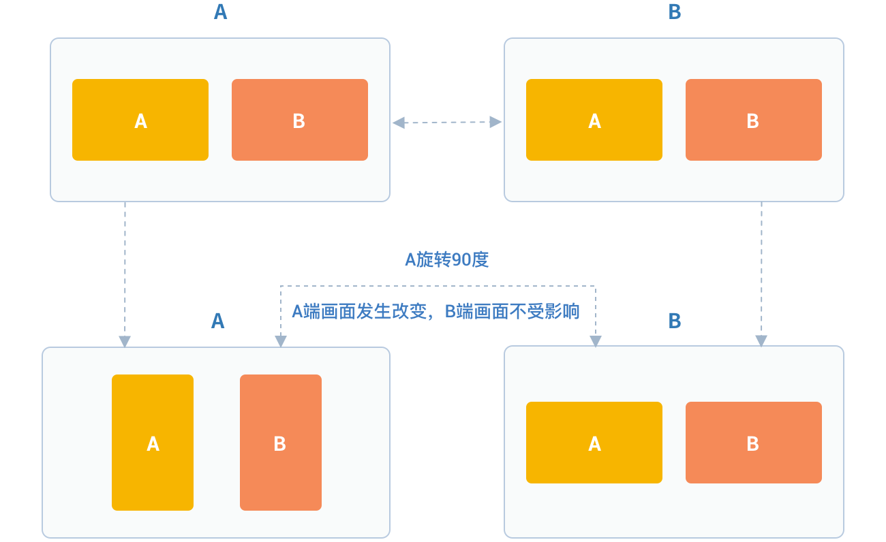

# 视频管理

## 视频数据采集管理

### 设置要开启的摄像头类型

视频采集前，可以指定要开启的摄像头

首先，获取摄像头列表

```csharp
/// <summary>
/// 摄像头列表
/// </summary>
public List<JCMediaDeviceCamera> cameras
```

其中，JCMediaDeviceCamera 有以下几个变量

```csharp
/// <summary>
/// 名称
/// </summary>
public string cameraName { get; internal set; }
/// <summary>
/// id
/// </summary>
public string cameraId
```

切换摄像头

```csharp
/// <summary>
/// 切换摄像头
/// </summary>
/// <param name="camera">要切换的摄像头</param>
/// <returns>true为切换成功，false为切换失败</returns>
public bool switchCamera(JCMediaDeviceCamera camera)
```

**示例代码**

```csharp
// 获取摄像头列表
List<JCMediaDeviceCamera> cameraDevices = mediaDevice.cameraDevices;

// 切换摄像头
mediaDevice.switchCamera(mediaDevice.cameras[0]);
```

### 设置摄像头采集分辨率

您可以通过自定义摄像头采集参数实现不同的视频分辨率，如采集的高度、宽度和帧速率。

摄像头采集属性设置接口如下：

```csharp
/// <summary>
/// 设定摄像头分辨率，请在调用startCamera()接口之前调用才会生效
/// </summary>
/// <param name="width">摄像头分辨率宽</param>
/// <param name="height">摄像头分辨率高</param>
/// <param name="framerate">帧速率</param>
public void setCameraProperty(int width, int height, int framerate)
```

**示例代码**

```csharp
// 设置摄像头采集属性
mediaDevice.setCameraProperty(640, 360, 30);
```

### 设置 Canvas 旋转角度

如果想设置Canvas中画布的角度，需要调用 JCMediaDeviceVideoCanvas 类中的 rotate 接口

```csharp
/// <summary>
/// 旋转画面
/// </summary>
/// <param name="angle">旋转角度</param>
public void rotate(JCMediaDeviceVideoCanvasRoatate angle)
```

其中，角度需为 90 的倍数。调用该接口后，本端显示的本地视频画面和远端视频画面会同时旋转相同的角度，而对端显示的画面不受影响。

例如 A 设置旋转 90 度，则 A 端显示的 A 和 B 视频画面会同时旋转 90 度。而 B 端的视频画面则不会发生任何改变。如下图所示：



JCMediaDeviceVideoCanvasRoatate 枚举值如下

```csharp
/// <summary>
/// 0
/// </summary>
Angle0 = 0,
/// <summary>
/// 90
/// </summary>
Angle90 = 90,
/// <summary>
/// 180
/// </summary>
Angle180 = 180,
/// <summary>
/// 270
/// </summary>
Angle270 = 270
```

**示例代码**

```csharp
// 设置摄像头采集属性
mediaDevice.rotate(JCMediaDeviceVideoCanvasRoatate.Angle0);
```

## 视频渲染管理

### 创建本地和远端视频画面

- 本地视频渲染

本地视频渲染通过调用 startCameraVideo 接口获得本地视频对象用于 UI 界面显示，**该接口会打开摄像头**

```csharp
/// <summary>
/// 获取预览视频对象，通过此对象能获得视图用于UI显示
/// </summary>
/// <param name="mode">渲染方式</param>
/// <returns>JCMediaDeviceVideoCanvas对象</returns>
public JCMediaDeviceVideoCanvas startCameraVideo(JCMediaDeviceRenderMode mode)
```

其中，渲染模式（JCMediaDeviceRenderMode)有以下三种

<table>
<colgroup>
<col style="width: 50%" />
<col style="width: 50%" />
</colgroup>
<thead>
<tr class="header">
<th><p>名称</p></th>
<th><p>描述</p></th>
</tr>
</thead>
<tbody>
<tr class="odd">
<td><p>FULLSCREEN</p></td>
<td><p>铺满窗口</p></td>
</tr>
<tr class="even">
<td><p>FULLCONTENT</p></td>
<td><p>全图像显示，会有黑边，但在窗口跟图像比例相同的情况下不会有黑边</p></td>
</tr>
<tr class="odd">
<td><p>AUTO</p></td>
<td><p>自适应</p></td>
</tr>
</tbody>
</table>

- 远端视频渲染

您可以调用 startVideo 方法获取对端视频对象并进行渲染

```csharp
/// <summary>
/// 获得视频对象，通过此对象能获得视图用于UI显示
/// </summary>
/// <param name="videoSource">渲染标识串，比如 JCMediaChannelParticipant JCCallItem 中的 renderId，当videoSource 为 videoFileId 时，内部会调用 startVideoFile</param>
/// <param name="mode">渲染模式</param>
/// <returns>JCMediaDeviceVideoCanvas对象</returns>
public JCMediaDeviceVideoCanvas startVideo(string videoSource, JCMediaDeviceRenderMode mode)
```

**示例代码**

```csharp
// 获取摄像头列表
List<JCMediaDeviceCamera> cameraDevices = mediaDevice.cameras;

// 打开本地视频预览
JCMediaDeviceVideoCanvas localCanvas = mediaDevice.startCameraVideo(JCMediaDeviceRenderMode.FULLCONTENT);
ImageBrush image = new ImageBrush(localCanvas.videoView);
image.Stretch = Stretch.Uniform;
this.label.Background = image;

// 远端视频渲染，renderId来源于通话对象，一对一为JCCallItem对象，多方为JCMediaChannelParticipant对象
JCMediaDeviceVideoCanvas remoteCanvas = mediaDevice.startVideo(renderId, JCMediaDeviceRenderMode.FULLSCREEN);
ImageBrush image = new ImageBrush(remoteCanvas.videoView);
image.Stretch = Stretch.Uniform;
this.label.Background = image;
```

-----

### 销毁本地和远端视频画面

在视频通话结束或者视频通话中，如果想销毁视频画面，可以调用下面的接口

```csharp
/// <summary>
/// 停止视频
/// </summary>
/// <param name="canvas">JCMediaDeviceVideoCanvas对象，由startVideo获得</param>
public void stopVideo(JCMediaDeviceVideoCanvas canvas)
```

示例代码:

```csharp
JCMediaDeviceVideoCanvas localCanvas = mediaDevice.startCameraVideo(JCMediaDeviceRenderMode.FULLCONTENT);
JCMediaDeviceVideoCanvas remoteCanvas = mediaDevice.startVideo(renderId, JCMediaDeviceRenderMode.FULLSCREEN);
if (localCanvas != null)
    {
        this.smvideoGrid.Background = null;
        mediaDevice.stopVideo(localCanvas);
        localCanvas = null;
    }
if (remoteCanvas != null)
    {
        this.fullvideoGrid.Background = null;
        mediaDevice.stopVideo(remoteCanvas);
        remoteCanvas = null;
    }
```

-----

### 视频通话截图

```csharp
/// <summary>
/// 视频通话截图
/// </summary>
/// <param name="width">截屏宽度像素，-1为视频源像素</param>
/// <param name="height">截屏高度像素，-1为视频源像素</param>
/// <param name="filePath">文件路径</param>
/// <returns>是否成功</returns>
public bool snapshot(int width, int height, string filePath)
```

-----

### 更新视频渲染标识

如果想替换当前摄像头视频画面，可以调用下面的接口

```csharp
/// <summary>
/// 更新视频渲染标识
/// </summary>
/// <param name="videoSource">渲染标识</param>
/// <returns>成功失败</returns>
public bool replace(string videoSource)
```

### 暂停渲染

如果想暂停画面的渲染可以调用如下接口

```csharp
/// <summary>
/// 暂停渲染
/// </summary>
/// <returns>成功失败</returns>
public bool pause()
```

### 恢复渲染

如果想对已暂停的画面继续进行渲染，可以调用下面的接口

```csharp
/// <summary>
/// 恢复渲染
/// </summary>
/// <returns>成功失败</returns>
public bool resume()
```

-----

## 视频设备管理

视频设备管理主要用到 JCMediaDevice 类中的方法，具体如下：

### 获取当前使用摄像头和默认摄像头

```csharp
/// <summary>
/// 当前使用摄像头
/// </summary>
public JCMediaDeviceCamera camera

/// <summary>
/// 默认摄像头
/// </summary>
public JCMediaDeviceCamera defaultCamera
```

### 开启关闭摄像头

```csharp
/// <summary>
/// 开启摄像头
/// </summary>
/// <returns>true为开启成功，false为开启失败</returns>
public bool startCamera()

/// <summary>
/// 关闭摄像头
/// </summary>
/// <returns>true为关闭成功，false为关闭失败</returns>
public bool stopCamera()
```

### 切换摄像头

```csharp
/// <summary>
/// 切换摄像头
/// </summary>
/// <param name="camera">要切换的摄像头</param>
/// <returns>true为切换成功，false为切换失败</returns>
public bool switchCamera(JCMediaDeviceCamera camera)
```

**示例代码**

```csharp
// 打开摄像头
mediaDevice.startCamera();

// 关闭摄像头
mediaDevice.stopCamera();

// 切换摄像头
mediaDevice.switchCamera(mediaDevice.cameras[0]);
```
