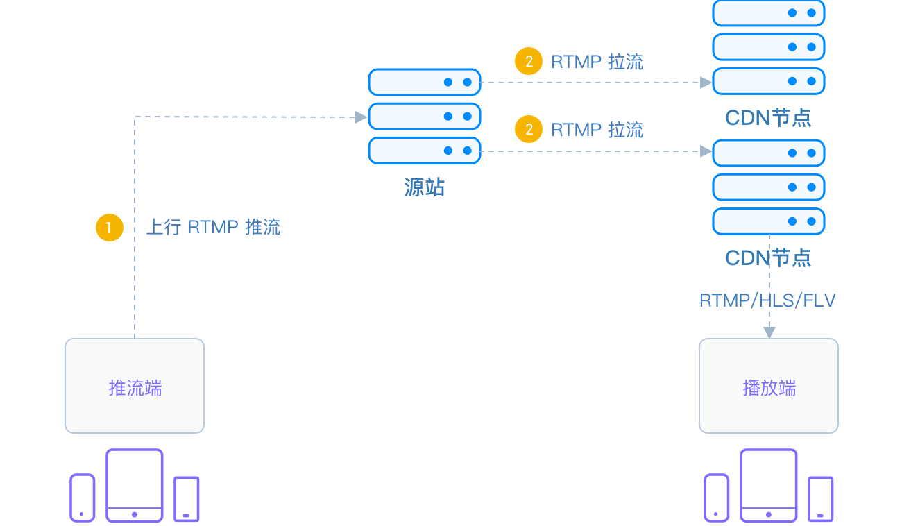

# CDN 推流

将直播流发布到 CDN(Content Delivery Network)的过程称为 CDN 直播推流，用户无需安装 App，可以通过 Web 浏览器观看直播。

推流对网络要求比较高，如果网络不稳定，直播效果就会很差，观众观看直播时就会发生卡顿等现象，观看体验很是糟糕。

要想用于推流还必须把音视频数据使用传输协议进行封装，变成流数据。常用的流传输协议有 RTSP、RTMP、HLS 等，使用 RTMP 传输的延时通常在1–3秒，对于手机直播这种实时性要求非常高的场景，RTMP 也成为手机直播中最常用的流传输协议。最后通过一定的 Qos 算法将音视频流数据推送到网络端，通过 CDN 进行分发。

CDN 推流的原理如下

## 适用场景

| 应用行业     | 场景说明                                 |
| :----------- | :--------------------------------------- |
| 音频互动直播 | 语音直播、游戏语音、线上 KTV、语音聊天室 |
| 视频互动直播 | 娱乐社交、电商直播、新闻媒体、赛事直播   |
| 视频会议     | 大型企业级会议                           |
| 在线教育     | 直播课堂、在线大班课                     |

