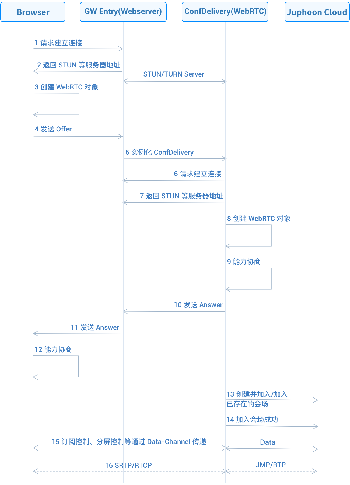
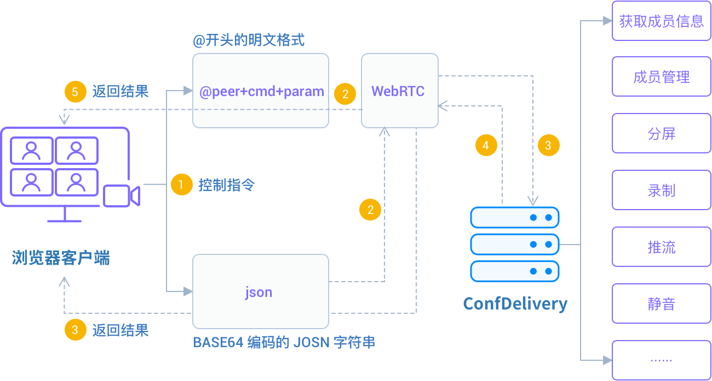

# 功能简介

## 简介
WebRTC 的优势是在浏览器中集成了媒体引擎，从而不需要另外安装插件或代理程序，可实现免安装使用；但并不是所有的浏览器都能够支持 WebRTC，目前 WebRTC 支持以下浏览器版本：

| 平台       | 实现功能                                                     |
| :--------- | :----------------------------------------------------------- |
| 桌上 PC 端 | Google Chrome 59.0.3071.115 及以上 Mozilla Firefox 54.0.1 及以上 Opera 20 及以上 Safari 11 及以上 360 7.1.2 及以上（极速模式） |
| 移动端     | Android Google Chrome 29 及以上 Android Mozilla Firefox 24 及以上 Android 微信7.0 及以上 safari 11 及以上，12 以后iPhone只支持safari |

## 通讯原理

SDK Web 端音视频通话是借助 WebRTC 搭建媒体通道，从而实现 Web 端与 ConfDelivery 之间的通信。ConfDelivery 作为一种特殊的终端，可实现 CDN 推流、会议录制、会议跟 WebRTC 对接服务等功能。

**WebRTC 通讯原理**

\- 假设会场已经建立，Browser 创建 WebRTC 对象并通过 WebServer 接入 GW Entry；

\- GW Entry 实例化网关 ConfDelivery，并通过 WebServer 透传 Offer/Answer 媒体协商 SDP；

\- Browser 和 ConfDelivery 建立连接并完成协商；

\- Browser 成功创建并加入或加入已存在的会场。

会议中的控制信息通过 Data-Channel 进行传递。

对于业务上的控制，由于 ConfDelivery 运行在服务器，由 JSMD (会议引擎）负责启动并传递初始配置，所以其他业务上的控制，只能通过特定的控制协议，远程操作 ConfDelivery 完成。

**控制协议有两种格式**

以 @ 开头的明文格式，适合手工输入，但无法处理特殊字符，此格式下 ConfDelivery 会自动反馈结果；

BASE64 编码的 JSON 串，适合由代码构造，可以处理特殊字符，但没有反馈机制。

两种格式的控制指令具体运行机制如下图

在 @ 开头的明文格式下，Web 端通过发送指令直接作用到目标对象，并通过 ConfDelivery 对目标对象进行相应的处理。

在 BASE64 编码的 JSON 字符串中，通过把会议指令进行加密，直接作用到 WebRTC，并由 WebRTC 对指令进行后续的处理。

两种控制指令的格式说明如下表所示
| 指令格式                | 实现功能                                                     |
| :---------------------- | :----------------------------------------------------------- |
| @ 开头的明文格式        | @ 开头的明文格式之后必须紧跟 ConfDelivery 的短名,然后是指令 形式如下： '@'+peer+cmd+param peer 为指令发送的目标 cmd 为指令,大小写不敏感 param 为相应参数 举例： ConfDelivery 的账户 ID 是[username:delivery0121@101055.cloud.justalk.com]，则如下打印帮助的指令都是正确的： @delivery0121 help @delivery0121help  |
| BASE64 编码的 JSON 格式 | 格式为：{“cmd”:”cmd”,param} cmd 为指令, param 为相应参数 举例： 修改成员昵称的指令： {“cmd”:”setnick”, “nick”:%s, “target”:%s} |

