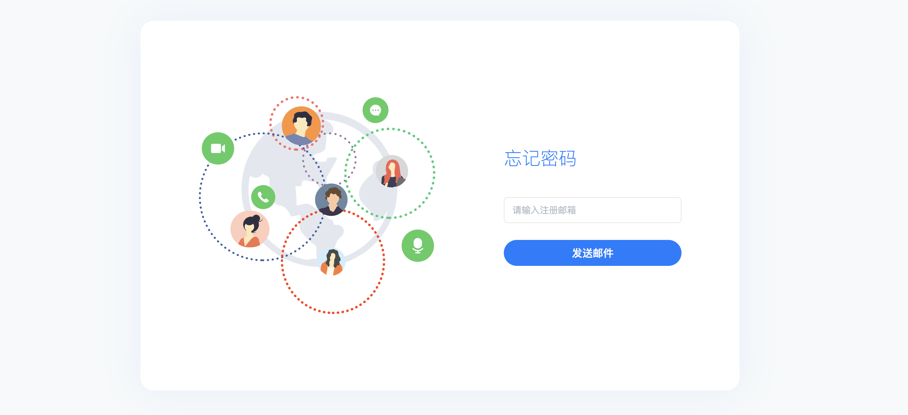

# 注册与登录

尊敬的开发者，欢迎使用菊风云控制台（简称控制台）。在这里方便开发者在使用菊风云平台时对各产品时进行充值、查看、管理等操作。本指南简要介绍如何使用控制台 。

本篇介绍控制台的功能，您还可以为您的团队成员设置不同权限，以便更好的管理您的产品。具体成员所能看到的页面视该成员的角色权限而定。

## 注册

### 进入注册

使用前请先注册创建菊风云开发者账号，进入 [菊风云开发者中心注册页面](https://developer.juphoon.com/signup)。

### 填写注册信息

填写您的邮箱、密码、公司或个人称呼，选择环境（密码长度不能小于6位）。

填写手机号并验证，作为安全校验方式，完成注册。

勾选同意平台服务协议，单击注册按钮发送注册邮件。

**基础知识“国内环境”和“国际环境”说明。**

1. 国内环境和国际环境都可以做全球通话。在您的国内用户量占比更多时，建议选择国内环境；在您的国外用户量占比更多时，建议选择国外环境。（注：若主要用户集中在中国香港及中国台湾地区，也请选择海外环境）。

2. 国内环境和国际环境是不互通的。

3. 国内环境和国际环境如果同时注册是分开计费的。

### 激活

前往邮箱激活注册邮件，激活成功后会自动登录控制台。

如果未发现如下邮件请查看一下垃圾箱或者10分钟后再查收邮件，如果点击邮箱中按钮无法激活账户可以复制按钮下方链接到浏览器手动激活。

### 登录控制台

您可以用注册时填写的邮箱登录菊风云平台，根据新手指引，创建你的第一个项目，快速体验音视频通话。你也可以对账号所属的个人或企业信息主体进行认证，详见[实名认证](../02_实名认证)。

如果一个邮箱账号同时注册了2个环境登录时需要选择环境后才会进入控制台，只有一个环境的账号会直接进入控制台。如果登录时忘记密码可以点击“忘记密码”轻松找回密码。

### 管理密码

#### 找回密码

如果您忘记了密码，可通过以下方式找回密码。点击 [登录](https://developer.juphoon.com/signin)，点击忘记密码，通过您的注册邮箱，我们为您发送一份密码重置的验证邮件，您可通过邮件设置新的密码。

#### 账号安全

您可以在登录后，点击右上角账号名，出现下拉框，点击基本信息进入账号安全页面。您可以在此页面对密码进行修改。

