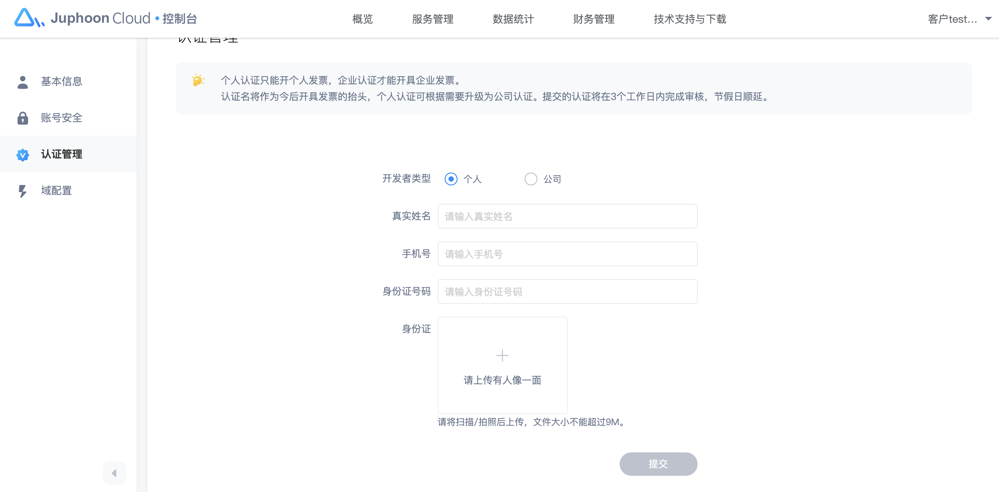

# 实名认证

## 个人认证

我们为您设置了个人认证和公司认证两种方式，个人认证可升级为公司认证。

1.个人实名认证成功可申请个人普通发票或企业普通发票；公司实名认证成功可申请企业普通发票或企业专用发票。

2.个人认证信息成功后可升级成公司认证，认证信息请谨慎填写。

3.如果未进行认证，您将无法进行开票申请。

个人认证信息包括：姓名、手机号，身份证号码、手持身份证头像面照片。文件大小不能超过9M。

## 企业认证

如果您个人认证成功后，您可以按照需求升级为公司认证。

公司认证信息包括：公司名称，公司地址，社会统一信用代码、企业固定电话、营业执照照片。文件大小不能超过9M。
