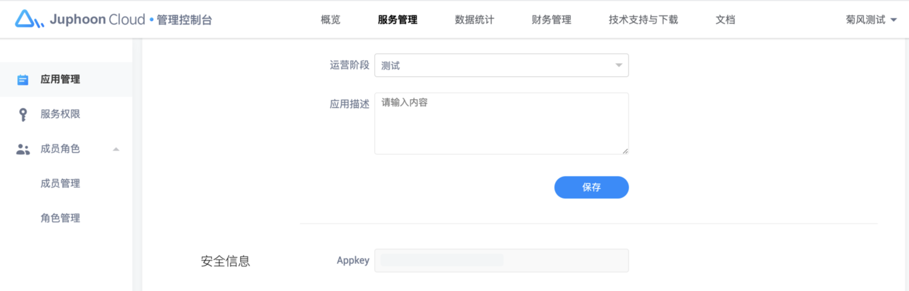

# 应用管理

## 创建应用

如果您已经拥有开发者帐号，请直接 [登录](https://developer.juphoon.com/signin) 并开始创建您的应用。登录后，点击顶部导航的服务管理并点击左侧的应用管理，进入应用管理页面，在该页面点击“创建应用”按钮。注：同一个环境并且在同一个账号下应用不能重名。

在弹出的对话框内输入应用名称并选择相应的应用行业，点击创建，新的应用就会显示在应用管理页面，创建完成后，系统会自动为您的应用生成 AppKey。

## 管理应用

### 基本信息

在应用管理页面，点击“小眼睛” 即可显示 AppKey。 点击用量按钮即可查看应用用量。

 点击编辑或设置按钮，可以设置应用名称、行业、运营阶段，应用描述，进行更改。 运营阶段：此信息仅供标记您应用的运营状态。

### 安全信息

查看 [AppKey](https://developer.juphoon.com/cn/document/V2.1/key-terms.php)

AppKey 是应用在菊风云平台中的唯一标识。
此外，在创建应用时，
**同一个控制台帐号中创建的多个应用属于同一个域。同域中的应用是可以互通的。**
所以同一帐号下的应用即使 AppKey 不同，也可以进行业务往来。例如，在同一域下，从其中一个应用登录的用户可以呼叫另一个应用登录的用户。

### 状态配置

应用状态通知配置

