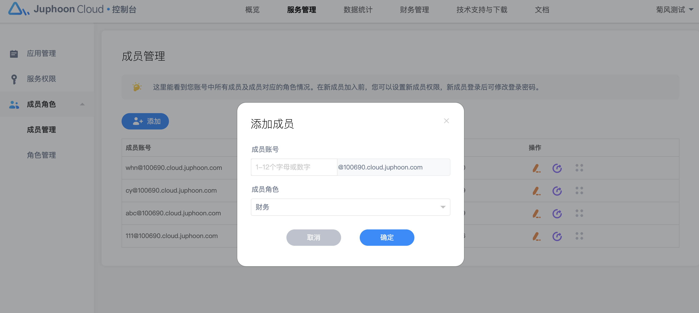

# 成员角色

您创建菊风开发者平台账号后即为超级管理员，可以为您的账号添加新的成员，为不同成员设置不同权限，以便更好的管理产品及团队协作。具体成员所能看到的页面视该成员的角色权限而定。

## 成员管理

### 添加成员

点击导航的服务管理并进入成员管理页面，点击“添加”按钮。

我们已为您默认成员账号的后缀，您只需输入新成员账号，为它选择对应角色权限即可，点击确定后您的团队成员账号显示在成员管理页面。

成员后缀为您的邮箱在菊风开发者平台对应的唯一域。

### 管理成员

您可以对您成员进行编辑角色，重置密码，删除成员等操作，也可将新创建的成员信息发送给对方。

## 角色管理

点击导航的服务管理并进入角色管理页面，您可以为其设置权限管理，删除等操作。

我们为您预设了3个默认角色，开发者，产品，财务。你也可以讲默认角色增减权限。

您还可以点击添加按钮，根据需要创建自定义角色并设置相关权限。

