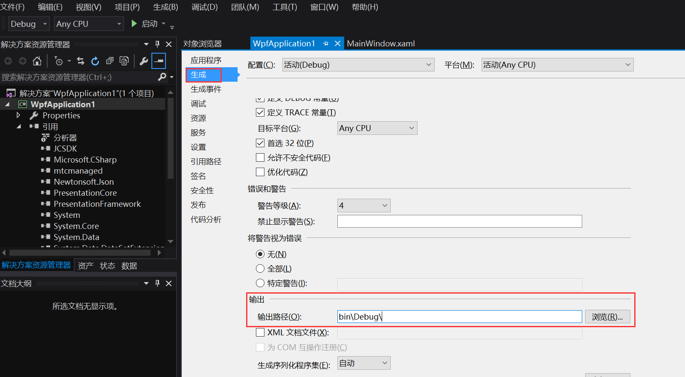

# Integrate SDK in One Minute

## Prerequisites

- Microsoft Visual Studio 2013 or above

- Supports Windows 7 or above

- Effective Juphoon Developer Account([free sign
    up](http:///developer.juphoon.com/signup) )

- Efficient Juphoon [AppKey](https://developer.juphoon.com/cn/document/V2.1/create-application.php)

## Create a Winform project

Follow the steps below to create a Winform project. If you already have
a Winform project, you can directly view the integrated SDK.

1. On the **Start** window, select **Create a New Project**.

2. Enter or type “Windows Form” in the search box of the **Create a New
    Project** window. Next, select **Desktop** from the **Project Type**
    list.

3. After applying the **Project Type** filter, select the **Windows
    Form Application (.NET Framework)** template for C\# or Visual
    Basic, and then select **Next**. \* In the **Configure a New
    Project** window, type or enter “PictureViewer” in the **Project
    Name** box. Then, select **Create**.

## Integrate SDK

1. Put nine files such as `zmfmanaged.dll` , `zmf.dll` ,
    `Newtonsoft.Json.dll` , `mtcwrap.dll` , `mtcmanaged.dll` , `mtc.dll`
    , `jssmme.dll` , `JCSDK.dll` , `bzip2.dll` in the bin directory into
    the application `../bin/Debug/` binDebug. (This is the default path)

2. Click **Project** -\> **Add Reference** –\> **Browse** –\> **Select
    dll placement path** and click “OK”.

3. Confirm that the output path is the same as the folder where the dll
    library is located.

If the compilation is successful, the integrated content is completed.
