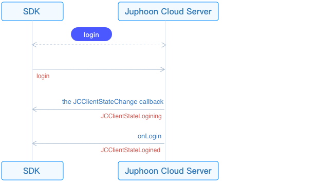
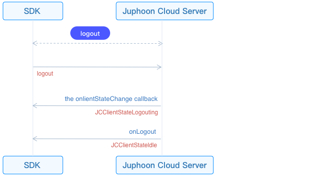

# Log In

This guide introduces how to initialize JC SDK and log in.

## Initialize

Before calling the initialize method, you need to extend the
JCClientCallback object, and then implement the pure virtual function in
the JCClientCallback object:

``````cpp
class JCManager : public JCClientCallback
{
public:
    //Singleton instance management class
    JCManager();
    ~JCManager();

    static std::shared_ptr<JCManager> shared();
    bool initialize();
    void uninitialize();
    //The callback of Login
    virtual void onLogin(bool result, JCClientReason reason);
    //Logout callback
    virtual void onLogout(JCClientReason reason);
    //The callback of ClientStateChange
    virtual void onClientStateChange(JCClientState state, JCClientState oldState);

public:
    //JCClient object
    JCClient* client;
};
``````

Call the
[createJCClient](/portal/reference/V2.1/windows/C++/html/_j_c_client_8h.html#a2d6fc4f203884536ff69bfe0e0ed300f)
method in the JCClientImpl class on the main thread, and pass in the
obtained `appKey` to initialize the JC SDK.

``````cpp
bool JCManager::initialize()
{
    //Initialize
    client = createJCClient("User appKey", this, NULL);
    if (client->getState() == JCClientStateNotInit) {
        return false;
    }
    return true;
}

//The callback of Login
void JCManager::onLogin(bool result, JCClientReason reason) {
}
//The callback of Logout
void JCManager::onLogout(JCClientReason reason) {
}
//The callback of ClientStateChange
void JCManager::onClientStateChange(JCClientState state, JCClientState oldState) {
}
``````

After initialization is successful, the JCClient state changes to
JCClientStateIdle (not logged in state).

## Initiate login

After the SDK is initialized, login integration is possible.The call
flow of the login interface is as follows:



Create
[JCClientLoginParam](/portal/reference/V2.1/windows/C++/html/class_j_c_client_login_param.html)
object to set login parameters and call
[login](/portal/reference/V2.1/windows/C++/html/class_j_c_client.html#ad612e9957623869289103fbf0721d902)
to initiate login:

``````cpp
//Login
void JCSampleDlg::OnBnClickedButtonLogin()
{
    int state = JCManager::shared()->client->getState();
    if (state == JCClientStateIdle) {
        JCClientLoginParam* loginParam = new JCClientLoginParam();
        // 1. Environment settings
        loginParam->serverAddress = "Server address";
        // 2. Initiate login
        JCManager::shared()->client->login("username", "123", loginParam);
    }
    else {
        // Log out if already logged in
        JCManager::shared()->client->logout();
    }
}
``````

::: tip

1. Environment settings:
   - Domestic environment `http:cn.router.justalkcloud.com:8080`
     (Default)
   - International environment
     `http:intl.router.justalkcloud.com:8080`

2. userID is English, numbers and `+` `-` `_` `.` , case-insensitive,
    the length should not exceed 64 characters, `-` `_` `.` cannot be
    the first character.

3. password the length should not exceed 128 characters.

4. When calling this interface returns true, it only means that the
    interface is called successfully, not that the login is successful.
    The result of the login will be reported through the onLogin
    callback.

:::

After the interface is successfully called, the callback of login state
change
[onClientStateChange](/portal/reference/V2.1/windows/C++/html/class_j_c_client_callback.html#ace087f907d2f8a2413f10d34cfb47337)
will be triggered, and you can perform logical operations in this
callback:

``````cpp
void JCManager::onClientStateChange(JCClientState state, JCClientState oldState) {
     if (state == JCClient.STATE_IDLE) { // Not logged in
       ...
    } else if (state == JCClientStateLogining) { // Logging in
       ...
    } else if (state == JCClientStateLogined) { // Login successful
       ...
    } else if (state == JCClientStateLogouting) { // Logout
       ...
    }
}
``````

After that, the
[onLogin](/portal/reference/V2.1/windows/C++/html/class_j_c_client_callback.html#ab2deb2e2d3c95f848d9dc2baa7c6daff)
callback is triggered. You can perform logical operations in the
callback:

``````cpp
void JCManager::onLogin(bool result, JCClientReason reason) {
    if (result) {/// Login successful
        ...
    }
    if (reason == JCClientReasonAuth) {// Account password is wrong
        ...
    }
}
``````

After successful login, the JCClientState status changes from
JCClientStateIdle (not logged in) to JCClientStateLogined (successful
login). The SDK will automatically remain connected to the server until
the user calls the logout interface, or the device is logged in because
the account is logged in on another device. For login successful/failed
reasons, please refer to
[JCClientReason](/portal/reference/V2.1/windows/C++/html/_j_c_client_constants_8h.html#a8b1b44e57fff02634fd4637428a70020)
.

## Log out

The call flow of the logout interface is as follows:



Call
[logout](/portal/reference/V2.1/windows/C++/html/class_j_c_client.html#abac015a13078c84b06afac69dcd392ff)
to initiate logout:

``````cpp
JCManager::shared()->client->logout();
``````

Logging out will also trigger a login state change (onClientStateChange)
callback, after which the logout result will be reported via the
onLogout callback:

``````cpp
void JCManager::onLogout(JCClientReason reason) {
    if (reason == JCClientReasonServerLogout) {// Force logout
        ...
    }
}
``````

For logout reasons, please refer to:
[JCClientReason](/portal/reference/V2.1/windows/C++/html/_j_c_client_constants_8h.html#a8b1b44e57fff02634fd4637428a70020)
.

After logging out successfully, the JCClientState status changes from
JCClientStateLogined (successful login) to JCClientStateIdle (not logged
in).
