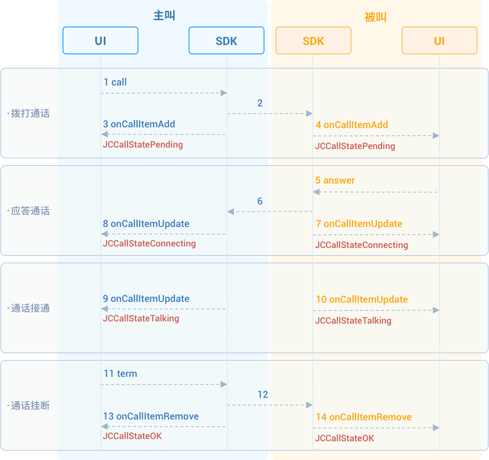

# Realize one-to-one voice calling

This guide introduces how to implement one-to-one voice calls. The API
call sequence of one-to-one voice calls is shown in the figure below:



## Initialize

Call
[JCMediaDevice.create()](https://developer.juphoon.com/portal/reference/V2.1/windows/html/cb59bc27-6528-9dbf-c996-de857096f847.htm)
and
[JCCall.create()](https://developer.juphoon.com/portal/reference/V2.1/windows/html/eef10110-a3f7-b505-26fa-4b9ec1e2b998.htm)
to initialize the modules needed for one-to-one calling:

``````csharp
/// Create a new class and implement it
class JCManager : JCClientCallback, JCMediaDeviceCallback,JCCallCallbac{

    #region JCMediaDeviceCallback

    public void onCameraUpdate(){...}

    public void onAudioOutputTypeChange(string audioOutputType){...}

    #endregion

    #region JCCallCallbac
    ...
    /// Implement the methods in JCCallCallbac
    ...
    #endregion

    /// Declare object
    JCMediaDevice mMediaDevice;
    JCMediaChannel mMediaChannel;

    /// Initialization function
    public bool initialize(Context context) {

        /// 1. Media class
        mMediaDevice = JCMediaDevice.create(mClient, this);
        /// 2. Call class
        mCall = JCCall.create(mClient, mMediaDevice, this);
    }
}
``````

## Make a call

Call
[call()](https://developer.juphoon.com/portal/reference/V2.1/windows/html/613adf03-d597-8221-86d5-0056c1b4d2a0.htm)
to initiate a video call, the parameters that need to be filled are:

- `userID` Fill in the user ID of the other party.

- `video` Select whether to call a video call, and true means to make
    a video call, while false means to make a voice call.

- [extraParam()](https://developer.juphoon.com/portal/reference/V2.1/windows/html/e0226cbc-1ca1-ef9c-5e8e-d3dc853d618d.htm)
    is a custom pass-through string, which can be obtained through
    item.extraParam.

``````csharp
/// Initiate a voice call
mCall.call(userID, isVideo, extraParam);
``````

After the call is made, both the caller and the called party will
receive the callback
[onCallItemAdd()](https://developer.juphoon.com/portal/reference/V2.1/windows/html/5e605b62-c8dc-4dde-2480-8fdcbbfc2f48.htm)
for the new call, and the call status will change to
[STATE\_PENDING](https://developer.juphoon.com/portal/reference/V2.1/windows/html/2134e734-614d-4a19-f411-5fe1a81d3ccd.htm)
at this time. You can perform logical operations by overriding
[onCallItemAdd()](https://developer.juphoon.com/portal/reference/V2.1/windows/html/5e605b62-c8dc-4dde-2480-8fdcbbfc2f48.htm):

``````csharp
/// 1. Initiate a voice call
mCall.call(userID, false, null);

/// 2. Override callback

public void onCallItemAdd(JCCallItem item) {
    /// Business logic
    if (item.direction == JCCall.DIRECTION_IN) {
        /// If you are the called party
        ...
    }else{
        /// If you are the caller
        ...
    }
}
``````

## Answer the call

1. The called party receives the
    [onCallItemAdd()](https://developer.juphoon.com/portal/reference/V2.1/windows/html/5e605b62-c8dc-4dde-2480-8fdcbbfc2f48.htm)
    callback, and judges whether it is a video call or a voice call
    according to the
    [JCCallItem](https://developer.juphoon.com/portal/reference/V2.1/windows/html/0267696e-79ee-8d46-c086-3c071a2b2b3a.htm)
    attribute in the callback, and then makes corresponding processing:

    ``````csharp
    public void onCallItemAdd(JCCallItem item) {
        /// 1. If it is an incoming video call and it is ringing
        if (item.direction == JCCall.DIRECTION_IN && !item.video) {
            /// 2. Make corresponding processing, such as "ringing" on the interface
            ...
        }
    }
    ``````

2. Call
    [answer()](https://developer.juphoon.com/portal/reference/V2.1/windows/html/7211e914-c311-4457-4b0e-bc4ef46c7733.htm)
    to answer the call:

    ``````csharp
    mCall.answer(item, false);
    ``````

After the call is answered, the call status changes to
STATE\_CONNECTING.

::: tip

If you want to reject the call at this time, please call the interface
to hang up the call. In this case, after calling hang up, the call state
changes to STATE\_CANCELED.

:::

## Hang up the call

Both the calling party and the called party can hang up the call.

1. Call
    [getActiveCallItem()](https://developer.juphoon.com/portal/reference/V2.1/windows/html/6df31ff9-272f-c7cc-1da6-2755c5aad5e0.htm)
    to get the currently active call object:

    ``````csharp
    mCall.getActiveCallItem();
    ``````

2. Call
    [term()](https://developer.juphoon.com/portal/reference/V2.1/windows/html/70758778-1450-172d-8684-3dd2818f2a84.htm)
    to hang up the current active call:

    ``````csharp
    mCall.term(item, reason, description);
    ``````

Sample code:

``````csharp
/// 1. Get the current active call
JCCallItem item = mCall.getActiveCallItem();
/// 2. Hang up the current active call
mCall.term(item, JCCall.REASON_NONE, null);
``````
