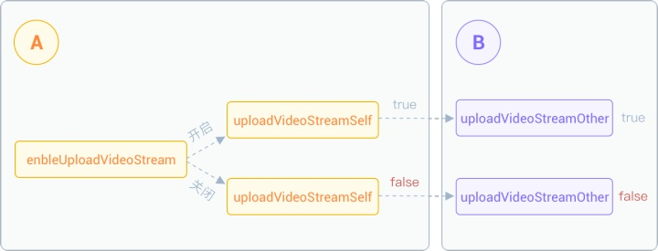

# Call Management

## Set the number of callers

Before initiating a call, you can set the maximum number of callers
using the maxCallNum and the default is 1. If it is a video call, the
maximum number can only be 1. If it is a voice call, the maximum number
is 2:

``````cpp
JCManager::shared()->call->maxCallNum = 1;
``````

When exceed the maximum number, outgoing calls will fail, incoming calls
will be automatically rejected.

## Control call process

### Call mute

Call the
[mute](/portal/reference/V2.1/windows/C++/html/class_j_c_call.html#a62d7c7454fae84422579e3a6275af243)
method to turn on/off mute, which depends on the current mute state of
the JCCallItem object. After the mute is turned on, another party will
not hear your voice.:

``````cpp
//Get active call object
JCCallItem* item = JCManager::shared()->call->getActiveCallItem();
//Get the mute state of the caller
bool isMute = item->getMute();
    if (item != NULL)
    {
    //Turn on/off mute
            JCManager::shared()->call->mute(item);
    }
``````

After calling this method, the
[onCallItemUpdate](/portal/reference/V2.1/windows/C++/html/class_j_c_call_callback.html#a1ba1c4f09c1f573d9fe2acb5057d6c18)
callback will be triggered.

-----

### Turn on/off call hold

Call the
[hold](/portal/reference/V2.1/windows/C++/html/class_j_c_call.html#aae536642d3d5c785c2ce7d9275f8653a)
method to maintain or release the call on the call object (this
operation cannot be performed when the call object is in the held
state), and the call hold needs to be turned on/off according to the
current call hold of the JCCallItem object state:

``````cpp
//Get active call object
JCCallItem* item = JCManager::shared()->call->getActiveCallItem();
//Get the call hold status of the caller
bool isHeld = item->getHold();
if (item != NULL)
    {
    //Turn on/off call hold
            JCManager::shared()->call->hold(item);
    }
``````

### Switch active call

Call the
[becomeActive](/portal/reference/V2.1/windows/C++/html/class_j_c_call.html#ae45d0744f3df39cc2c6dc3bb00bb7354)
method to switch between the held call and the ongoing call:

``````cpp
//Get a list of callers
std::list<JCCallItem*>* callItems = JCManager::shared()->call->getCallItems();
JCManager::shared()->call->becomeActive(callItems[1]);
``````

-----

### Turn on/off sending video streams

Call the
[enableUploadVideoStream](/portal/reference/V2.1/windows/C++/html/class_j_c_call.html#adcd6dd97b6737909ae0348a0e714d754)
method to turn on/off sending video streams, which will trigger
[onCallItemUpdate](/portal/reference/V2.1/windows/C++/html/class_j_c_call_callback.html#a1ba1c4f09c1f573d9fe2acb5057d6c18)
callback after being called:

``````cpp
JCCallItem* item = JCManager::shared()->call->getActiveCallItem();
    if (item != NULL)
    {
            JCManager::shared()->call->enableUploadVideoStream(item);
    }
``````

The specific mechanism of this interface is shown in the figure below:



- If A turns on sending video streams, the return value of A’s
    item-\>getUploadVideoStreamSelf() is true, and B uses the
    item-\>getUploadVideoStreamOther() method (the return value is true)
    to determine the sending status of A’s video streams.

- If A turns off sending video streams, the return value of A’s
    item-\>getUploadVideoStreamSelf() is false, and B uses the
    item-\>getUploadVideoStreamOther() method (the return value is
    false) to determine the sending status of A’s video streams. B will
    not see A’s image.

-----

### Related callbacks

During a call, if the call status changes, like turning on/off mute,
turning on/off call hold, switching active status, turning on/off
sending audio and video streams, etc., the
[onCallItemUpdate](/portal/reference/V2.1/windows/C++/html/class_j_c_call_callback.html#a1ba1c4f09c1f573d9fe2acb5057d6c18)
callback will be triggered:

``````cpp
void JCManager::onCallItemUpdate(JCCallItem* item, JCCallItemChangeParam changeParam)
{
    if (changeParam.mute) { // Turn on mute
        ...
    } else if (changeParam.sate) { // hang up
        ...
    } else if (changeParam.held) { // suspended
        ...
    } else if (changeParam.active) { // active state
        ...
    } else if (changeParam.netStatus) { // normal network status
        ...
    }
    ...
}
``````

-----

### Call recording

.You can record during a call. Trun on/off recording depends on the
current recording status. If recording is in progress or the call is
hanged or suspended, audio recording cannot be performed. The recording
status can be obtained through the
[getAudioRecord](/portal/reference/V2.1/windows/C++/html/class_j_c_call_item.html#ad8b5118a3c06a156e917f59625bcc73d)
method.

Call the
[audioRecord](/portal/reference/V2.1/windows/C++/html/class_j_c_call.html#a058fb76428f0a77f4bbbb8670eec2868)
method to turn on or off call recording:

``````cpp
void JCSampleDlg::OnBnClickedButton1Callrecordaudio()
{
    JCCallItem* item = JCManager::shared()->call->getActiveCallItem();
    if (item != NULL)
    {
        if (item->getAudioRecord())
        {
            //If it is recording, stop audio recording
            JCManager::shared()->call->audioRecord(item, false, "");
        }
        else
        {
            std::string filePath = "the file path of recording audio";
            //Start audio recording
            JCManager::shared()->call->audioRecord(item, true, filePath);
        }
    }
}
``````

When the recording is turned on/off, the recording status will change
and be reported through the
[onCallItemUpdate](/portal/reference/V2.1/windows/C++/html/class_j_c_call_callback.html#a1ba1c4f09c1f573d9fe2acb5057d6c18)
callback:

``````cpp
void JCManager::onCallItemUpdate(JCCallItem* item, JCCallItemChangeParam changeParam) {
}
``````

-----

### Send messages during a call

Call the
[sendMessage](/portal/reference/V2.1/windows/C++/html/class_j_c_call.html#a94e37abb045b901e1703b7534f4cc379)
method to realize the function of sending messages during a call:

``````cpp
JCCallItem* item = JCManager::shared()->call->getActiveCallItem();
JCManager::shared()->call->sendMessage(item, "text", "message content");
``````

When messages are received during a call, you will receive the
[onMessageReceive](/portal/reference/V2.1/windows/C++/html/class_j_c_call_callback.html#afb8281abd54bc8c18b77aadfe234a882)
callback:

``````cpp
void JCManager::onMessageReceive(const char* type, const char* content, JCCallItem* item)
{
    cout << "Call message received" << item->getDisplayName() << "type:" << type << endl;
}
``````
