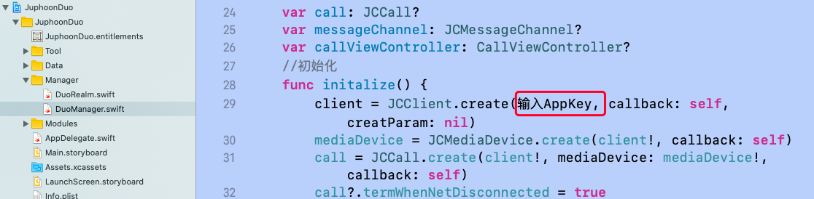

# Run through demo in one minute

To quickly experience the demo, please follow the steps below:

## Get AppKey

Please refer to [AppKey](https://developer.juphoon.com/cn/document/V2.1/create-application.php) to
get your AppKey.

::: tip

Applications created under the same account are interconnected and
belong to the same domain.

:::

## Download Demo source code

Please click
[Demo](http://developer.juphoon.com/portal/cn/downloadsdk/download_demo.php?filename=JuphoonDuo-iOS.tar.gz)
to download the Demo source code.

## Compile and run

### Unzip the downloaded Demo source code package and open the project

The unzipped directory is as follows:

JuphoonCommon is an independent module that the project relies on and
provides http account management functions.

### Set your own AppKey

Enter your AppKey in the code marked in the red box below

### Run Demo

Connect to the real iOS device, compile the JuphoonCommon project. After
successful compilation, JuphoonCommon.framework will be generated.

Open the JuphoonDuo project, click ‘General’, and then click the ‘+’
sign in the “Linked Frameworks and Libraries” column to add the
generated JuphoonCommon.framework to the project. As shown below:

Click `run` to compile and run the Demo program.

::: tip

The current RealmSwift version is compiled with the Swift 5.1 compiler,
and developers need to download the corresponding RealmSwift library
according to their current Xcode version to replace it.

:::

-----
