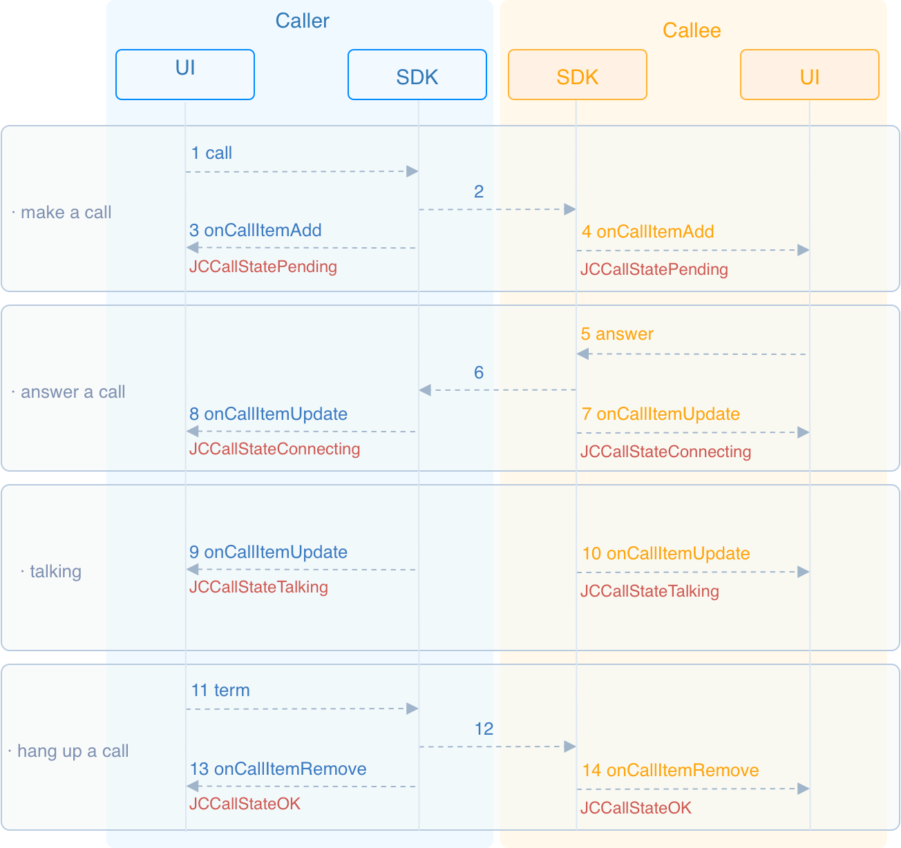

# Realize One-to-One Video Calling

This guide introduces how to achieve one-to-one video calling. API call
sequence for one-to-one call is as shown below:



## Initialize

Call
[JCMediaDevice.create()](https://developer.juphoon.com/portal/reference/V2.1/android/com/juphoon/cloud/JCMediaDevice.html#create-com.juphoon.cloud.JCClient-com.juphoon.cloud.JCMediaDeviceCallback-)
and
[JCCall.create()](https://developer.juphoon.com/portal/reference/V2.1/android/com/juphoon/cloud/JCCall.html#create-com.juphoon.cloud.JCClient-com.juphoon.cloud.JCMediaDevice-com.juphoon.cloud.JCCallCallback-)
to initialize the modules needed for one-to-one calling:

``````java
// Declare object
JCMediaDevice mMediaDevice;
JCCall mCall;

// Initialization function
public boolean initialize(Context context) {
    //1. Media class
    mMediaDevice = JCMediaDevice.create(mClient, new JCMediaDeviceCallback() {
        @Override
        public void onCameraUpdate() {

        }
        @Override
        public void onAudioOutputTypeChange(int i) {

        }
        @Override
        public void onRenderReceived(JCMediaDeviceVideoCanvas jcMediaDeviceVideoCanvas) {

        }
        @Override
        public void onRenderStart(JCMediaDeviceVideoCanvas jcMediaDeviceVideoCanvas) {

        }
    });
    //2. Call class
    mCall = JCCall.create(mClient, mMediaDevice, new JCCallCallback() {
        @Override
        public void onCallItemAdd(JCCallItem jcCallItem) {

        }

        @Override
        public void onCallItemRemove(JCCallItem jcCallItem, int i, String s) {

        }

        @Override
        public void onCallItemUpdate(JCCallItem jcCallItem, JCCallItem.ChangeParam changeParam) {

        }

        @Override
        public void onMessageReceive(String s, String s1, JCCallItem jcCallItem) {

        }

        @Override
        public void onMissedCallItem(JCCallItem jcCallItem) {

        }
    });
}
``````

## Media parameter setting

One-to-one video calls support the integration of smart hardware
devices, and media parameters need to be set before a call is initiated:

``````java
// Generate configuration parameters according to the mode
JCCall.MediaConfig mediaConfig = JCCall.MediaConfig.generateByMode(JCCall.MediaConfig.MODE_INTELLINGENT_HARDWARE_SMALL);
// Set media parameters
JCManager.shared.call.mediaConfig = mediaConfig;
``````

Juphoon provides three configuration modes for developers to choose, and
open related attributes for developers to make custom configuration. For
specific methods, please see <span class="xref std std-ref">Media
parameter setting</span> .

## Make a call

To call
[call()](https://developer.juphoon.com/portal/reference/V2.1/android/com/juphoon/cloud/JCCall.html#call-java.lang.String-boolean-java.lang.String-)
to initiate a video call, the parameters to be filled are:

- `userID` Fill in the user ID of the other party.

- `isVideo` Select whether to call a video call, and true means to
    make a video call, while false means to make a voice call.

- [extraParam()](https://developer.juphoon.com/portal/reference/V2.1/android/com/juphoon/cloud/JCCall.html#call-java.lang.String-boolean-java.lang.String-)
    is a custom pass-through string, which can be obtained through the
    [getExtraParam()](https://developer.juphoon.com/portal/reference/V2.1/android/com/juphoon/cloud/JCCallItem.html#getExtraParam--)
    method.

``````java
// Initiate a voice call
mCall.call(userID, isVideo, null);
``````

After the call is made, both the caller and the called party will
receive the callback
[onCallItemAdd()](https://developer.juphoon.com/portal/reference/V2.1/android/com/juphoon/cloud/JCCallCallback.html#onCallItemAdd-com.juphoon.cloud.JCCallItem-)
for the new call, and the call status will change to
[STATE\_PENDING](https://developer.juphoon.com/portal/reference/V2.1/android/com/juphoon/cloud/JCCall.html#STATE_PENDING)
at this time. You can perform logical operations by overriding
[onCallItemAdd()](https://developer.juphoon.com/portal/reference/V2.1/android/com/juphoon/cloud/JCCallCallback.html#onCallItemAdd-com.juphoon.cloud.JCCallItem-):

``````java
@Override
public void onCallItemAdd(JCCallItem item) {
    // Business logic
    if (item.direction == JCCall.DIRECTION_IN) {
        // If you are the called party
        ...
    }else{
        // If you are the caller
        ...
    }
}
``````

## Create local video images

After initiating a call, call the
[startSelfVideo()](https://developer.juphoon.com/portal/reference/V2.1/android/com/juphoon/cloud/JCCallItem.html#startSelfVideo-int-)
in the
[JCCallItem](https://developer.juphoon.com/portal/reference/V2.1/android/com/juphoon/cloud/JCCallItem.html)
class to open the local video preview. You need to fill in the parameter
[JCMediaDevice.RenderType](https://developer.juphoon.com/portal/reference/V2.1/android/com/juphoon/cloud/JCMediaDevice.html#RENDER_FULL_AUTO)
to select the rendering mode:

``````java
// 1. Initiate a video call
mCall.call("222", true, null);
// 2. Get the current active call
JCCallItem mCallItem = mCall.getActiveCallItem();
// 3. Open the local video preview (the adaptive mode)
mCallItem.startSelfVideo(JCMediaDevice.RENDER_FULL_AUTO);
``````

## Answer a call

The called party receives the
[onCallItemAdd()](https://developer.juphoon.com/portal/reference/V2.1/android/com/juphoon/cloud/JCCallCallback.html#onCallItemAdd-com.juphoon.cloud.JCCallItem-)
callback, and calls the
[getVideo()](https://developer.juphoon.com/portal/reference/V2.1/android/com/juphoon/cloud/JCCallItem.html#getVideo--)
in
[JCCallItem](https://developer.juphoon.com/portal/reference/V2.1/android/com/juphoon/cloud/JCCallItem.html)
in the callback to obtain the video attribute to determine whether it is
an incoming video call or a voice call, and then make corresponding
processing:

``````java
@Override
public void onCallItemAdd(JCCallItem item) {
    // 1. If it is a video call and is ringing
    if (item.getDirection() == JCCall.DIRECTION_IN && item.getVideo()) {
        // 2. Make corresponding processing, such as "ringing" on the interface
        ...
    }
}
``````

Call
[answer()](https://developer.juphoon.com/portal/reference/V2.1/android/com/juphoon/cloud/JCCall.html#answer-java.lang.String-boolean-java.lang.String-)
to answer the call:

``````java
mCall.answer(item, true);
``````

After the call is answered, the call status changes to
STATE\_CONNECTING.

::: tip

If you want to reject the call at this time, please call the interface
to hang up the call. In this case, after calling hang up, the call state
changes to STATE\_CANCELED.

:::

## Create remote video images

During a video call, you usually need to see other users. After the
called party answers the call, the two parties will establish a
connection. At this time, both the calling party and the called party
will receive the callback of call update (onCallItemUpdate), and the
call status will change to STATE\_TALKING.

Call
[startOtherVideo()](https://developer.juphoon.com/portal/reference/V2.1/android/com/juphoon/cloud/JCCallItem.html#startOtherVideo-int-)
in the
[JCCallItem](https://developer.juphoon.com/portal/reference/V2.1/android/com/juphoon/cloud/JCCallItem.html)
class to get the remote video image. The returned object is
[JCMediaDeviceVideoCanvas](https://developer.juphoon.com/portal/reference/V2.1/android/com/juphoon/cloud/JCMediaDeviceVideoCanvas.html):

``````java
@Override
public void onCallItemUpdate(JCCallItem item) {
    // If the peer is uploading a video streaming (uploadVideoStreamOther)
    // mRemoteCanvas is a JCMediaDeviceVideoCanvas object instance; please declare it before the method
    if (item.getState() == JCCall.STATE_TALKING && mRemoteCanvas == null && item.getUploadVideoStreamOther()) {
        // Get remote video image, renderId comes from the JCCallItem object
        JCMediaDeviceVideoCanvas mRemoteCanvas = item.startOtherVideo(JCMediaDevice.RENDER_FULL_CONTENT);
        ...
    }
}
``````

## Hang up a call

Both the calling party and the called party can hang up the call.

1. Call
    [getActiveCallItem()](https://developer.juphoon.com/portal/reference/V2.1/android/com/juphoon/cloud/JCCall.html#getActiveCallItem--)
    to get the currently active call object:

    ``````java
    mCall.getActiveCallItem();
    ``````

2. Call
    [term()](https://developer.juphoon.com/portal/reference/V2.1/android/com/juphoon/cloud/JCCall.html#term-com.juphoon.cloud.JCCallItem-int-java.lang.String-)
    to hang up the current active call:

    ``````java
    mCall.term(item, reason, description);
    ``````

Sample code:

``````java
// 1. Get the current active call
JCCallItem item = mCall.getActiveCallItem();
// 2. Hang up the current active call
mCall.term(item, JCCall.REASON_NONE, null);
``````

## Destroy local and remote video images

After the call is hung up, you receive the callback
[onCallItemRemove()](https://developer.juphoon.com/portal/reference/V2.1/android/com/juphoon/cloud/JCCallCallback.html#onCallItemRemove-com.juphoon.cloud.JCCallItem-int-java.lang.String-)
to remove the call, and the call state changes to STATE\_OK. At this
time, you need to call
[stopSelfVideo()](https://developer.juphoon.com/portal/reference/V2.1/android/com/juphoon/cloud/JCCallItem.html#stopSelfVideo--)
and
[stopOtherVideo()](https://developer.juphoon.com/portal/reference/V2.1/android/com/juphoon/cloud/JCCallItem.html#stopOtherVideo--)
to destroy the local and remote video images:

``````java
@Override
public void onCallItemRemove(JCCallItem item, @JCCall.CallReason int reason, String description) {
    // Destroy the local video image
    item.stopSelfVideo();
    // Destroy the local video image
    item.stopOtherVideo();
}
``````

## Standby power solution

For the problem of standby power consumption of the JC SDK on the watch,
Juphoon provides corresponding solutions. For details, please refer to:
[<span class="std std-ref">standby power
solution</span>](../../05_adv_func/Android/03_intelligent_hardware.html#id1).
