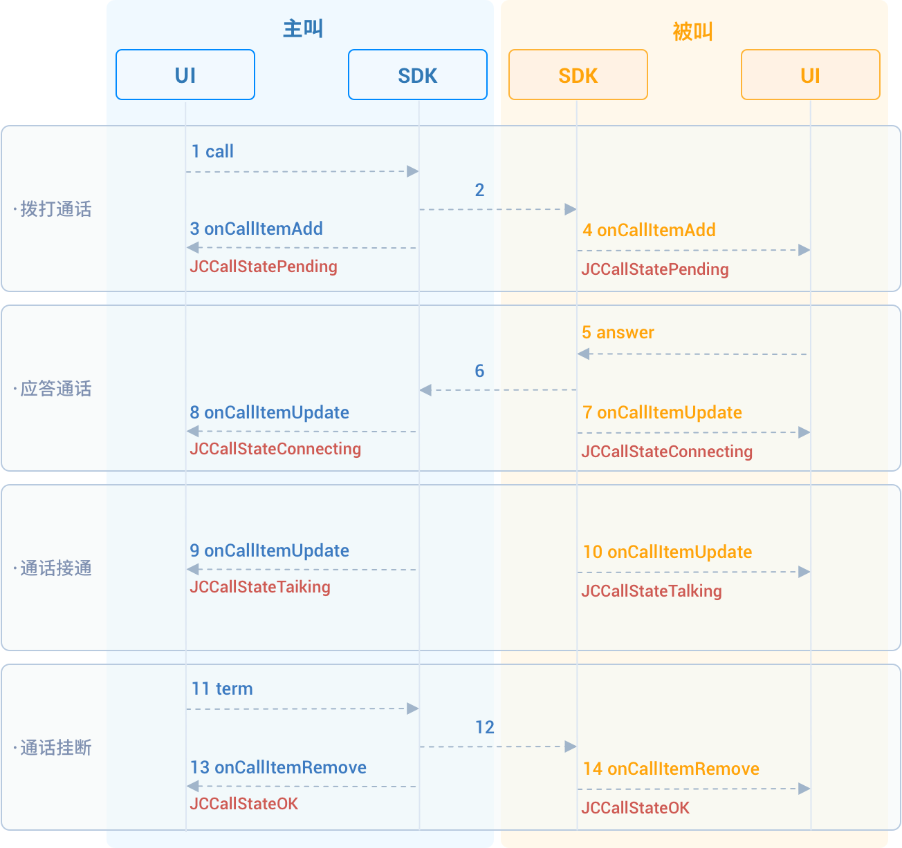

# 实现一对一通话

本章将介绍如何实现一对一视频通话，一对一通话的 API 调用时序见下图：



## 初始化

首先继承
[JCMediaDeviceCallback](https://developer.juphoon.com/portal/reference/V2.1/windows/C++/html/class_j_c_media_device_callback.html)
对象和
[JCCallCallback](https://developer.juphoon.com/portal/reference/V2.1/windows/C++/html/class_j_c_call_callback.html)
对象，并实现这两个对象中的纯虚函数。

``````cpp
class JCManager : public JCMediaDeviceCallback, public JCCallCallback
{
public:
  //新增通话回调
  virtual void onCallItemAdd(JCCallItem* item);
  //移除通话回调
  virtual void onCallItemRemove(JCCallItem* item, JCCallReason reason, const char* description);
  //通话状态更新回调
  virtual void onCallItemUpdate(JCCallItem* item, JCCallItemChangeParam changeParam);
  //通话中收到消息回调
  virtual void onMessageReceive(const char* type, const char* content, JCCallItem* item);
  //上报服务器拉取的未接来电
  virtual void onMissedCallItem(JCCallItem* item);
  //摄像头变化回调
  virtual void onCameraUpdate();

public:
    //JCMediaDevice 对象
    JCMediaDevice* mediaDevice;
    //JCCall 对象
    JCCall* call;
};
``````

::: tip

回调中的对象只能在该回调中使用，不能保存，上层可通过对应的方法获取通话对象。

:::

然后调用
[createJCMediaDevice](https://developer.juphoon.com/portal/reference/V2.1/windows/C++/html/_j_c_media_device_8h.html#a96a10766264f3c12af531b70cb9c9749)
和
[createJCCall](https://developer.juphoon.com/portal/reference/V2.1/windows/C++/html/_j_c_call_8h.html#a29320972a659ce8eaf4994576103a62c)
以初始化一对一通话需要的模块

``````cpp
bool JCManager::initialize()
{
  //1. 媒体类
  mediaDevice = createJCMediaDevice(client, this);
  //2. 通话类
  call = createJCCall(client, mediaDevice, this);
  return true;
}
``````

其中：

- JCMediaDevice create 方法中的 this 为
    [JCMediaDeviceCallback](https://developer.juphoon.com/portal/reference/V2.1/windows/C++/html/class_j_c_media_device_callback.html)
    的派生类，该类于将媒体设备相关的事件通知给上层。因此需要先创建 JCMediaDeviceCallback
    的派生类，然后在该派生类中实现 JCMediaDeviceCallback
    的纯虚函数。

- JCCall create 方法中的 this 为
    [JCCallCallback](https://developer.juphoon.com/portal/reference/V2.1/windows/C++/html/class_j_c_call_callback.html)
    的派生类，该类用于将通话相关的事件通知给上层。因此需要先创建 JCCallCallback 的派生类，然后在该派生类中实现
    JCCallCallback 的纯虚函数。

## 拨打通话

调用
[call](https://developer.juphoon.com/portal/reference/V2.1/windows/C++/html/class_j_c_call.html#a7b2d614431cb23e82ea18b77deb50549)
发起视频通话，需要填写的参数有：

- `userID` 填写对方的用户ID。

- `video` 选择是否为视频通话， true 表示拨打视频通话， false 表示拨打语音通话。

- `extraParam` 为自定义透传字符串， 可通过 JCCallItem 对象中的 extraParam 属性获得。

``````cpp
// 发起视频呼叫
void JCSampleDlg::OnBnClickedButtonVideocall()
{
  JCManager::shared()->call->call("userID", true, "自定义透传字符串");
}
``````

拨打通话后，主叫和被叫均会收到新增通话的回调
[onCallItemAdd](https://developer.juphoon.com/portal/reference/V2.1/windows/C++/html/class_j_c_call_callback.html#a2188f777767ca071c145d4a50687ce63)
，此时通话状态变为 JCCallStatePending 。你可以在上层实现
[onCallItemAdd](https://developer.juphoon.com/portal/reference/V2.1/windows/C++/html/class_j_c_call_callback.html#a2188f777767ca071c145d4a50687ce63)
方法并处理相关的逻辑。

示例代码:

``````cpp
// 收到新增通话回调
void JCManager::onCallItemAdd(JCCallItem* item) {
    // 业务逻辑
    if (item->direction == JCCallDirectionIn) {
        // 如果是呼入
        ...
    } else {
        // 如果是呼出
        ...
    }
}
``````

::: tip

回调中的对象只能在该回调中使用，不能保存，上层可通过对应的方法获取通话对象。
如果主叫想取消通话，可以直接转到挂断通话部分。调用挂断接口后，通话状态变为
JCCallStateCancel。

:::

## 创建本地视频画面

发起通话后，调用
[JCCallItem](https://developer.juphoon.com/portal/reference/V2.1/windows/C++/html/class_j_c_call_item.html)
类中的
[startSelfVideo](https://developer.juphoon.com/portal/reference/V2.1/windows/C++/html/class_j_c_call_item.html#a16fadea791640b31f32c6075f9233578)
方法创建本地视频画面，该方法会返回一个
[JCMediaDeviceVideoCanvas](https://developer.juphoon.com/portal/reference/V2.1/windows/C++/html/class_j_c_media_device_video_canvas.html)
对象。该对象用于将视频渲染到画布上，并管理渲染的方式。（调用此方法会打开摄像头）：

``````cpp
void JCManager::onCallItemAdd(JCCallItem* item) {
    JCMediaDeviceVideoCanvas* mCallLocalCanvas;
    if (mCallLocalCanvas == NULL && item->getUploadVideoStreamSelf())
                {
        // 创建本地视频画面
        mCallLocalCanvas = item->startSelfVideo((void*)mWndCallLocalVideo.m_hWnd, (JCMediaDeviceRenderMode)JCMediaDeviceRenderModeFullContent);
    }
}
``````

## 应答通话

1. 主叫发起呼叫成功后，被叫会收到
    [onCallItemAdd](https://developer.juphoon.com/portal/reference/V2.1/windows/C++/html/class_j_c_call_callback.html#a2188f777767ca071c145d4a50687ce63)
    回调，此时可以通过回调中的
    [JCCallItem](https://developer.juphoon.com/portal/reference/V2.1/windows/C++/html/class_j_c_call_item.html)
    对象中的 getVideo() 方法以及 getDirection() 方法判断是视频呼入还是语音呼入，从而做出相应的处理：

    ``````cpp
    void JCManager::onCallItemAdd(JCCallItem* item) {
        // 1. 如果是视频呼入且在振铃中
        if (item->getDirection() == JCCallDirectionIn && item->getState() == JCCallStatePending) {
            // 2. 做出相应的处理，如在界面上显示“振铃中”
             ...
        }
    }
    ``````

2. 调用
    [answer](https://developer.juphoon.com/portal/reference/V2.1/windows/C++/html/class_j_c_call.html#a8e44cef3051dba33a600042c7a5bf987)
    接听通话，**视频通话既可语音应答也可视频应答**：

    ``````cpp
    // 获取活跃通话
    JCCallItem* item = JCManager::shared()->call->getActiveCallItem();
    // 应答通话
    JCManager::shared()->call->answer(item, item->getVideo());
    ``````

通话应答后，通话状态变为 JCCallStateConnecting。

::: tip

如果被叫要在此时拒绝通话，可以直接转到挂断通话部分。调用挂断接口后，通话状态变为 JCCallStateCanceled。

:::

## 创建远端视频画面

被叫接听通话后，双方将建立连接，此时，主叫和被叫都将会收到通话更新的回调（onCallItemUpdate），通话状态变为
JCCallStateTalking。

调用
[JCCallItem](https://developer.juphoon.com/portal/reference/V2.1/windows/C++/html/class_j_c_call_item.html)
类中的
[startOtherVideo](https://developer.juphoon.com/portal/reference/V2.1/windows/C++/html/class_j_c_call_item.html#ac3ccc64bbb7ebebaa3ca3219b21d4ce9)
方法创建远端视频画面，该方法会返回一个
[JCMediaDeviceVideoCanvas](https://developer.juphoon.com/portal/reference/V2.1/windows/C++/html/class_j_c_media_device_video_canvas.html)
对象，该对象用于将视频渲染到画布上，并管理渲染的方式。

``````cpp
void JCManager::onCallItemUpdate(JCCallItem* item, JCCallItemChangeParam changeParam) {
    JCMediaDeviceVideoCanvas *mCallRemoteCanvas;
    // 如果对端在上传视频流（uploadVideoStreamOther）
    if (mCallRemoteCanvas == NULL && item->getUploadVideoStreamOther())
    {
      // 创建远端视频画面
      mCallRemoteCanvas = item->startOtherVideo(mWndCallRemoteVideo.m_hWnd, (JCMediaDeviceRenderMode)JCMediaDeviceRenderModeFullContent);
    }
}
``````

## 挂断通话

主叫或者被叫均可以挂断通话。

1. 首先调用
    [getActiveCallItem](https://developer.juphoon.com/portal/reference/V2.1/windows/C++/html/class_j_c_call.html#a4b5e8afc43bd12f877e37a97fec2ff7a)
    获取当前活跃的通话对象；

2. 当前活跃通话对象获取后，调用
    [term](https://developer.juphoon.com/portal/reference/V2.1/windows/C++/html/class_j_c_call.html#a168fd884512bfd5451ffa5fac83c598b)
    挂断当前活跃通话：

    ``````cpp
    void JCSampleDlg::OnBnClickedButtonTermcall()
    {
      // 1. 获取当前活跃通话
      JCCallItem* item = JCManager::shared()->call->getActiveCallItem();
      if (item != NULL)
      {
        // 2. 挂断当前活跃通话
        JCManager::shared()->call->term(item, JCCallReasonNone, "term");
      }
    }
    ``````

## 销毁本地和远端视频画面

通话挂断后，会触发
[JCCallCallback](https://developer.juphoon.com/portal/reference/V2.1/windows/C++/html/class_j_c_call_callback.html)
中的 onCallItemRemove（通话移除回调），通话状态变为 JCCallStateOk，此时您需要调用
[stopSelfVideo](https://developer.juphoon.com/portal/reference/V2.1/windows/C++/html/class_j_c_call_item.html#a8d6f702c5e477f60df2e671e9392ce76)
和
[stopOtherVideo](https://developer.juphoon.com/portal/reference/V2.1/windows/C++/html/class_j_c_call_item.html#a1c58b54ed0f4aac1bef8383ede0f7651)
方法销毁本地和远端视频画面：:

``````cpp
void JCManager::onCallItemRemove(JCCallItem* item, JCCallReason reason, const char* description) { //移除通话回调
  // 本端视频销毁
  if (mCallLocalCanvas != NULL && !item->getUploadVideoStreamSelf())
  {
    item->stopSelfVideo();
    mCallLocalCanvas = NULL;
    mWndCallLocalVideo.Invalidate();
  }
  // 远端视频销毁
  if (mCallRemoteCanvas != NULL && !item->getUploadVideoStreamOther())
  {
    item->stopOtherVideo();
    mCallRemoteCanvas = NULL;
    mWndCallRemoteVideo.Invalidate();
  }
}
``````

至此，你就完成了基础的一对一视频通话功能。
