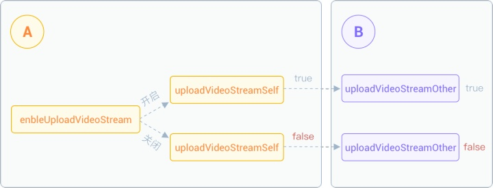

# Call Management

## Set the number of callers

Before initiating a call, you can set the maximum number of people using
the maxCallNum and the default is 1. If it is a video call, the maximum
number of people can only be 1. If it is a voice call, the maximum
number of people is 2:

``````cpp
JCManager::shared()->call->maxCallNum = 1;
``````

When the call number exceeds the maximum number, the outgoing call will
fail, and the incoming call will be automatically rejected.

## Control call process

### Call mute

Call the
[mute](https://developer.juphoon.com/portal/reference/V2.1/windows/C++/html/class_j_c_call.html#a62d7c7454fae84422579e3a6275af243)
method to turn on/off mute. Turn on/off mute must be determined
according to the current mute state of the JCCallItem object. After the
mute is turned on, the other party will not hear your voice.:

``````cpp
//Get active call object
JCCallItem* item = JCManager::shared()->call->getActiveCallItem();
//Get the mute state of the caller
bool isMute = item->getMute();
    if (item != NULL)
    {
    //Turn on/off mute
            JCManager::shared()->call->mute(item);
    }
``````

After calling this method, the
[onCallItemUpdate](https://developer.juphoon.com/portal/reference/V2.1/windows/C++/html/class_j_c_call_callback.html#a1ba1c4f09c1f573d9fe2acb5057d6c18)
callback will be triggered.

-----

### Turn on/off call hold

Call the
[hold](https://developer.juphoon.com/portal/reference/V2.1/windows/C++/html/class_j_c_call.html#aae536642d3d5c785c2ce7d9275f8653a)
method to hold or release the call on the call object (this operation
cannot be performed when the call object is in the held state), and the
call hold needs to be turned on or off according to the current call
hold of the JCCallItem object State to decide:

``````cpp
//Get active call object
JCCallItem* item = JCManager::shared()->call->getActiveCallItem();
//Get the call hold status of the caller
bool isHeld = item->getHold();
if (item != NULL)
    {
    //Turn on/off call hold
            JCManager::shared()->call->hold(item);
    }
``````

### Switch active call

Call the
[becomeActive](https://developer.juphoon.com/portal/reference/V2.1/windows/C++/html/class_j_c_call.html#ae45d0744f3df39cc2c6dc3bb00bb7354)
method to switch between the held call and the ongoing call:

``````cpp
//Get the list of callers
std::list<JCCallItem*>* callItems = JCManager::shared()->call->getCallItems();
JCManager::shared()->call->becomeActive(callItems[1]);
``````

-----

### Turn on/off sending video streams

Call the
[enableUploadVideoStream](https://developer.juphoon.com/portal/reference/V2.1/windows/C++/html/class_j_c_call.html#adcd6dd97b6737909ae0348a0e714d754)
method to turn on/off sending video streams, which will trigger
[onCallItemUpdate](https://developer.juphoon.com/portal/reference/V2.1/windows/C++/html/class_j_c_call_callback.html#a1ba1c4f09c1f573d9fe2acb5057d6c18)
callback after being called:

``````cpp
JCCallItem* item = JCManager::shared()->call->getActiveCallItem();
    if (item != NULL)
    {
            JCManager::shared()->call->enableUploadVideoStream(item);
    }
``````

The specific mechanism of this interface is shown in the figure below:



- If A starts sending video streams, the return value of A’s
    item-\>getUploadVideoStreamSelf() is true, and B uses the
    item-\>getUploadVideoStreamOther() method (the return value is true)
    to determine the sending status of A’s video streams.

- If A closes sending video streams, the return value of A’s
    item-\>getUploadVideoStreamSelf() is false, and B uses the
    item-\>getUploadVideoStreamOther() method (the return value is
    false) to determine the sending status of A’s video streams. B will
    not see A’s image.

-----

### Related callbacks

During a call, if the call status changes, such as turning on/off mute,
turning on/off call hold, switching between active status, turning
on/off audio and video streaming, etc., the
[onCallItemUpdate](https://developer.juphoon.com/portal/reference/V2.1/windows/C++/html/class_j_c_call_callback.html#a1ba1c4f09c1f573d9fe2acb5057d6c18)
callback will be triggered:

``````cpp
void JCManager::onCallItemUpdate(JCCallItem* item, JCCallItemChangeParam changeParam)
{
    if (changeParam.mute) { // Turn on mute
        ...
    } else if (changeParam.sate) { // When call status changed
        ...
    } else if (changeParam.held) { // When held changed
        ...
    } else if (changeParam.active) { // When active state changed
        ...
    } else if (changeParam.netStatus) { // When network status changed
        ...
    }
    ...
}
``````

-----

### Call recording

.You can record during a call. The current recording status determines
to turn on or off recording. If recording is in progress or the call is
hanged or suspended, audio recording cannot be performed. The recording
status can be obtained through the
[getAudioRecord](https://developer.juphoon.com/portal/reference/V2.1/windows/C++/html/class_j_c_call_item.html#ad8b5118a3c06a156e917f59625bcc73d)
method.

Call the
[audioRecord](https://developer.juphoon.com/portal/reference/V2.1/windows/C++/html/class_j_c_call.html#a058fb76428f0a77f4bbbb8670eec2868)
method to turn on or off call recording:

``````cpp
void JCSampleDlg::OnBnClickedButton1Callrecordaudio()
{
    JCCallItem* item = JCManager::shared()->call->getActiveCallItem();
    if (item != NULL)
    {
        if (item->getAudioRecord())
        {
            //If it is recording, stop audio recording
            JCManager::shared()->call->audioRecord(item, false, "");
        }
        else
        {
            std::string filePath = "Recording audio file path";
            //Start audio recording
            JCManager::shared()->call->audioRecord(item, true, filePath);
        }
    }
}
``````

When the recording is turned on or off, the recording status will change
and be reported through the
[onCallItemUpdate](https://developer.juphoon.com/portal/reference/V2.1/windows/C++/html/class_j_c_call_callback.html#a1ba1c4f09c1f573d9fe2acb5057d6c18)
callback:

``````cpp
void JCManager::onCallItemUpdate(JCCallItem* item, JCCallItemChangeParam changeParam) {
}
``````

-----

### Send messages during a call

Call the
[sendMessage](https://developer.juphoon.com/portal/reference/V2.1/windows/C++/html/class_j_c_call.html#a94e37abb045b901e1703b7534f4cc379)
method to realize the function of sending messages during a call:

``````cpp
JCCallItem* item = JCManager::shared()->call->getActiveCallItem();
JCManager::shared()->call->sendMessage(item, "text", "message content");
``````

When a message is received during a call, you will receive the
[onMessageReceive](https://developer.juphoon.com/portal/reference/V2.1/windows/C++/html/class_j_c_call_callback.html#afb8281abd54bc8c18b77aadfe234a882)
callback:

``````cpp
void JCManager::onMessageReceive(const char* type, const char* content, JCCallItem* item)
{
    cout << "Call message received" << item->getDisplayName() << "type:" << type << endl;
}
``````
