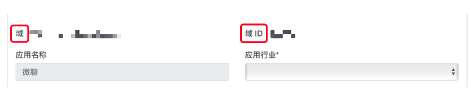

# FAQ

`Log in`

1. Is there a user name required when logging in? What is the
    specification of user name?

<!-- end list -->

- User name with English numbers and’+’’-‘’\_’’.’,’-‘’\_’’.’ cannot be
    used as the first character, and the length should not exceed 64
    characters.

<!-- end list -->

2. How do customers use their own account system in the mode of no
    authentication?

<!-- end list -->

- In the mode of no authentication, if customers want to use their own
    account system, but do not want to use their account as the server’s
    account identifier, they can create a server-side account identifier
    corresponding to their own account system as their own Id. If your
    own account system is mobile phone number: 150…, the server-side
    account system can be an identifier such as ABC.

<!-- end list -->

3. How to judge whether the connection with the server has been
    successful according to the login status?

<!-- end list -->

- You can check the login status changes through the
    onClientStateChange callback in the JCClient class.

-----

`Account query`

If you encounter the problems of query status, you can check the server
address at first to ensure that the server address and domain are
consistent. For the setting of the server address, refer to
<span class="xref std std-ref">Login Environment settings</span>.

-----

`One-to-One calls`

1. During a one-to-one call, the opposite party exits abnormally
    (program gets killed, network disconnection). How long will the
    local end hang up?

<!-- end list -->

- After 20 seconds, the peer is killed; the local end will hang up in
    20 seconds; the upper layer will receive notifyCallItemRemove; the
    reason is term\_by\_self, and the netstatus status in the callitem
    is -3.

<!-- end list -->

2. How long is the call waiting time now?

<!-- end list -->

- 2 minutes in signaling mode. If timeout, the server will
    automatically hang up the call.

<!-- end list -->

3. A calls B, and B is disconnected from the network at this time, then
    A hangs up, and the network of B is restored. At this time, B will
    pop up the call interface and end immediately. What is the reason?
    Can it be avoided?

<!-- end list -->

- The reason for this phenomenon is that after the B network is
    restored, the message of call establishment and the message of
    ending call are continuously received.

- When A calls B, the messae of call establishment is sent to the
    server, and when A hangs up, the message of ending call is sent,
    instead of canceling the previous message (the server does not have
    the function of canceling the previous message). These messages will
    be cached on the server for a period of time (60 seconds). If B
    recovers the network within the buffer time, it will receive the
    cached message. If B recovers from the network outside the buffer
    time, the cached messages have been deleted, B will not receive
    these messages, and the call interface will not pop up and end
    immediately.

- One way to avoid this phenomenon is to delay the display of the call
    interface after receiving the message of call establishment for a
    period of time (for example, 0.5 seconds).If the message to end the
    call is received immediately, the call interface will not be
    displayed.

<!-- end list -->

4. The problems of call status

<!-- end list -->

- After calling the call interface to initiate a call, the status of
    the incoming call is pending. After calling the answer interface,
    the call status changes to connecting, and it changes to talking
    status after being connected.

<!-- end list -->

5. The callback description of onCallItemRemove

<!-- end list -->

- When the onCallItemRemove callback is received, the callItem is not
    necessarily the current call, and all current calls can be obtained
    through the getCallItems method.

<!-- end list -->

6. About the use of Mtc\_CallDbSetFullScreen(bool)

<!-- end list -->

- Calling this method will affect the **Local Video Request
    Resolution**, the default setting is true

Prerequisites:

>
>
>
>
> 1. The default request on this end is 640\*360 resolution;
>
> 2. The local screen resolution is 360\*360.
>
>

If set to true, the requested resolution will be adjusted to 360\*360.

If it is set to false, the requested resolution is still 640\*360.

7. About the use of Mtc\_CallDbSetAdaptiveAspect(bool)

<!-- end list -->

- Calling this method will affect the video **Sending Resolution**,
    and the default is false

Prerequisites:

>
>
>
>
> 1. camera capture is 1280\*720 (16:9);
>
> 2. After consultation, a 320\*240 (4:3) image needs to be sent to the
>     other party.
>
>

If set to true, the sending video will be sent according to the ratio
(16:9) collected by the camera (the video data received by the peer is
not according to the consultated resolution).

If set to false, the sending video will be sent according to the video
ratio (4:3) that needs to be sent after conslutation (crop the image
collected by the camera).

8. Collect video data by yourself for transmission (the smart device
    SDK does not have this interface) Only care about data transmission

<!-- end list -->

- You can set as follows:

>
>
>
>
> startVideoFile - setVideoFileFrame - stopVideoFile
>
> Or need to use Juphoon rendering :
>
> startVideo(access videoSource value via getVideoFileId) -
> setVideoFileFrame - stopVideo
>
>

Supported formats:

>
>
>
>
> I420, IYUV, RGB24, ABGR, ARGB, ARGB444, RGB565, ARGB1555, YUY2, YV12,
> UYVY, MJPG, NV21, NV12, BGRA
>
>

Among them, The interface of setVideoFileFrame is as follows:

``````java
/**
 * Capture video frame by frame
 *
 * When in H264 format
 * 1. If it is a keyframe, the data of 0x67 0x68 0x41 needs to be passed in as a frame
 * 2. The keyframe should be passed in at a fixed interval, such as 5 seconds, otherwise the video may not be displayed in the peer for a few seconds at the beginning.
 *
 * @param data image binary data
 * @param format   video pixel format
 * @param width    width
 * @param height   height
 * @param angle    multiples of 90
 * @param mirror   0 does not mirror, and 1 mirrors left and right
 * @param keyFrame only need to set key frame in h264 mode
 */
public abstract void setVideoFileFrame(byte[] data, @VideoPixelFormat int format, int width, int height, int angle, int mirror, boolean keyFrame);
``````

**The description of H264:**

Since the bottom layer of the media defaults to the off state of H264 at
the beginning, setVideoFrame must be called before connecting when the
program starts at first, otherwise it will cause the peer to not receive
the image.

Solution 1: Adjust early.

Solution 2: Call the following code after SDKInitialize succeeds:

``````java
mediaDevice.startVideoFile();
byte[] buf = new byte[10];
buf[0] = 0x5;
mediaDevice.setVideoFileFrame(buf, JCMediaDevice.H264, 1, 1, 0, 0, false);
mediaDevice.stopVideoFile();
``````

-----

`Problems that need to be explained in the conference function`

1. The maximum number of participants in the conference is 16.

2. Since CDN live streaming, Webrtc, recording, etc. are all counted as
    members of conferences, you need to pay attention when calculating
    the number of people.

3. 示When joining a meeting, the same channel ID in the same area can
    connect even if the AppKey is different. Among them, the area is
    means the country (geographical location), and the domain refers to
    the domain name of the server, as shown in the following figure:



If the participants are not in the same area, they cannot communicate
even if the channel ID is the same. The default area of the program is
China. For example, user A and User B in China can join the conference
under the same channel ID. If another member C is abroad, even if he/she
has the same channel ID as A and B, he/she cannot join the conference.
