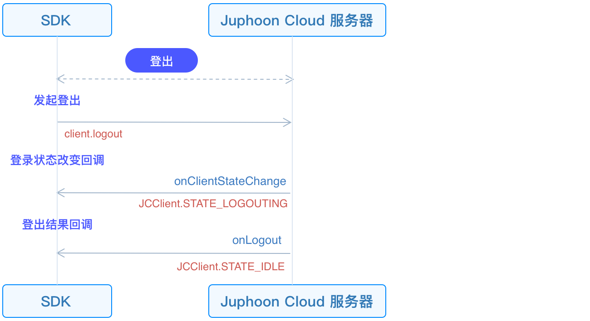

# Log In

This guide introduces how to initialize JC SDK and log in.

## Initialize

Call
[JCClient.create()](https://developer.juphoon.com/portal/reference/V2.1/android/com/juphoon/cloud/JCClient.html#create-android.content.Context-java.lang.String-com.juphoon.cloud.JCClientCallback-com.juphoon.cloud.JCClient.CreateParam-)
on the main thread to create a
[JCClient](https://developer.juphoon.com/portal/reference/V2.1/android/com/juphoon/cloud/JCClient.html)
instance object. Pass in the obtained `appKey` to initialize the
[JCClient](https://developer.juphoon.com/portal/reference/V2.1/android/com/juphoon/cloud/JCClient.html):

``````java
// JCClient object
JCClient mClient;

// Initialization function
public boolean initialize(Context context) {
    // Login class
    mClient = JCClient.create(context, "User appKey", new JCClientCallback() {
        @Override
        public void onLogin(boolean result, int reason) {

        }
        @Override
        public void onLogout(int reason) {

        }
        @Override
        public void onClientStateChange(int state, int oldState) {

        }
    }, null);
    // Get the initialization state (used to judge the initialization state)
    mInit = mClient.getState() == JCClient.STATE_IDLE;
    return mInit;
}
``````

After successful initialization, the state of JCClient.ClientState
changes from JCClientStateNotInit (not initialized) to JCClientStateIdle
(not logged in).

## Initiate login

After the SDK is initialized, login integration is possible. The call
flow of the login interface is as follows:


First create a
[JCClient.LoginParam](https://developer.juphoon.com/portal/reference/V2.1/android/com/juphoon/cloud/JCClient.LoginParam.html)
instance to adjust the login parameters. Then call
[login()](https://developer.juphoon.com/portal/reference/V2.1/android/com/juphoon/cloud/JCClient.html#login-java.lang.String-java.lang.String-com.juphoon.cloud.JCClient.LoginParam-)
to initiate login:

``````java
JCClient.LoginParam loginParam = new JCClient.LoginParam();
// 1. Set the server environment.
loginParam.serverAddress = "Server address";
// 2. Initiate login
mClient.login(userID, password, loginParam);
``````

::: tip

1. Environment settings:

      - Domestic environment `http:cn.router.justalkcloud.com:8080`
        (Default)

      - International environment
        `http:intl.router.justalkcloud.com:8080`

2. userID is English, numbers and `+` `-` `_` `.` , case-insensitive,
    the length should not exceed 64 characters, `-` `_` `.` cannot be
    the first character.

3. password the length should not exceed 128 characters.

4. When calling this interface returns true, it only means that the
    interface is called successfully, not that the login is successful.
    The result of the login will be reported through the onLogin
    callback.

:::

After the interface is successfully called, the login state change
callback
[onClientStateChange()](https://developer.juphoon.com/portal/reference/V2.1/android/com/juphoon/cloud/JCClientCallback.html#onClientStateChange-int-int-)
will be triggered first. You can perform logical operations by
overriding
[onClientStateChange()](https://developer.juphoon.com/portal/reference/V2.1/android/com/juphoon/cloud/JCClientCallback.html#onClientStateChange-int-int-):

``````java
@Override
public void onClientStateChange(@JCClient.ClientState int state, @JCClient.ClientState int oldState) {
     if (state == JCClient.STATE_IDLE) { // Not logged in
        ...
    } else if (state == JCClient.STATE_LOGINING) { // Logging in
        ...
    } else if (state == JCClient.STATE_LOGINED) { // Login successful
        ...
    } else if (state == JCClient.STATE_LOGOUTING) { // Logout
        ...
    }
}
``````

Then trigger the
[onLogin()](https://developer.juphoon.com/portal/reference/V2.1/android/com/juphoon/cloud/JCClientCallback.html#onLogin-boolean-int-)
callback. You can perform logical operations by overriding
[onLogin()](https://developer.juphoon.com/portal/reference/V2.1/android/com/juphoon/cloud/JCClientCallback.html#onLogin-boolean-int-):

``````java
@Override
public void onLogin(boolean result, @JCClient.ClientReason int reason) {
    if (result) {// Login successful
        ...
    }
    if (reason == REASON_AUTH) {// Account password is wrong
        ...
    }
}
``````

After the login is successful, the SDK will automatically maintain the
connection status with the server until the user actively calls the
logout interface, or the device is logged out because the account is
logged in on another device. Login success/failure reason Refer to
[JCClient.ClientReason](https://developer.juphoon.com/portal/reference/V2.1/android/com/juphoon/cloud/JCClient.html#REASON_ANOTHER_DEVICE_LOGINED).

## Log out

The call flow of the logout interface is as follows:



Call
[logout()](https://developer.juphoon.com/portal/reference/V2.1/android/com/juphoon/cloud/JCClient.html#logout--)
to initiate logout. More logout reasons reference:
[JCClient.ClientReason](https://developer.juphoon.com/portal/reference/V2.1/android/com/juphoon/cloud/JCClient.html#REASON_ANOTHER_DEVICE_LOGINED):

``````java
@Override
public void onLogout(@JCClient.ClientReason int reason) {
    if (reason == REASON_SERVER_LOGOUT) {// Force logout
        ...
    }
}
``````
