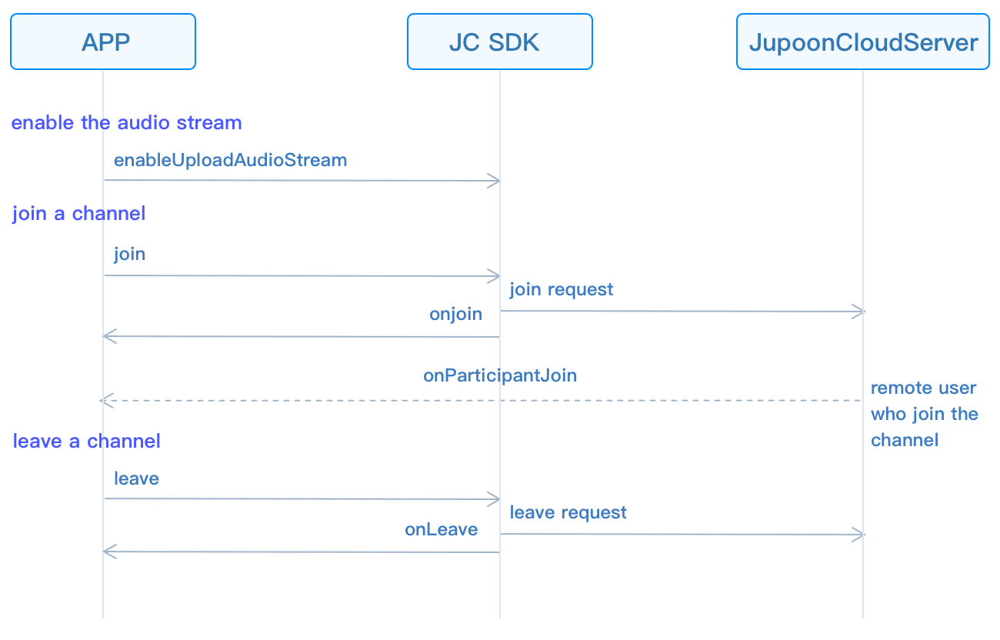

# Realize group voice calling

This guide introduces how to implement group voice calling. The API call
sequence of group voice calls is shown in the figure below:



## Initialize

Extend the
[JCMediaChannelCallback](https://developer.juphoon.com/portal/reference/V2.1/windows/C++/html/class_j_c_media_channel_callback.html)
object and
[JCMediaDeviceCallback](https://developer.juphoon.com/portal/reference/V2.1/windows/C++/html/class_j_c_media_device_callback.html)
object, and implement the pure virtual functions in these two objects.

``````cpp
class JCManager : public JCMediaDeviceCallback, public JCMediaChannelCallback
{
public:

    //The callback of MediaChannel state change
    virtual void onMediaChannelStateChange(JCMediaChannelState state, JCMediaChannelState oldState);
    //The callback of channel property change
    virtual void onMediaChannelPropertyChange(JCMediaChannelPropChangeParam propChangeParam);
    //The callback of joining ChannelReason
    virtual void onJoin(bool result, JCMediaChannelReason reason, const char* channelId);
    //The callback of leaving ChannelReason
    virtual void onLeave(JCMediaChannelReason reason, const char* channelId);
    //The callback of channel Stop result
    virtual void onStop(bool result, JCMediaChannelReason reason);
    //The callback of channel Query result
    virtual void onQuery(int operationId, bool result, JCMediaChannelReason reason, JCMediaChannelQueryInfo* queryInfo);
    //The callback of ParticipantJoin
    virtual void onParticipantJoin(JCMediaChannelParticipant* participant);
    //The callback of ParticipantLeft
    virtual void onParticipantLeft(JCMediaChannelParticipant* participant);
    //The callback of ParticipantUpdate
    virtual void onParticipantUpdate(JCMediaChannelParticipant* participant, JCMediaChannelParticipant::ChangeParam changeParam);
    //This callback triggers when messages are received in the channel
    virtual void onMessageReceive(const char* type, const char* content, const char* fromUserId);
    //The callback of InviteSipUserResult
    virtual void onInviteSipUserResult(int operationId, bool result, JCMediaChannelReason reason);
    //The volume change of Participants
    virtual void onParticipantVolumeChange(JCMediaChannelParticipant* participant);

public:
    //mediaDevice object
    JCMediaDevice* mediaDevice;
    //mediaChannel object
    JCMediaChannel* mediaChannel;
};
``````

Call
[createJCMediaDevice](https://developer.juphoon.com/portal/reference/V2.1/windows/C++/html/_j_c_media_device_8h.html#a96a10766264f3c12af531b70cb9c9749)
and
[createJCCall](https://developer.juphoon.com/portal/reference/V2.1/windows/C++/html/_j_c_call_8h.html#a29320972a659ce8eaf4994576103a62c)
to initialize the modules needed for group video calls:

``````cpp
//Initialize
bool JCManager::initialize()
{
    //1. Media class
    mediaDevice = createJCMediaDevice(client, this);
    //1. mediaChannel class
    mediaChannel = createJCMediaChannel(client, mediaDevice, this);
    return true;
}
``````

Among them:

- This in the JCMediaDevice create method is a derived class of
    [JCMediaDeviceCallback](https://developer.juphoon.com/portal/reference/V2.1/windows/C++/html/class_j_c_media_device_callback.html)
    , which is used to notify the upper layer of media device-related
    events. Therefore, you need to create a derived class of
    JCMediaDeviceCallback, and then implement the pure virtual function
    of JCMediaDeviceCallback in the derived class.

- This in the JCMediaChannel create method is a derived class of
    [JCMediaChannelCallback](https://developer.juphoon.com/portal/reference/V2.1/windows/C++/html/class_j_c_media_channel_callback.html)
    , which is used to notify related events in the channel to the upper
    layer. Therefore, you need to create a derived class of
    JCMediaChannelCallback, and then implement the pure virtual function
    of JCMediaChannelCallback in the derived class.

::: tip

The object in the callback can only be used in the callback and cannot
be saved. The upper layer can obtain the call object through the
corresponding method.

:::

## Join a channel

JC SDK does not upload local audio streams by default, so if you need to
enter the meeting to hear each other’s voices, you need to pre-open the
upload logo of audio stream before joining the channel:

1. Call
    [enableUploadAudioStream](https://developer.juphoon.com/portal/reference/V2.1/windows/C++/html/class_j_c_media_channel.html#a2b08d87b38fe2fd7a394e2786241cc4c)
    to enable audio streaming:

    ``````cpp
    // Turn on audio streaming
    JCManager::shared()->mediaChannel->enableUploadAudioStream(true);
    ``````

::: tip

This interface can be called before joining the channel, or after
joining the channel. The differences between the two circumstances are
as follows.

If it is called before joining the channel, it only turns on or off the
“Upload Audio”, but not send data. When joining the channel
successfully, it will determine whether to upload audio data according
to the value set by enableUploadAudioStream. At the same time, other
members in the channel receive the status change callback
(onParticipantUpdate) of the member “whether to upload audio”.

If called after joining the channel, it will turn on or off sending
local audio stream data, and the server will also determine whether to
upload audio data according to the value set by enableUploadAudioStream.
At the same time, other members in the channel will receive the state
change callback (onParticipantUpdate) of the member “whether to upload
audio”.

In addition, this method can also implement the function of turning
on/off mute. When the enable value is false, the local audio stream will
be stopped, and you can hear other members’ voices, but other members
will not hear your voice. Thus, the mute function has been realized.

:::

Since the SDK uploads video streams by default, you need to turn off the
upload video stream logo before joining the channel for voice calls:

``````cpp
// Turn off uploading video stream
JCManager::shared()->mediaChannel->enableUploadVideoStream(false);
``````

2. Call the
    [join](https://developer.juphoon.com/portal/reference/V2.1/windows/C++/html/class_j_c_media_channel.html#acfdb1da52955cf8b01d95527eb28890b)
    method to join the channel. You need to pass in the following
    parameters in this method:

<!-- end list -->

- channelIdOrUri: Channel ID or channel Uri. When uriMode in param is
    set to true, it means channel Uri, and others mean channel ID. Users
    with the same channel ID or Uri will enter the same channel.

- joinParam: Join parameters, if not, fill in NULL. See
    [JCMediaChannelJoinParam](https://developer.juphoon.com/portal/reference/V2.1/windows/C++/html/class_j_c_media_channel_join_param.html)
    object for details.

``````cpp
// Join a channel
JCManager::shared()->mediaChannel->join("channel ID", NULL);
``````

3. Receive
    [onJoin](https://developer.juphoon.com/portal/reference/V2.1/windows/C++/html/class_j_c_media_channel_callback.html#a430bd78b28e189ee3c9564ddb7db213d)
    callback after joining a channel:

    ``````cpp
    // The callback of joining ChannelReason
    void JCManager::onJoin(bool result, JCMediaChannelReason reason, const char* channelId)
    {
        if (result) {
        //the logic of successful joining in
        ...
        } else {
        //the logic of failed joining in
        ...
        }
    }
    ``````

## Leave a channel

Call the
[leave](https://developer.juphoon.com/portal/reference/V2.1/windows/C++/html/class_j_c_media_channel.html#a93c19137044fec1568f73f1f6dbfee84)
method to leave the current channel:

``````cpp
JCManager::shared()->mediaChannel->leave();
``````

After leaving the channel, they receive the
[onLeave](https://developer.juphoon.com/portal/reference/V2.1/windows/C++/html/class_j_c_media_channel_callback.html#a18bc4fae89f0d56fb849075f1603ac71)
callback, and other members receive the
[onParticipantLeft](https://developer.juphoon.com/portal/reference/V2.1/windows/C++/html/class_j_c_media_channel_callback.html#a5888058878f3aaa382b3ede94228a6e8)
callback at the same time:

``````cpp
// The callback of leaving the channel
void JCManager::onLeave(JCMediaChannelReason reason, const char* channelId);
{
    //The logic of leaving a channel
}
``````

## Destroy a channel

If you want to destroy a channel, you can call the following interface,
and all members will be quit:

``````cpp
// End a channel
JCManager::shared()->mediaChannel->stop();
``````

After the channel is stopped, the member that initiated the termination
receives the
[onStop](https://developer.juphoon.com/portal/reference/V2.1/windows/C++/html/class_j_c_media_channel_callback.html#a61a1d5a81563d34f80e70541a114a74a)
callback, and other members receive the
[onLeave](https://developer.juphoon.com/portal/reference/V2.1/windows/C++/html/class_j_c_media_channel_callback.html#a18bc4fae89f0d56fb849075f1603ac71)
callback at the same time. Please refer to
[JCMediaChannelReason](https://developer.juphoon.com/portal/reference/V2.1/windows/C++/html/_j_c_media_channel_constants_8h.html#a24a2154e4bb2db63c75b31cd2b021fc3)
for the enumeration value of the reason for failure.

``````cpp
void JCManager::onStop(bool result, JCMediaChannelReason reason)
{
    //The pocess logic of ending a channel
}
``````

Now, you have completed the basic function of group voice calling.
