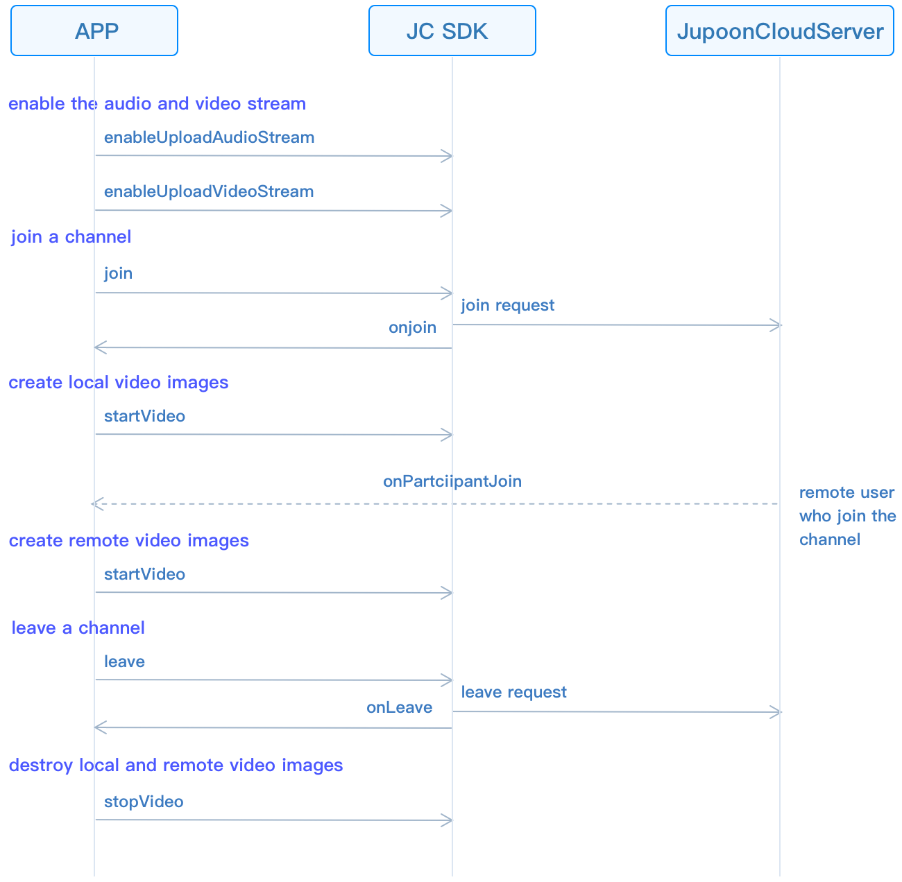

# Realize group video calling

This guide introduces how to implement goup audio and video calls. The
API call sequence of group video calls is shown in the figure below:



## Initialize

Call
[JCMediaDevice.create()](/portal/reference/V2.1/windows/html/cb59bc27-6528-9dbf-c996-de857096f847.htm)
and
[JCCall.create()](/portal/reference/V2.1/windows/html/eef10110-a3f7-b505-26fa-4b9ec1e2b998.htm)
to initialize modules needed to implement group calls:

``````csharp
/// Create a new class and implement it
class JCManager : JCClientCallback, JCMediaDeviceCallback,JCMediaChannelCallbac{

    #region JCMediaDeviceCallback

    public void onCameraUpdate(){...}

    public void onAudioOutputTypeChange(string audioOutputType){...}

    #endregion

    #region JCMediaChannelCallback
    ...
    /// Achieve methods in JCMediaChannelCallback
    ...
    #endregion

    /// Declare object
    JCMediaDevice mMediaDevice;
    JCMediaChannel mMediaChannel;

    /// Initialization function
    public bool initialize(Context context) {

        /// 1. Media class
        mMediaDevice = JCMediaDevice.create(mClient, this);
        /// 2. Media channel lass
        mMediaChannel = JCMediaChannel.create(client, mediaDevice, this);
    }
}
``````

## Join a channel

1. Call
    [enableUploadAudioStream()](/portal/reference/V2.1/windows/html/70f2d136-ebf6-12fc-eb1e-2a90622caca7.htm)
    to enable audio streaming. Call
    [enableUploadVideoStream()](/portal/reference/V2.1/windows/html/75fc5ba5-75a9-c704-5bd2-bf011fb8a082.htm)
    to enable video streaming:

    ``````csharp
    /// 1. Enable the audio stream
    mMediaDeviceChannel.enableUploadAudioStream(true);
    /// 2. Turn on the video stream
    mMediaDeviceChannel.enableUploadVIdeoStream(true);
    ``````

2. To create and join a channel, you need to pass in `channelIdOrUri`
    and
    [JCMediaChannel.JoinParam](/portal/reference/V2.1/windows/html/af4ac634-bbe3-76e3-d1f8-120213ef2fff.htm):

      - `channelIdOrUri` refers to the channel ID or channel Uri.

      - In `JCMediaChannelJoinParam`, the `uriMode` parameter is set
        to true, which means the incoming channel Uri. When other
        parameters are set, it means the incoming channel ID. Users
        who pass in the same channel ID or the same channel Uri will
        enter the same Channel.

    ``````csharp
    mMediaChannel.join("222", null);
    ``````

3. The
    [onJoin()](/portal/reference/V2.1/windows/html/535cbae7-841e-ca31-32ea-87c1a840eff1.htm)
    callback triggers after joining the channel:

    ``````csharp
    public void onJoin(bool result, JCMediaChannelReason reason, String channelId) {
        if (result) {
            /// Join the channel successfully
        } else {
            /// Join the channel failed
        }
    }
    ``````

## Create local video images

After joining a channel, call
[<span id="id2" class="problematic">|getSelfParticipant|</span>](#id1)
in [<span id="id4" class="problematic">|JCMediaChannel|</span>](#id3) to
get the object of the user in the channel, Then call the
[startVideo()](/portal/reference/V2.1/windows/html/6243f463-7566-cc48-dd7f-1b29ea2604cb.htm)
method to open local video preview in
[JCMediaChannelParticipant](/portal/reference/V2.1/windows/html/8ad58616-3028-b8d3-8106-81b8b805c1ea.htm).
The returned object is
[JCMediaDeviceVideoCanvas](/portal/reference/V2.1/windows/html/6a5b853c-d890-c30e-d236-5728d789ace1.htm).
(Calling this method will turn on the camera)

``````csharp
/// Open local video preview
mMediaChannel.getSelfParticipant().startVideo(JCMediaDevice.RENDER_FULL_CONTENT, JCMediaChannel.PICTURESIZE_NONE);
``````

## Create remote video images

After entering a channel, call
[<span id="id6" class="problematic">|getParticipants|</span>](#id5) in
[<span id="id8" class="problematic">|JCMediaChannel|</span>](#id7) to
get all the member objects in the channel.

Call
[startVideo()](/portal/reference/V2.1/windows/html/6243f463-7566-cc48-dd7f-1b29ea2604cb.htm)
in the
[JCMediaChannelParticipant](/portal/reference/V2.1/windows/html/8ad58616-3028-b8d3-8106-81b8b805c1ea.htm)
class to get the remote video. The returned object is
[JCMediaDeviceVideoCanvas](/portal/reference/V2.1/windows/html/6a5b853c-d890-c30e-d236-5728d789ace1.htm)
.

After the
[startVideo()](/portal/reference/V2.1/windows/html/6243f463-7566-cc48-dd7f-1b29ea2604cb.htm)
method is called, you also need to call the
[requestVideo()](/portal/reference/V2.1/windows/html/1a89408a-468e-73b8-6b6c-376811a18dda.htm)
method in
[<span id="id10" class="problematic">|JCMediaChannel|</span>](#id9) to
request the video streams of other users in the channel.

``````csharp
/// Access all member objects
List<JCMediaChannelParticipantparticipants = mMediaChannel.getSelfParticipant();
/// Call the method of creating a video image
participants.get(0).startVideo(JCMediaDevice.RENDER_FULL_CONTENT, JCMediaChannel.PICTURESIZE_NONE);
/// Request remote video stream (call large video window)
mMediaChannel.requestVideo(participants.get(0), Large);
``````

## Leave a channel

Call the
[leave()](/portal/reference/V2.1/windows/html/7f034b94-15ee-8d49-48e3-905fff27f31f.htm)
method to leave the current channel:

``````csharp
mMediaChannel.leave();
``````

In a group video call, you need to call
[stopVideo()](/portal/reference/V2.1/windows/html/851cc6d3-1b5a-8e26-ce3c-a3c1780936d2.htm)
to remove the video image when leaving the channel:

``````csharp
mParticipant.stopVideo();
``````

After leaving a channel, you will receive the
[onLeave()](/portal/reference/V2.1/windows/html/f356aba3-ebed-a72c-4e34-02a684925a15.htm)
callback, and other members will receive the
[onParticipantLeft()](/portal/reference/V2.1/windows/html/89a35b12-8c2c-247d-e90c-ebe04f3e4521.htm)
callback at the same time:

``````csharp
/// The callback of leaving the ChannelReason

public void onLeave(JCMediaChannelReason reason, String channelId) {
    ...
    /// Destroy the video
    mParticipant.stopVideo();
}
``````

## Destroy local and remote video images

After hanging up the call, call
[stopVideo()](/portal/reference/V2.1/windows/html/851cc6d3-1b5a-8e26-ce3c-a3c1780936d2.htm)
in the
[JCMediaChannelParticipant](/portal/reference/V2.1/windows/html/8ad58616-3028-b8d3-8106-81b8b805c1ea.htm)
to destroy local and remote video images.

``````csharp
mParticipant.stopVideo();
``````

## Destroy a channel

If you want to destroy a channel, you can call the following interface,
and all members will be quit:

``````csharp
/// End a channel
mMediaChannel.stop();
``````

In a group video call, you need to call
[stopVideo()](/portal/reference/V2.1/windows/html/851cc6d3-1b5a-8e26-ce3c-a3c1780936d2.htm)
to remove the video image when leaving the channel:

``````csharp
mParticipant.stopVideo();
``````

After the channel is stopped, the member that initiated the termination
receives the
[onStop()](/portal/reference/V2.1/windows/html/d3732af7-2770-2d00-e4cb-e8f658da6c48.htm)
callback, and other members receive the
[onLeave()](/portal/reference/V2.1/windows/html/f356aba3-ebed-a72c-4e34-02a684925a15.htm)
callback at the same time. Please refer to
[MediaChannelReason](/portal/reference/V2.1/windows/html/4481d778-9d4d-43fe-f94d-fdfa690dd939.htm)
for the enumeration value of the reason for failure:

``````csharp
public void onStop(bool result, JCMediaChannelReason reason) {
    /// destroy the video, canvas is the instance of JCMediaDeviceVideoCanvas object
    mParticipant.stopVideo();
    canvas = null;
}
``````
