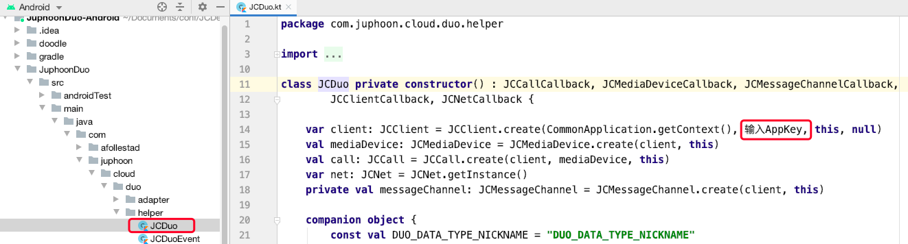

# Run Through Demo in One Minute

To quickly experience the Demo, please follow the steps below:

## Get AppKey

Please refer to [AppKey](https://developer.juphoon.com/cn/document/V2.1/create-application.php) to
get your AppKey.

::: tip

Applications created under the same account are interconnected and
belong to the same domain.

:::

## Demo source code download

Please click
[Demo](http://developer.juphoon.com/portal/cn/downloadsdk/download_demo.php?filename=JuphoonLive-Android.tar.gz)
to download the Demo source code.

## Compile and run

1. Unzip the downloaded Demo source code package and open the project.

2. Set your own AppKey: Enter your own AppKey in the code marked in the
    red box in the figure below:

    

3. Connect to a real Android device, compile and run Demo.
