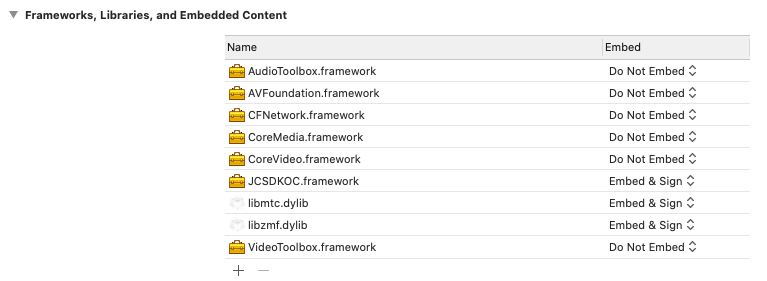

# Integrate SDK in One Minute

This chapter will introduce how to integrate the SDK into a project you
created.

## Prerequisites

- Supports macOS 10.10 or above

- Effective Juphoon Developer Account ([free sign
    up](http://developer.juphoon.com/signup) )

- Efficient Juphoon [AppKey](https://developer.juphoon.com/cn/document/V2.1/create-application.php)

## Create a macOS project

Follow the steps below to create a macOS project. If you already have a
macOS project, you can directly check the step of integrating JC SDK.

- Open Xcode and click Create a new Xcode project.

- Select the project type as Cocoa App and click Next.

- Enter the project information, such as project name, development
    team information, organization name and language, and click Next.

::: tip

If you have not added the information of development team, click
\[Xcode\] \Preferences… \Accounts, click the plus sign in the lower
left corner and follow the on-screen prompts to log in your Apple ID.
After that, you can choose your account as the development team.

:::

- Select the project storage path and click Create.

- Go to the TARGETS\Project Name\Signing & Capabilities menu and
    check Automatically manage signing.

## Integrate SDK

The dynamic library used on the mac integrates SDK.

1. Unpack and open the downloaded JC SDK dynamic library, including the
    JCSDKOC.framework file in the sdk file directory.

2. Copy the `sdk` folder to the directory where your project is
    located.

3. Import SDK

    Click ‘General’ and the ‘+’ symbol in the “Embedded Binaries”
    column, then import JCSDKOC.framework under the JCSDK folder.

4. Import SDK dependency library

    Continue to click the ‘+’ symbol to import the following system
    dependency libraries:

      - AudioToolbox.framework

      - VideoToolBox.framework

      - AVFoundation.framework

      - CFNetwork.framework

      - CoreMedia.framework

      - CoreVideo.framework

    The effect after importing is as follows:

    

5. Set path

    Click ‘Build Settings’, find Search Paths, set Framework Search
    Paths, Header Search Paths (header file path) and Library Search
    Paths (library file path):

      - Framework Search Paths:$(PROJECT\_DIR)/../sdk

      - Header Search Paths:$(PROJECT\_DIR)/../sdk/include

      - Library Search Paths:$(PROJECT\_DIR)/../sdk/lib/ios

    ::: tip

    After completing the first step to import JCSDKOC.framework and
    two .a files, Xcode will automatically generate the path. If Xcode
    does not automatically generate the path, the user should manually
    set the path according to the directory where JCSDKOC.framework,
    include and lib files are located.

    :::

6. Set Enable Bitcode to NO

    Enter Target -\Build Settings -\Enable Bitcode in the project
    and set this item to NO.

7. Set the parameters of Other Linker Flags to -ObjC

    Click ‘Build Settings’, find Other Linker Flags and add the
    parameter -ObjC.

8. Set Preprocessor Macros

    Click ‘Build Settings’, find Preprocessor Macros, and enter
    ZPLATFORM=ZPLATFORM\_OSX on the right.

## Add project permissions

1. Get device permissions

    If your project has enabled App Sandbox or Hardened Runtime
    settings, you need to check the following to obtain the
    corresponding device permissions:

    
    

    ::: tip

    According to official Apple requirements:

      - For software released on the Mac App Store, the App Sandbox
        setting needs to be enabled. See [Apple’s
        official](https://developer.apple.com/app-sandboxing/)
        statement for details.

      - For software that is not released on the Mac App Store, the
        Hardened Runtime setting needs to be enabled. See [Apple’s
        official](https://developer.apple.com/news/?id=09032019a)
        statement for details.

      - Library Validation in the Hardened Runtime settings will
        prevent app from loading frameworks, plugins or libraries
        unless the framework, plugin or library is signed by Apple or
        the same team ID as the app. When encountering a scenario
        where the security restriction needs to be removed (for
        example, it cannot be enumerated to a third-party virtual
        camera), check Hardened Runtime -\Runtime Exceptions -\>
        Disable Library Validation.

    :::

2. Add the following keys to the info.plist of the project:

<table style="width:99%;">
<colgroup>
<col style="width: 33%" />
<col style="width: 33%" />
<col style="width: 33%" />
</colgroup>
<thead>
<tr class="header">
<th>
Key
</th>
<th>
Type
</th>
<th>
Value
</th>
</tr>
</thead>
<tbody>
<tr class="odd">
<td>
Privacy - Microphone Usage Description
</td>
<td>
String
</td>
<td>
Use the microphone for purposes like voice calls.
</td>
</tr>
<tr class="even">
<td>
Privacy - Camera Usage Description
</td>
<td>
String
</td>
<td>
Use the camera for purposes like video calls.
</td>
</tr>
</tbody>
</table>
