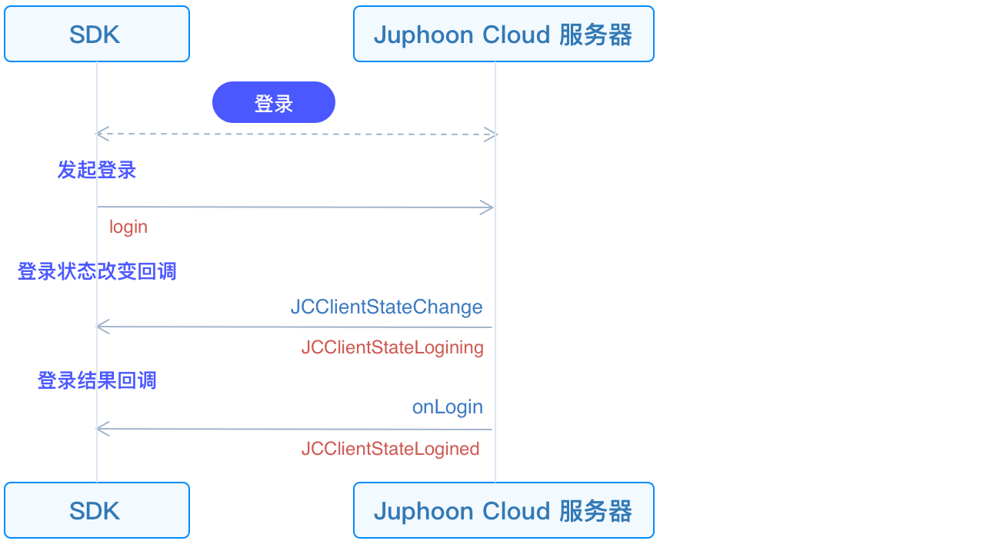

# Log in

This guide introduces how to initialize JC SDK and log in.

## Initialize

Call the [JCClient
create](https://developer.juphoon.com/portal/reference/V2.1/ios/Classes/JCClient.html#//api/name/create:callback:creatParam:)
interface on the main thread to create a
[JCClient](https://developer.juphoon.com/portal/reference/V2.1/ios/Classes/JCClient.html)
instance object. Input the obtained `appKey` to initialize
[JCClient](https://developer.juphoon.com/portal/reference/V2.1/ios/Classes/JCClient.html)
.

::: tip

Since JC SDK functions are based on modules and module instances will be
frequently used, it is recommended to use a singleton to manage the
classes in the JC SDK.

:::

``````objectivec
//Initialize
-(bool)initialize {
   JCClient *client = [JCClient create:"AppKey" callback:self creatParam:nil];
   return client.state == JCClientStateIdle;
}
``````

Among them, callback is the proxy object of the JCClientCallback
protocol, which is used to notify the upper layer of the client’s state
changes. Therefore, you need to specify the proxy object of callback
first, and then implement the method of JCClientCallback in the proxy
object.

The main methods in JCClientCallback are as follows:

``````objectivec
//Login result callback
-(void)onLogin:(bool)result reason:(JCClientReason)reason;

//Logout callback
-(void)onLogout:(JCClientReason)reason;

//Login status change notification
-(void)onClientStateChange:(JCClientState)state oldState:(JCClientState)oldState;
``````

After successful initialization, JCClientState state changes from
JCClientStateNotInit (not initialized) to JCClientStateIdle (not logged
in).

## Initiate login

After the SDK is initialized, login integration is possible.

The call flow of the login interface is as follows:



First create a
[JCClientLoginParam](https://developer.juphoon.com/portal/reference/V2.1/ios/Classes/JCClientLoginParam.html)
instance to adjust the login parameters. Then call
[login](https://developer.juphoon.com/portal/reference/V2.1/ios/Classes/JCClient.html#//api/name/login:password:loginParam:)
to initiate login:

``````objectivec
JCClientLoginParam* loginParam = [[JCClientLoginParam alloc] init];
// 1. Environment settings
loginParam.serverAddress = @"Server address";

// 2. Initiate login
[client login:userID password:password loginParam:loginParam];
``````

::: tip

1. Environment settings:

      - Domestic environment `http:cn.router.justalkcloud.com:8080`
        (Default)

      - International environment
        `http:intl.router.justalkcloud.com:8080`

2. userID is English, numbers and `+` `-` `_` `.` , case-insensitive,
    the length should not exceed 64 characters, `-` `_` `.` cannot be
    the first character.

3. password the length should not exceed 128 characters.

4. When calling this interface returns true, it only means that the
    interface is called successfully, not that the login is successful.
    The result of the login will be reported through the onLogin
    callback.

:::

After the call to initiate the login interface is successful, the method
in the JCClientCallback callback will be triggered to notify the upper
layer of the status of the client. The specific logic is as follows:

First, the login state change callback
[onClientStateChange](https://developer.juphoon.com/portal/reference/V2.1/ios/Protocols/JCClientCallback.html#//api/name/onClientStateChange:oldState:)
in JCClientCallback will be triggered. You can implement the
[onClientStateChange](https://developer.juphoon.com/portal/reference/V2.1/ios/Protocols/JCClientCallback.html#//api/name/onClientStateChange:oldState:)
method in the upper layer and handle the related logic.

``````objectivec
-(void)onClientStateChange:(JCClientState)state oldState:(JCClientState)oldState
{
    if (state == JCClientStateIdle) { // Not logged in
    ...
    } else if (state == JCClientStateLogining) { // Logging in
    ...
    } else if (state == JCClientStateLogined) {  // Login successful
    ...
    } else if (state == JCClientStateLogouting) {
    ...
    }
}
``````

Then the
[onLogin](https://developer.juphoon.com/portal/reference/V2.1/ios/Protocols/JCClientCallback.html#//api/name/onLogin:reason:)
callback in JCClientCallback will be triggered. You can implement the
[onLogin](https://developer.juphoon.com/portal/reference/V2.1/ios/Protocols/JCClientCallback.html#//api/name/onLogin:reason:)
method in the upper layer and handle the related logic:

``````objectivec
-(void)onLogin:(bool)result reason:(JCClientReason)reason {
    if (result) {// Login successful
        ...
    }
    if (reason == JCClientReasonAuth) {// Account password is wrong
        ...
    }
}
``````

After successful login, the JCClientState status changes from
JCClientStateIdle (not logged in) to JCClientStateLogined (successful
login). The SDK will automatically maintain the connection status with
the server until the user actively calls the logout interface, or the
device is logged out, or the account is logged in on another device.
Login success/failure reason reference
[JCClientClientReason](https://developer.juphoon.com/portal/reference/V2.1/ios/Constants/JCClientReason.html)
.

## Log out

The call flow of the logout interface is as follows:


Call
[logout](https://developer.juphoon.com/portal/reference/V2.1/ios/Classes/JCClient.html#//api/name/logout)
to initiate logout, and you cannot carry out various business operations
on the platform after logging out:

``````objectivec
[client logout];
``````

Logging out will also trigger a login state change (onClientStateChange)
callback, after which the logout result will be reported via the
onLogout callback:

``````objectivec
-(void)onLogout:(JCClientReason)reason {
    if (reason == JCClientReasonServerLogout) {// Force logout
        ...
    }
}
``````

More logout reason reference:
[JCClientClientReason](https://developer.juphoon.com/portal/reference/V2.1/ios/Constants/JCClientReason.html)

After logging out successfully, the JCClientState status changes from
JCClientStateLogined (successful login) to JCClientStateIdle (not logged
in).
