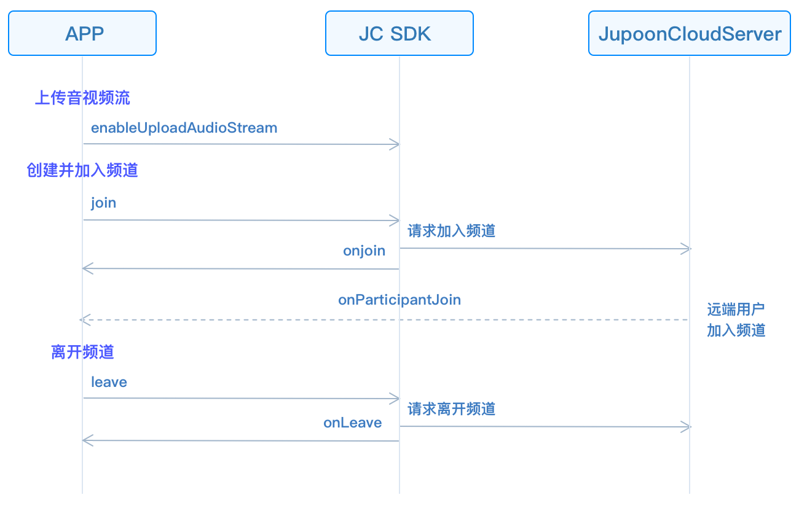

# Realize Live Interactive Streaming

This guide introduces how to implement live interactive voice streaming.
The API call sequence of live interactive voice streaming is shown in
the figure below:



## Initialize

Extend the
[JCMediaChannelCallback](https://developer.juphoon.com/portal/reference/V2.1/windows/C++/html/class_j_c_media_channel_callback.html)
object and
[JCMediaDeviceCallback](https://developer.juphoon.com/portal/reference/V2.1/windows/C++/html/class_j_c_media_device_callback.html)
object, and implement the pure virtual functions in these two objects.

``````cpp
class JCManager : public JCMediaDeviceCallback, public JCMediaChannelCallback
{
public:

    //The callback of MediaChannel state change
    virtual void onMediaChannelStateChange(JCMediaChannelState state, JCMediaChannelState oldState);
    //The callback of channel property change
    virtual void onMediaChannelPropertyChange(JCMediaChannelPropChangeParam propChangeParam);
    //The callback of joining ChannelReason
    virtual void onJoin(bool result, JCMediaChannelReason reason, const char* channelId);
    //The callback of leaving ChannelReason
    virtual void onLeave(JCMediaChannelReason reason, const char* channelId);
    //The callback of channel Stop result
    virtual void onStop(bool result, JCMediaChannelReason reason);
    //The callback of channel Query result
    virtual void onQuery(int operationId, bool result, JCMediaChannelReason reason, JCMediaChannelQueryInfo* queryInfo);
    //The callback of ParticipantJoin
    virtual void onParticipantJoin(JCMediaChannelParticipant* participant);
    //The callback of ParticipantLeft
    virtual void onParticipantLeft(JCMediaChannelParticipant* participant);
    //The callback of ParticipantUpdate
    virtual void onParticipantUpdate(JCMediaChannelParticipant* participant, JCMediaChannelParticipant::ChangeParam changeParam);
    //This callback triggers when messages are received in the channel
    virtual void onMessageReceive(const char* type, const char* content, const char* fromUserId);
    //The callback of InviteSipUserResult
    virtual void onInviteSipUserResult(int operationId, bool result, JCMediaChannelReason reason);
    //The volume change of Participants
    virtual void onParticipantVolumeChange(JCMediaChannelParticipant* participant);

public:
    //mediaDevice object
    JCMediaDevice* mediaDevice;
    //mediaChannel object
    JCMediaChannel* mediaChannel;
};
``````

Call
[createJCMediaDevice](https://developer.juphoon.com/portal/reference/V2.1/windows/C++/html/_j_c_media_device_8h.html#a96a10766264f3c12af531b70cb9c9749)
and
[createJCCall](https://developer.juphoon.com/portal/reference/V2.1/windows/C++/html/_j_c_call_8h.html#a29320972a659ce8eaf4994576103a62c)
to initialize the modules needed for group video calls:

``````cpp
//Initialize
bool JCManager::initialize()
{
    //1. Media class
    mediaDevice = createJCMediaDevice(client, this);
    //1. mediaChannel class
    mediaChannel = createJCMediaChannel(client, mediaDevice, this);
    return true;
}
``````

Among them:

- This in the JCMediaDevice create method is a derived class of
    [JCMediaDeviceCallback](https://developer.juphoon.com/portal/reference/V2.1/windows/C++/html/class_j_c_media_device_callback.html)
    , which is used to notify the upper layer of media device-related
    events. Therefore, you need to create a derived class of
    JCMediaDeviceCallback, and then implement the pure virtual function
    of JCMediaDeviceCallback in the derived class.

- This in the JCMediaChannel create method is a derived class of
    [JCMediaChannelCallback](https://developer.juphoon.com/portal/reference/V2.1/windows/C++/html/class_j_c_media_channel_callback.html)
    , which is used to notify related events in the channel to the upper
    layer. Therefore, you need to create a derived class of
    JCMediaChannelCallback, and then implement the pure virtual function
    of JCMediaChannelCallback in the derived class.

::: tip

The object in the callback can only be used in the callback and cannot
be saved. The upper layer can obtain the call object through the
corresponding method.

:::

## Role setting

There are two roles for users in live streaming: the host and audience.
The audience in the live sreaming can only hear the voice of the host,
but cannot talk.

Before joining a channel, you must set the role at first. The host can
upload local audio and video streams, and the audience can only see the
image of the host and hear the voice of the host.

The role value can be customized according to the
[JCMediaChannelCustomRole](https://developer.juphoon.com/portal/reference/V2.1/windows/C++/html/_j_c_media_channel_constants_8h.html#aa5042852bc565ec1e596a7c286ad3c64)
enumeration value, such as:

``````cpp
//Customize the role of the host according to the CustomState enumeration value
JCMediaChannelCustomRole ROLE_BROASCASTER = JCMediaChannelCustomRole0;
//Customize the role of audiences according to the CustomState enumeration value
JCMediaChannelCustomRole ROLE_AUDIENCE = JCMediaChannelCustomRole1;
``````

Call
[setCustomRole](https://developer.juphoon.com/portal/reference/V2.1/windows/C++/html/class_j_c_media_channel.html#a7b6b97e8193f2cf7f2819ec3ca49b813)
to set your own role to enter the channel:

``````cpp
// Set the role; the value of participant (the second parameter) is null, which means that you set your own role
JCManager::shared()->mediaChannel->setCustomRole(ROLE_BROASCASTER, NULL);
``````

::: tip

After joining a channel, if you want to switch user roles, you can also
call the setCustomRole method.

:::

## Join a channel

Before joining a channel, you need to control the upload of audio and
video streams according to the role of the member.In the live
interactive voice streaming, the host needs to upload the local audio
stream, but the audience does not.

1. Call
    [enableUploadAudioStream](https://developer.juphoon.com/portal/reference/V2.1/windows/C++/html/class_j_c_media_channel.html#a2b08d87b38fe2fd7a394e2786241cc4c)
    to enable audio streaming:

    ``````cpp
    //Upload local audio and video streams according to roles
    JCManager::shared()->mediaChannel->enableUploadVideoStream(customRole == ROLE_BROASCASTER);
    ``````

Since the SDK uploads video streams by default, you need to turn off the
uploading video stream symbol before joining a channel for live
interactive voice streamingSince the SDK uploads video streams by
default, you need to turn off the uploading video stream logo before
joining a channel for live interactive voice streaming:

``````cpp
//Turn off uploading video stream
JCManager::shared()->mediaChannel->enableUploadAudioStream(false);
``````

::: tip

- These two interfaces can be called before or after joining a
    channel.

- If called before joining a channel, **it will only pre-open or close
    the “upload audio and video stream” symbol, and not send data**.
    After joining a channel, the server will determine whether to upload
    audio and video according to the value passed in the parameter.

- If the value passed in the enableUploadVideoStream method is false
    before joining a channel, the live interactive voice streaming mode
    will be automatically turned on after joining a channel.

- In addition, calling the enableUploadVideoStream method to send
    local video stream data according to whether the camera has been
    opened.

- After the interface is called, when joining a channel, other members
    in the channel will receive the status change callback
    (onParticipantUpdate) of the member “whether to upload audio and
    video”.

:::

2. After the role is set, call the
    [join](https://developer.juphoon.com/portal/reference/V2.1/windows/C++/html/class_j_c_media_channel.html#acfdb1da52955cf8b01d95527eb28890b)
    method to create and join a channel. You need to pass in the
    following parameters in the method:

      - channelIdOrUri: Channel ID or channel Uri. When uriMode in
        param is set to true, it means channel Uri, and others mean
        channel ID. Users with the same channel ID or Uri will enter
        the same channel.

      - joinParam: Join parameters, if not, fill in NULL. See
        [JCMediaChannelJoinParam](https://developer.juphoon.com/portal/reference/V2.1/windows/C++/html/class_j_c_media_channel_join_param.html)
        object for details.

    ``````cpp
    // Join a channel
    JCManager::shared()->mediaChannel->join("channel ID", NULL);
    ``````

3. The
    [onJoin](https://developer.juphoon.com/portal/reference/V2.1/windows/C++/html/class_j_c_media_channel_callback.html#a430bd78b28e189ee3c9564ddb7db213d)
    callback triggers after joining the channel:

    ``````cpp
    // The callback of joining ChannelReason
    void JCManager::onJoin(bool result, JCMediaChannelReason reason, const char* channelId)
    {
        if (result) {
        //the logic of successful joining in
        ...
        } else {
        //the logic of failed joining in
        ...
        }
    }
    ``````

## Leave a channel

Call the
[leave](https://developer.juphoon.com/portal/reference/V2.1/windows/C++/html/class_j_c_media_channel.html#a93c19137044fec1568f73f1f6dbfee84)
method to leave the current channel:

``````cpp
JCManager::shared()->mediaChannel->leave();
``````

After leaving the channel, they receive the
[onLeave](https://developer.juphoon.com/portal/reference/V2.1/windows/C++/html/class_j_c_media_channel_callback.html#a18bc4fae89f0d56fb849075f1603ac71)
callback, and other members receive the
[onParticipantLeft](https://developer.juphoon.com/portal/reference/V2.1/windows/C++/html/class_j_c_media_channel_callback.html#a5888058878f3aaa382b3ede94228a6e8)
callback at the same time:

``````cpp
// The callback of leaving the channel
void JCManager::onLeave(JCMediaChannelReason reason, const char* channelId);
{
    //The logic of leaving a channel
}
``````

## Destroy a channel

If you want to destroy a channel, you can call the following interface,
and all members will be quit.

``````cpp
// End a channel
JCManager::shared()->mediaChannel->stop();
``````

After the channel is stopped, the member that initiated the termination
receives the
[onStop](https://developer.juphoon.com/portal/reference/V2.1/windows/C++/html/class_j_c_media_channel_callback.html#a61a1d5a81563d34f80e70541a114a74a)
callback, and other members receive the
[onLeave](https://developer.juphoon.com/portal/reference/V2.1/windows/C++/html/class_j_c_media_channel_callback.html#a18bc4fae89f0d56fb849075f1603ac71)
callback at the same time. Please refer to
[JCMediaChannelReason](https://developer.juphoon.com/portal/reference/V2.1/windows/C++/html/_j_c_media_channel_constants_8h.html#a24a2154e4bb2db63c75b31cd2b021fc3)
for the enumeration value of the reason for failure.

``````cpp
void JCManager::onStop(bool result, JCMediaChannelReason reason)
{
    //The processing of ending a channel
}
``````
