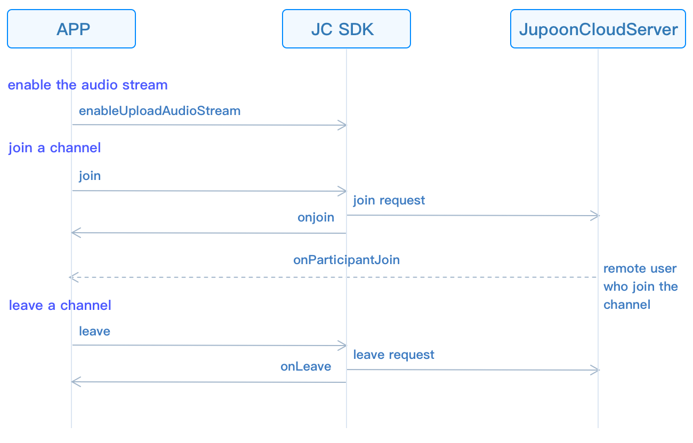

# Realize live interactive voice streaming

This guide introduces how to implement live interactive voice streaming.
The API call sequence of live interactive voice streaming is shown in
the figure below:



## Initialize

Call
[JCMediaDevice.create()](https://developer.juphoon.com/portal/reference/V2.1/windows/html/cb59bc27-6528-9dbf-c996-de857096f847.htm)
and
[JCCall.create()](https://developer.juphoon.com/portal/reference/V2.1/windows/html/eef10110-a3f7-b505-26fa-4b9ec1e2b998.htm)
to initialize modules needed to implement group calls:

``````csharp
/// Create a new class and implement it
class JCManager : JCClientCallback, JCMediaDeviceCallback,JCMediaChannelCallbac{

    #region JCMediaDeviceCallback

    public void onCameraUpdate(){...}

    public void onAudioOutputTypeChange(string audioOutputType){...}

    #endregion

    #region JCMediaChannelCallback
    ...
    /// Achieve methods in JCMediaChannelCallback
    ...
    #endregion

    /// Declare object
    JCMediaDevice mMediaDevice;
    JCMediaChannel mMediaChannel;

    /// Initialization function
    public bool initialize(Context context) {

        /// 1. Media class
        mMediaDevice = JCMediaDevice.create(mClient, this);
        /// 2. Media channel lass
        mMediaChannel = JCMediaChannel.create(client, mediaDevice, this);
    }
}
``````

## Role setting

Before joining the channel, you must set the role first. The role
setting include the host and audiences. The role value can be customized
according to the
[JCMediaChannel.CustomRole](https://developer.juphoon.com/portal/reference/V2.1/windows/html/e8ce33fb-e1af-d33e-f0d8-795a840eae30.htm)
enumeration value, for example:

``````csharp
//Customize the role of the host according to the CustomState enumeration value
JCMediaChannelCustomRole ROLE_BROASCASTER = JCMediaChannelConstants.CUSTOM_ROLE_0;
//Customize the role of audiences according to the CustomState enumeration value
JCMediaChannelCustomRole ROLE_AUDIENCE = JCMediaChannelConstants.CUSTOM_ROLE_1;
``````

Call
[setCustomRole()](https://developer.juphoon.com/portal/reference/V2.1/windows/html/02d30d7f-6906-cea0-9775-a244e2b25e87.htm)
to set your own role to enter the channel:

``````csharp
/// Set the role; the value of participant (the second parameter) is null, which means that you set your own role
mediaChannel.setCustomRole(ROLE_BROASCASTER, null);
``````

## Join a channel

1. Call
    [enableUploadAudioStream()](https://developer.juphoon.com/portal/reference/V2.1/windows/html/70f2d136-ebf6-12fc-eb1e-2a90622caca7.htm)
    to enable audio streaming:

    ``````csharp
    /// 1. Enable the audio stream
    mMediaDeviceChannel.enableUploadAudioStream(true);
    ``````

2. To create and join a channel, you need to pass in `channelIdOrUri`
    and
    [JCMediaChannel.JoinParam](https://developer.juphoon.com/portal/reference/V2.1/windows/html/af4ac634-bbe3-76e3-d1f8-120213ef2fff.htm):

      - `channelIdOrUri` refers to the channel ID or channel Uri.

      - In `JCMediaChannelJoinParam`, the `uriMode` parameter is set
        to true, which means the incoming channel Uri. When other
        parameters are set, it means the incoming channel ID. Users
        who pass in the same channel ID or the same channel Uri will
        enter the same Channel.

    ``````csharp
    mMediaChannel.join("222", null);
    ``````

3. The
    [onJoin()](https://developer.juphoon.com/portal/reference/V2.1/windows/html/535cbae7-841e-ca31-32ea-87c1a840eff1.htm)
    callback triggers after joining the channel:

    ``````csharp
    public void onJoin(bool result, JCMediaChannelReason reason, String channelId) {
        if (result) {
            /// Join the channel successfully
        } else {
            /// Join the channel failed
        }
    }
    ``````

## Leave a channel

Call the
[leave()](https://developer.juphoon.com/portal/reference/V2.1/windows/html/7f034b94-15ee-8d49-48e3-905fff27f31f.htm)
method to leave the current channel:

``````csharp
mMediaChannel.leave();
``````

In a group video call, you need to call
[stopVideo()](https://developer.juphoon.com/portal/reference/V2.1/windows/html/851cc6d3-1b5a-8e26-ce3c-a3c1780936d2.htm)
to remove the video image when leaving the channel:

``````csharp
mParticipant.stopVideo();
``````

After leaving a channel, you will receive the
[onLeave()](https://developer.juphoon.com/portal/reference/V2.1/windows/html/f356aba3-ebed-a72c-4e34-02a684925a15.htm)
callback, and other members will receive the
[onParticipantLeft()](https://developer.juphoon.com/portal/reference/V2.1/windows/html/89a35b12-8c2c-247d-e90c-ebe04f3e4521.htm)
callback at the same time:

``````csharp
/// The callback of leaving the ChannelReason

public void onLeave(JCMediaChannelReason reason, String channelId) {
    ...
    /// Destroy the video
    mParticipant.stopVideo();
}
``````

## Destroy a channel

If you want to destroy a channel, you can call the following interface,
and all members will be quit:

``````csharp
/// End a channel
mMediaChannel.stop();
``````

In a group video call, you need to call
[stopVideo()](https://developer.juphoon.com/portal/reference/V2.1/windows/html/851cc6d3-1b5a-8e26-ce3c-a3c1780936d2.htm)
to remove the video image when leaving the channel:

``````csharp
mParticipant.stopVideo();
``````

After the channel is stopped, the member that initiated the termination
receives the
[onStop()](https://developer.juphoon.com/portal/reference/V2.1/windows/html/d3732af7-2770-2d00-e4cb-e8f658da6c48.htm)
callback, and other members receive the
[onLeave()](https://developer.juphoon.com/portal/reference/V2.1/windows/html/f356aba3-ebed-a72c-4e34-02a684925a15.htm)
callback at the same time. Please refer to
[MediaChannelReason](https://developer.juphoon.com/portal/reference/V2.1/windows/html/4481d778-9d4d-43fe-f94d-fdfa690dd939.htm)
for the enumeration value of the reason for failure:

``````csharp
public void onStop(bool result, JCMediaChannelReason reason) {
    /// destroy the video, canvas is the instance of JCMediaDeviceVideoCanvas object
    mParticipant.stopVideo();
    canvas = null;
}
``````
