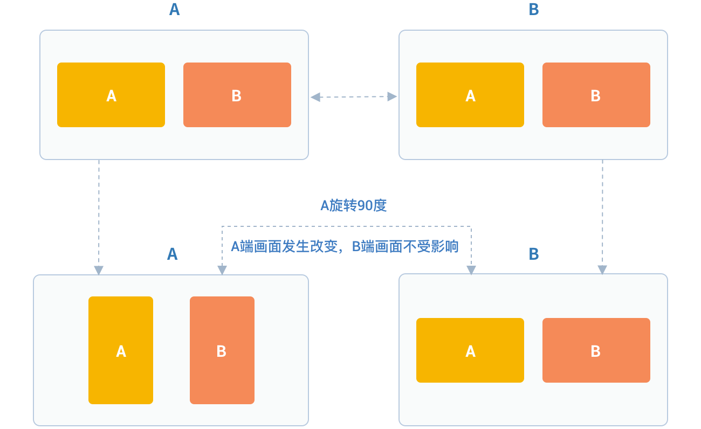

# Video Management

## Video data collection management

### Set the type of camera to turn on

Before video capture, you can specify the camera to be turned on

Get the camera list at first

``````csharp
/// <summary>
/// Camera list
/// </summary>
public List<JCMediaDeviceCamera> cameras
``````

Among them, JCMediaDeviceCamera has the following variables:

``````csharp
/// <summary>
/// Name
/// </summary>
public string cameraName { get; internal set; }
/// <summary>
/// ID
/// </summary>
public string cameraId
``````

Switch the camera:

``````csharp
/// <summary>
/// Switch the camera
/// </summary>
/// <param name="camera">The camera to switch</param>
/// <returns>true(switchover success), false (switchover failure)</returns>
public bool switchCamera(JCMediaDeviceCamera camera)
``````

Sample code:

``````csharp
// Get camera list
List<JCMediaDeviceCamera> cameraDevices = mediaDevice.cameraDevices;

// Switch the camera
mediaDevice.switchCamera(mediaDevice.cameras[0]);
``````

### Set camera capture resolution

You can achieve different video resolutions by customizing camera
acquisition parameters, such as acquisition height, width, and frame
rate.

The camera collection property setting interface is as follows:

``````csharp
/// <summary>
/// Set the camera resolution (please call it before calling startCamera() interface)
/// </summary>
/// <param name="width">Wide camera resolution</param>
/// <param name="height">High camera resolution</param>
/// <param name="framerate">Frame rate</param>
public void setCameraProperty(int width, int height, int framerate)
``````

Sample code:

``````csharp
// Set camera collection properties
mediaDevice.setCameraProperty(640, 360, 30);
``````

### Set canvas rotation angle

If you want to set the angle of the canvas in Canvas, you need to call
the rotate interface in the JCMediaDeviceVideoCanvas class:

``````csharp
/// <summary>
/// Rotate the picture
/// </summary>
/// <param name="angle">Rotation angle</param>
public void rotate(JCMediaDeviceVideoCanvasRoatate angle)
``````

Among them, the angle needs to be a multiple of 90. After calling this
interface, the local video image displayed on the local end and the
remote video image will rotate the same angle at the same time, but the
screen displayed on the opposite end will not be affected.

For example, if A is set to rotate 90 degrees, the A and B video images
displayed on the A side will rotate 90 degrees at the same time. The
video image on the B side will not change. As shown below:



JCMediaDeviceVideoCanvasRoatate

``````csharp
/// <summary>
/// 0
/// </summary>
Angle0 = 0,
/// <summary>
/// 90
/// </summary>
Angle90 = 90,
/// <summary>
/// 180
/// </summary>
Angle180 = 180,
/// <summary>
/// 270
/// </summary>
Angle270 = 270
``````

Sample code:

``````csharp
// Set camera collection properties
mediaDevice.rotate(JCMediaDeviceVideoCanvasRoatate.Angle0);
``````

## Video rendering management

### Create local and remote video images

- Local video rendering

Local video rendering obtains local video objects for UI interface
display by calling the startCameraVideo interface, which opens the
camera:

``````csharp
/// <summary>
/// Local video rendering obtains local video objects for UI interface display by calling the startCameraVideo interface, which opens the camera
/// </summary>
/// <param name="mode">Rendering method</param>
/// <returns>JCMediaDeviceVideoCanvas object</returns>
public JCMediaDeviceVideoCanvas startCameraVideo(JCMediaDeviceRenderMode mode)
``````

Among them, the rendering mode (JCMediaDeviceRenderMode) has the
following three types

<table>
<colgroup>
<col style="width: 50%" />
<col style="width: 50%" />
</colgroup>
<thead>
<tr class="header">
<th><p>Name</p></th>
<th><p>Description</p></th>
</tr>
</thead>
<tbody>
<tr class="odd">
<td><p>FULLSCREEN</p></td>
<td><p>Window covering</p></td>
</tr>
<tr class="even">
<td><p>FULLCONTENT</p></td>
<td><p>The whole image is displayed, there will be black borders, but there will be no black borders when the window is the same as the image ratio</p></td>
</tr>
<tr class="odd">
<td><p>AUTO</p></td>
<td><p>Adaptive</p></td>
</tr>
</tbody>
</table>

- Remote video rendering

You can call the startVideo method to get the peer video object and
render:

``````csharp
/// <summary>
/// Obtain a video object, through which you can get a view for UI display
/// </summary>
/// <param name="videoSource">rendering identifier string, such as renderId in JCMediaChannelParticipant JCCallItem, when videoSource is videoFileId, startVideoFile will be called internally</param>
/// <param name="mode">Render mode</param>
/// <returns>JCMediaDeviceVideoCanvas object</returns>
public JCMediaDeviceVideoCanvas startVideo(string videoSource, JCMediaDeviceRenderMode mode)
``````

Sample code:

``````csharp
// Get camera list
List<JCMediaDeviceCamera> cameraDevices = mediaDevice.cameras;

// Open local video preview
JCMediaDeviceVideoCanvas localCanvas = mediaDevice.startCameraVideo(JCMediaDeviceRenderMode.FULLCONTENT);
ImageBrush image = new ImageBrush(localCanvas.videoView);
image.Stretch = Stretch.Uniform;
this.label.Background = image;

// Remote video rendering; renderId comes from the call object; one-to-one is JCCallItem object, multi-party is JCMediaChannelParticipant object
JCMediaDeviceVideoCanvas remoteCanvas = mediaDevice.startVideo(renderId, JCMediaDeviceRenderMode.FULLSCREEN);
ImageBrush image = new ImageBrush(remoteCanvas.videoView);
image.Stretch = Stretch.Uniform;
this.label.Background = image;
``````


### Destroy local and remote video images

At the end of a video call or during a video call, if you want to
destroy the video image, you can call the following interface:

``````csharp
/// <summary>
/// Stop video
/// </summary>
/// <param name="canvas">JCMediaDeviceVideoCanvas object, obtained by startVideo</param>
public void stopVideo(JCMediaDeviceVideoCanvas canvas)
``````

Sample code:

``````csharp
JCMediaDeviceVideoCanvas localCanvas = mediaDevice.startCameraVideo(JCMediaDeviceRenderMode.FULLCONTENT);
JCMediaDeviceVideoCanvas remoteCanvas = mediaDevice.startVideo(renderId, JCMediaDeviceRenderMode.FULLSCREEN);
if (localCanvas != null)
    {
        this.smvideoGrid.Background = null;
        mediaDevice.stopVideo(localCanvas);
        localCanvas = null;
    }
if (remoteCanvas != null)
    {
        this.fullvideoGrid.Background = null;
        mediaDevice.stopVideo(remoteCanvas);
        remoteCanvas = null;
    }
``````


Video call screenshot
\>\>\>\>\>\>\>\>\>\>\>\>\>\>\>\>\>\>\>\>\>\>\>\>\>\>\>\>\>\>\>:

``````csharp
/// <summary>
/// Video call screenshot
/// </summary>
/// <param name="width">Screen capture width pixels; -1 is the video source pixel</param>
/// <param name="height">Screen capture height pixel; -1 is the video source pixel</param>
/// <param name="filePath">File Path</param>
/// <returns>success or failure</returns>
public bool snapshot(int width, int height, string filePath)
``````


### Update video rendering logo

If you want to replace the current camera video image, you can call the
following interface:

``````csharp
/// <summary>
/// Update video rendering logo
/// </summary>
/// <param name="videoSource">videoSource video source</param>
/// <returns>true/ false</returns>
public bool replace(string videoSource)
``````

### Pause rendering

If you want to pause the rendering of the screen, you can call the
following interface:

``````csharp
/// <summary>
/// Pause rendering
/// </summary>
/// <returns>true/ false</returns>
public bool pause()
``````

### Resume rendering

If you want to continue rendering the paused picture, you can call the
following interface:

``````csharp
/// <summary>
/// Resume rendering
/// </summary>
/// <returns>true/ false</returns>
public bool resume()
``````


## Video equipment management

Video device management mainly uses the methods in the JCMediaDevice
class, as follows:

Get current camera and default camera
\>\>\>\>\>\>\>\>\>\>\>\>\>\>\>\>\>\>\>\>\>\>\>\>\>\>\>\>\>\>\>:

``````csharp
/// <summary>
/// Currently used camera
/// </summary>
public JCMediaDeviceCamera camera

/// <summary>
/// Default camera
/// </summary>
public JCMediaDeviceCamera defaultCamera
``````

### Turn camera on and off

``````csharp
/// <summary>
///  Turn on the camera
/// </summary>
/// <returns>true (open success), false (open failure)</returns>
public bool startCamera()

/// <summary>
/// Turn off the camera
/// </summary>
/// <returns>true is closed successfully, and false is closed failed</returns>
public bool stopCamera()
``````

### Switch the camera

``````csharp
/// <summary>
/// Switch the camera
/// </summary>
/// <param name="camera">The camera to switch</param>
/// <returns>true(switchover success), false (switchover failure)</returns>
public bool switchCamera(JCMediaDeviceCamera camera)
``````

Sample code:

``````csharp
// Turn on the camera
mediaDevice.startCamera();

// Turn off the camera
mediaDevice.stopCamera();

// Switch the camera
mediaDevice.switchCamera(mediaDevice.cameras[0]);
``````
