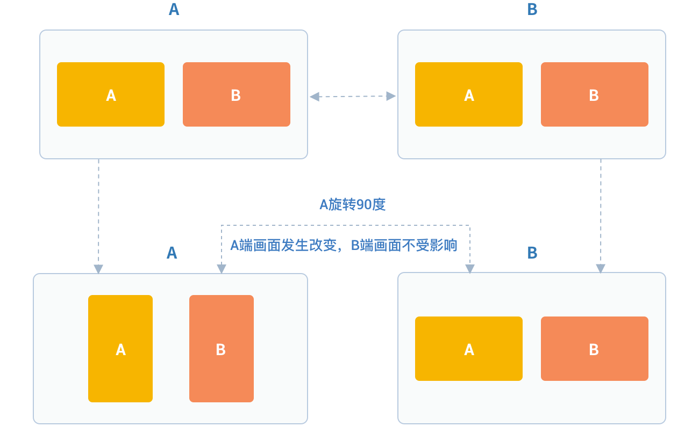

# Video Management

## Video Data Collection Management

### Set the type of camera to turn on

Before video capture settings, you can get the camera list, current
camera, and default camera through the properties in the JCMediaDevice
class, as follows:

``````objectivec
/// Camera list
NSArray<JCMediaDeviceCamera*> *  __nonnull cameras;

/// The camera being used
JCMediaDeviceCamera* __nullable camera;

/// Default camera
JCMediaDeviceCamera* __nullable defaultCamera;
``````

Among them, the camera object (JCMediaDeviceCamera) has the following
properties:

``````objectivec
/// Camera id
NSString* __nonnull cameraId;

/// Camera name
NSString* __nonnull cameraName;

/// Camera type
JCMediaDeviceCameraType cameraType;
``````

The camera type (JCMediaDeviceCameraType) has the following types:

``````objectivec
JCMediaDeviceCameraTypeNone = 0,
JCMediaDeviceCameraTypeFront = 1,
JCMediaDeviceCameraTypeBack = 2,
JCMediaDeviceCameraTypeUnknown = 3
``````

After the camera list is obtained, you can call the following method to
switch the specified camera:

``````objectivec
/// Switch the specified camera
/// @param camera camera
-(bool)switchCamera:(JCMediaDeviceCamera* __nonnull)camera;
``````

### Set camera capture resolution

You can achieve different video resolutions by customizing camera
acquisition parameters, such as acquisition height, width, and frame
rate.

The camera collection property setting interface is as follows:

``````objectivec
/**
 *  @breif Set camera collection properties
 *  @param width default640
 *  @param height default360
 *  @param framerate default30
 */
- (void)setCameraProperty:(int)width height:(int)height framerate:(int)framerate;
``````

### Set camera collection angle

You can call the following interface to set the angle of the camera
collection, where the angle needs to be a multiple of 90:

``````objectivec
/**
 * @breif specify the camera collection angle, a multiple of 90
 * @param angle angle
 */
-(void)specifyCameraAngle:(int)angle;
``````

### Set canvas rotation angle

If you want to set the angle of the canvas in Canvas, you need to call
the rotate interface in the JCMediaDeviceVideoCanvas class:

``````objectivec
/**
 * @brief rotation angle must be a multiple of 90, and it represents the angle between the screen and the positive direction of the screen after rotation
 * @param angle angle value
 */
-(void)rotate:(int)angle;
``````

Among them, the angle needs to be a multiple of 90. After calling this
interface, the local video image displayed on the local end and the
remote video image will rotate the same angle at the same time, but the
screen displayed on the opposite end will not be affected.

For example, if A is set to rotate 90 degrees, the A and B video images
displayed on the A side will rotate 90 degrees at the same time. The
video image on the B side will not change. As shown below:



The angle value is as follows:

``````objectivec
/// Window and screen angle 0
JCMediaDeviceRotateAngle0 = 0,
/// Window and screen angle 90
JCMediaDeviceRotateAngle90 = 90,
/// Window and screen angle 180
JCMediaDeviceRotateAngle180 = 180,
/// Window and screen angle 270
JCMediaDeviceRotateAngle270 = 270,
``````

Sample code:

``````objectivec
// Get camera list
NSArray<JCMediaDeviceCamera*> * cameras = mediaDevice.cameras;
// Set the camera to switch
[mediaDevice switchCamera:cameras[1]];

// Set camera collection properties
[mediaDevice setCameraProperty:640 height:360 framerate:30];

// Set Canvas rotation angle
[canvas rotate:90];
``````

-----

### Raw video data

In the process of video transmission, you can perform image processing
on each frame of video data to achieve beauty mode and other needs.
There are two processingcircumstances:

1. Process before pre-encoding and after video capture which affects
    local preview and peer receiving video.

2. Process after decoding and before rendering which affects the local
    video reception.

Details are as follows:

**Process after video capture and before pre-coding**

Refer to the following steps to implement the original video data
function in your project:

1. Register the video capture callback through
    Zmf\_VideoCaptureAddCallback before initiating the service, and
    implement a callback function of type ZmfVideoCaptureCallback in
    this function

2. After successful registration, the JC SDK will call back the
    corresponding parameters of the original video data collected
    through the callback function when each video frame is captured

3. After the user gets the video data, he/she performs parameter
    processing in the callback function according to the needs of the
    scene, and the processed data is returned to the JC SDK through the
    callback function.

Register the video capture callback at first, which can be called after
successful login:

``````objectivec
/** add capture data callback
 * @param[in] pUser     the callback user data
 * @param[in] pfnCb     the callback
 * returns 0 on succeed, otherwise failed
 */
int Zmf_VideoCaptureAddCallback (void *pUser, ZmfVideoCaptureCallback pfnCb)
``````

Callback type description:

``````objectivec
/** the callback to receive captured image
 * iImgAngle - iCamOrient equal to device rotate angle.
 * if encoder is NULL, the pixel format of buf must be ZmfPixelFormatI420
 *
 * @param[in] pUser     the user data registered by Zmf_VideoCaptureAddCallback
 * @param[in] captureId the id of captured image
 * @param[in] iFace     the capture Face @see ZmfVideoFaceType
 * @param[in] iImgAngle the image rotated angle (CW)
 * @param[in] iCaptureOrient the capturer fixed orient
 * @param[in,out] iWidth  the image width
 * @param[in,out] iHeight the image height
 * @param[in,out] buf     the image data I420 buffer
 * @param[in,out] encoder capture encoder
 */
 typedef void (*ZmfVideoCaptureCallback)(void* pUser, const char* captureId, int iFace,
                                       int iImgAngle, int iCaptureOrient, int* iWidth, int* iHeight,
                                       unsigned char *buf, ZmfVideoCaptureEncoder* encoder);
``````

Sample code:

``````objectivec
id render; //The collected video data object
void* p = (__bridge void *)render;
static void zmfVideoCaptureCallback(void* pUser, const char* captureId, int iFace,
                                    int iImgAngle, int iCaptureOrient, int* iWidth, int* iHeight,
                                    unsigned char *buf, ZmfVideoCaptureEncoder* encoder) {

    NSLog(@"Video data processing");
}
- (void)videoCall {
    //Register callback
    Zmf_VideoCaptureAddCallback(p, zmfVideoCaptureCallback);
    //Initiate the call
    [call call:@"Peer number" video:true extraParam:@"custom pass-through string"];
}
``````

After registration, the video data collected in each frame can be
processed through the ZmfVideoCaptureCallback callback, and the
corresponding video data can be processed.

If you want to remove the callback, call the following interface:

``````objectivec
```
 /** remove capture data callback
  * @param[in] pUser     the callback user data
  * returns 0 on succeed, otherwise failed
  */
int Zmf_VideoCaptureRemoveCallback (void *pUser)
```
``````

Sample code:

``````objectivec
id render; //The collected video data object
void* p = (__bridge void *)render;
-(void)endCall {
    //Remove callback
    Zmf_VideoCaptureRemoveCallback(p);
    //Hang up the call
    [call term:item reason:JCCallReasonNone description:@"hang up by yourself"];
}
``````

**Process after decoding and before pre-rendering**

Refer to the following steps to implement the original video data
function in your project:

1. Register the video capture callback through
    Zmf\_VideoCaptureAddCallback before initiating the service, and
    implement a callback function of type ZmfVideoCaptureCallback in
    this function

2. After successful registration, the JC SDK will call back the
    corresponding parameters of the original video data collected
    through the callback function when each video frame is captured

3. After the user gets the video data, he/she performs parameter
    processing in the callback function according to the needs of the
    scene, and the processed data is returned to the JC SDK through the
    callback function.

Register the video capture callback at first, which can be called after
successful login:

``````objectivec
/**
 * add render data callback
 *
 * @param[in] pUser      the callback user data
 * @param[in] pfnCb      the callback
 *
 * @return               0 on succeed, otherwise failed.
 */
int Zmf_VideoRenderAddCallback (void *pUser, ZmfVideoRenderCallback pfnCb);
``````

Callback type description:

``````objectivec
/**
 * The callback to receive video render data
 *
 * @param[in] pUser         the user data registered by Zmf_AddVideoRenderCallback
 * @param[in] renderId      video render unique name
 * @param[in] sourceType    video render source type @see ZmfVideoSourceType
 * @param[in] iAngle the image angle
 * @param[in] iMirror the image mirror type
 * @param[in] iWidth  the image width
 * @param[in] iHeight  the image height
 * @param[in] buf           I420 render data
 *
 * @return                  if process render data should return > 0, other 0
 *
 * @remarks
 *  if buf == 0 or iWidth ==0 or iHeight == 0, means the render will close,
 *  so should call Zmf_OnVideoRenderRequestRemove.
 */
 typedef int  (*ZmfVideoRenderCallback)(void* pUser, const char* renderId, int sourceType, int iAngle,
                                  int iMirror, int* iWidth, int* iHeight, unsigned char *buf,
                                  unsigned long timeStamp);
``````

After registration, the video data collected in each frame can be
processed through the ZmfVideoCaptureCallback callback, and the
corresponding video data can be processed.

Sample code:

``````objectivec
id render; //The collected video data object
void* p = (__bridge void *)render;
static void zmfVideoRenderCallback(void* pUser, const char* renderId, int sourceType, int iAngle,
                                   int iMirror, int* iWidth, int* iHeight, unsigned char *buf,
                                   unsigned long timeStamp) {

    NSLog(@"Video data processing");
}
- (void)videoCall {
    //Register callback
    Zmf_VideoRenderAddCallback(p, zmfVideoRenderCallback);
    //Initiate the call
    [call call:@"Peer number" video:true extraParam:@"custom pass-through string"];
}
``````

If you want to remove the callback, call the following interface:

``````objectivec
/**
 * remove render data callback
 *
 * @param[in] pUser      the callback user data
 * @return               0 on succeed, otherwise failed.
 */
int Zmf_VideoRenderRemoveCallback (void *pUser)
``````

Sample code:

``````objectivec
id render; //The collected video data object
void* p = (__bridge void *)render;
-(void)endCall {
    //Remove callback
    Zmf_VideoRenderRemoveCallback(p);
    //Hang up the call
    [call term:item reason:JCCallReasonNone description:@"hang up by yourself"];
}
``````

### Custom video capture and rendering

For video capture/rendering devices that do not support the system’s
standard APIs, or if you want to use the already collected I420 or h264
data, you can start a separate capture/rendering thread and put the
capture/rendering data into the corresponding interface of Juphoon for
subsequent operations.

Refer to the following steps to implement the custom video source
function in your project:

1. Input the data collected/ready to be rendered by the external device
    to the JC SDK through the interface provided by the JC SDK for
    subsequent operations.

2. If you want to stop the data input collected/ready to be rendered by
    the external device, you can call the interface provided by the JC
    SDK to stop the data input.

The custom video capture interface is as follows:

After receiving the callback for successful login and after
Zmf\_VideoInitialize is initialized successfully, input the data
collected/ready for rendering through the following interface:

``````objectivec
/**
 * The video capture data entry to ZMF
 * iImgAngle - iCamOrient equal to device rotate angle.
 * if encoder is NULL, the pixel format of bufI420 must be ZmfPixelFormatI420
 *
 * @param[in] captureId     unique name of the video capture           //Identify the external ID
 * @param[in] iFace         the capture face, @see ZmfVideoFaceType    //The orientation of the external video, generally 0
 * @param[in] iImgAngle     the image rotated angle (CW)               // The rotation angle required for the input external video to stand upright, clockwise is positive, and the value range is 0, 90, 180, 270
 * @param[in] iCamAngle     the camera fixed orient                    //External camera fixed angle, same as iImgAngle, value range 0, 90, 180, 270
 * @param[in,out] iWidth    the image width at least align 4,
 *                          return the cropped width of bufI420.       //Input the width of the image
 * @param[in,out] iHeight   the image height at least align 4.
 *                          return the cropped height of bufI420.      //Input the height of the input image
 * @param[in] bufI420       the image data                             //Input the buffer of the input image
 * @param[in,out] encoder   the capture encoder                        //Identify the encoding format of the input image
 */
 void Zmf_OnVideoCapture(const char *captureId, int iFace, int iImgAngle, int iCamAngle, int *iWidth, int *iHeight, unsigned char *bufI420, ZmfVideoCaptureEncoder* encoder);
``````

Sample code:

``````objectivec
Zmf_VideoInitialize(NULL);
- (void)videoCall {
    //The input resolution of the image is 640*360 with I420 code, without additional rotation
    Zmf_OnVideoCapture("Test",0,0,0,640,360,buf,0);
    //Initiate the call
    [call call:@"Peer number" video:true extraParam:@"custom pass-through string"];
}
``````

Collection stop interface:

``````objectivec
/**
 * tell ZMF the video capture has stopped
 *
 * @param[in] captureId     unique name of the device
 */
void Zmf_OnVideoCaptureDidStop(const char *captureId);
``````

Sample code:

``````objectivec
- (void)endCall {
    //Stop collection
    Zmf_OnVideoCaptureDidStop("Test");
    //Hang up the call
    [call term:item reason:JCCallReasonNone description:@"hang up by yourself"];
}
``````

If you want to use your own rendering method on the video rendering
side, call the following interface:

Video data rendering interface:

``````objectivec
/**
 * The video render data entry to ZMF
 *
 * @param[in] renderId      unique name of the video render source                //Identify the rendering ID
 * @param[in] sourceType    the render source type, @see ZmfVideoSourceType       //Render source type, generally 0
 * @param[in] iAngle        the image rotated angle (CW)ZmfVideoCaptureCallback   //The angle required for rendering upright, generally 0, value range 0, 90, 180, 270
 * @param[in] iMirror       the camera fixed orient                               //default 0
 * @param[in] iWidth        the image width                                       //Render image width
 * @param[in] iHeight       the image height                                      //Render image height
 * @param[in] bufI420       the image data I420 buffer                            //Renderibg data buffer
 */
 void Zmf_OnVideoRender(const char *renderId, int sourceType, int iAngle, int iMirror, int *iWidth, int *iHeight, unsigned char *bufI420, unsigned long timeStamp);
``````

Sample code:

``````objectivec
Zmf_VideoInitialize(NULL);
- (void)videoCall {
    //The input resolution of the image is 640*360 with I420 code, without additional rotation
    Zmf_OnVideoRender("Test",0,0,0,640,360,buf,0);
    //Initiate the call
    [call call:@"Peer number" video:true extraParam:@"custom pass-through string"];
}
``````

Render data stop interface:

``````objectivec
Zmf_OnVideoRender(const char *renderId, 0, 0, 0, 0, 0, 0, 0);
``````

Sample code:

``````objectivec
- (void)endCall {
    //Stop rendering
    Zmf_OnVideoRender("Test", 0, 0, 0, 0, 0, 0, 0);
    //Hang up the call
    [call term:item reason:JCCallReasonNone description:@"hang up by yourself"];
}
``````

## Video Rendering Management

### Create local and remote video images

- Local video rendering

Local video rendering obtains local video objects for UI interface
display by calling the startCameraVideo interface, which opens the
camera

``````objectivec
/**
 *  @brief get preview video object, and you can get view for UI display through this object
 *  @param type rendering mode, @ref JCMediaDeviceRender
 *  @return JCMediaDeviceVideoCanvas object
 */
-(JCMediaDeviceVideoCanvas* __nullable)startCameraVideo:(int)type;
``````

Among them, the rendering mode (JCMediaDeviceRender) has the following
three:

<table>
<colgroup>
<col style="width: 50%" />
<col style="width: 50%" />
</colgroup>
<thead>
<tr class="header">
<th><p>Name</p></th>
<th><p>Description</p></th>
</tr>
</thead>
<tbody>
<tr class="odd">
<td><p>JCMediaDeviceRenderFullScreen = 0</p></td>
<td><p>The video image fills the entire rendering area proportionally (crop out part of the area beyond the rendering area)</p></td>
</tr>
<tr class="even">
<td><p>JCMediaDeviceRenderFullContent</p></td>
<td><p>The content of the video image is completely presented in the rendering area (black borders may appear, similar to the screen of a movie)</p></td>
</tr>
<tr class="odd">
<td><p>JCMediaDeviceRenderFullAuto</p></td>
<td><p>automatic</p></td>
</tr>
</tbody>
</table>

- Remote video rendering

You can call the startVideo method to get the peer video object and
render:

``````objectivec
/**
 *  @brief get preview video object, and you can get view for UI display through this object
 *  @param videoSource rendering identifier string, such as renderId in JCMediaChannelParticipant JCCallItem, when videoSource is videoFileId, startVideoFile will be called internally
 *  @param type         rendering mode, @ref JCMediaDeviceRender
 *  @return JCMediaDeviceVideoCanvas object
 */
-(JCMediaDeviceVideoCanvas* __nullable)startVideo:(NSString* __nonnull)videoSource renderType:(int)type;
``````

Sample code:

``````objectivec
// Create local and remote video images object
JCMediaDeviceVideoCanvas *local = [mediaDevice startCameraVideo:JCMediaDeviceRenderFullContent];
local.videoView.frame = CGRectMake(0, 0, 100, 100);
[self.view addSubview:local.videoView];

// Create a remote video image object; the renderId comes from the call object; one-to-one is a JCCallItem object, and many parties are JCMediaChannelParticipant objects
JCMediaDeviceVideoCanvas *remote = [mediaDevice startVideo:renderId renderType:JCMediaDeviceRenderFullContent];
remote.videoView.frame = CGRectMake(100, 0, 100, 100);
[self.view addSubview:remote.videoView];
``````

-----

### Destroy local and remote video images

At the end of a video call or during a video call, if you want to
destroy the video image, you can call the following interface:

``````objectivec
/**
 *  @brief stop video
 *  @param canvas JCMediaDeviceVideoCanvas object, obtained by startVideo
 */
-(void)stopVideo:(JCMediaDeviceVideoCanvas* __nonnull)canvas;
``````

Sample code:

``````objectivec
JCMediaDeviceVideoCanvas *localCanvas = [mediaDevice startCameraVideo:JCMediaDeviceRenderFullContent];
JCMediaDeviceVideoCanvas *remoteCanvas = [mediaDevice startVideo:renderId renderType:JCMediaDeviceRenderFullContent];
if (localCanvas) {
    // Remove local video
    [mediaDevice stopVideo:localCanvas];
    [localCanvas.videoView removeFromSuperview];
    localCanvas = nil;
}
if (remoteCanvas) {
    // Remove remote video
    [mediaDevice stopVideo:remoteCanvas];
    [remoteCanvas.videoView removeFromSuperview];
    remoteCanvas = nil;
}
``````

-----

Rendering control mainly uses the interface in the
JCMediaDeviceVideoCanvas class. Details are as follows:

### Update video rendering logo

If you want to update the video rendering logo, you can call the
following interface:

``````objectivec
/**
 *  @breif Update video rendering logo
 *  @param videoSource video source
 *  @return return true/ false
 */
-(bool)replace:(NSString*)videoSource;
``````

### Pause rendering

If you want to pause the rendering of the screen, you can call the
following interface:

``````objectivec
/**
 *  @brief Pause rendering
 *  @return return true/ false
 */
-(void)pause;
``````

### Resume rendering

If you want to continue rendering the paused picture, you can call the
following interface:

``````objectivec
/**
 *  @brief Resume rendering
 *  @return return true/ false
 */
-(void)resume;
``````

## Video Equipment Management

Video device management mainly uses the methods in the JCMediaDevice
class, as follows:

### Turn camera on and off

``````objectivec
/**
 *  @breif  turn on the camera, usually called when you only need to turn on the camera
 *  @return return true/ false
 */
-(bool)startCamera;

/**
 *  @breif turn off the camera, usually used with startCamera
 *  @return return true/ false
 */
-(bool)stopCamera;
``````

### Switch the camera

``````objectivec
/**
 *  @breif switch between front and back cameras, and SDK will switch camera types according to the current camera type
 *  @return return true/ false
 */
-(bool)switchCamera;
``````

Sample code:

``````objectivec
// Turn on the camera
[mediaDevice startCamera];

// Turn off the camera
[mediaDevice stopCamera];

// Switch the camera
[mediaDevice switchCamera];
``````
