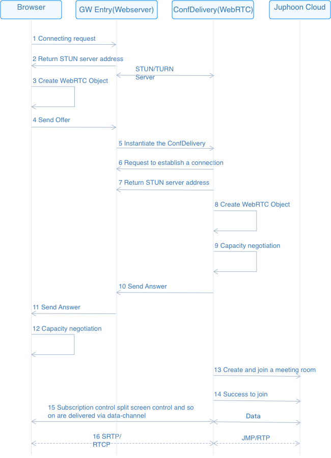
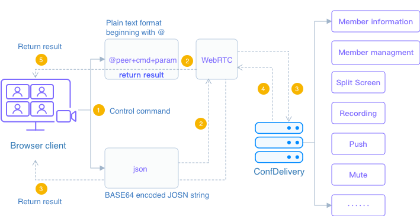

# Function introduction

## Introduction

The advantage of WebRTC is that it integrates a media engine in the browser, which eliminates the need to install additional plug-ins or agents, and can be used without installation; however, not all browsers can support WebRTC. Currently, WebRTC supports the following browser versions:

| Platform   | Realize function                                             |
| :--------- | ------------------------------------------------------------ |
| Desktop PC | Google Chrome 59.0.3071.115 and above Mozilla Firefox 54.0.1 and above Opera 20 and above Safari 11 and above 360 7.1.2 and above (Speed Mode) |
| Mobile     | Android Google Chrome 29 and above Android Mozilla Firefox 24 and above Android WeChat 7.0 and above safari 11 and above, after 12, iPhone only supports safari |

## Communication principle

The audio and video calls on the SDK web end use WebRTC to build a media channel to realize the communication between the web end and ConfDelivery. As a special terminal, ConfDelivery can realize CDN streaming, meeting recording, meeting and WebRTC docking services.

**WebRTC communication principle**

\- Assuming that the venue has been established, Browser creates a WebRTC object and accesses GW Entry through WebServer;

\- GW Entry instantiates the gateway ConfDelivery, and transparently transmits Offer/Answer media negotiation SDP through WebServer;

\- Browser and ConfDelivery establish a connection and complete the negotiation;

\- Browser successfully creates and joins or joins an existing conference venue.

The control information in the conference is transmitted through Data-Channel.

For business control, since ConfDelivery runs on the server, and JSMD (Conference Engine) is responsible for starting and transmitting the initial configuration, other business control can only be done through a specific control protocol and remote operation of ConfDelivery.

**There are two formats of control protocol**

The plain text format beginning with @ is suitable for manual input, but cannot handle special characters. In this format, ConfDelivery will automatically feedback the result;

BASE64 encoded JSON string is suitable to be constructed by code and can handle special characters, but there is no feedback mechanism.

The specific operating mechanism of the two formats of control instructions is as follows

In the plain text format beginning with @, the Web end directly affects the target object by sending instructions, and performs corresponding processing on the target object through ConfDelivery.

In the BASE64-encoded JSON string, by encrypting the meeting instruction, it is directly applied to WebRTC, and WebRTC performs subsequent processing on the instruction.

The format description of the two control commands is shown in the following table

| Command format                             | Realize function                                             |
| :----------------------------------------- | ------------------------------------------------------------ |
| The plaintext format at the beginning of @ | The plaintext format at the beginning of @ must be followed by the short name of ConfDelivery, and then the command The form is as follows:  '@'+peer+cmd+param peer is The target of the command sending cmd is the command, case insensitive param is the corresponding parameter Example: The account ID of ConfDelivery is [username:delivery0121@101055.cloud.justalk. com], the following instructions for printing help are correct: @delivery0121 help @delivery0121help  |
| BASE64-encoded JSON format                 | The format is: {"cmd":"cmd",param} cmd is the command, param is the corresponding parameter Example: The command to modify the member's nickname: {"cmd":"setnick", "nick":%s, "target":%s} |