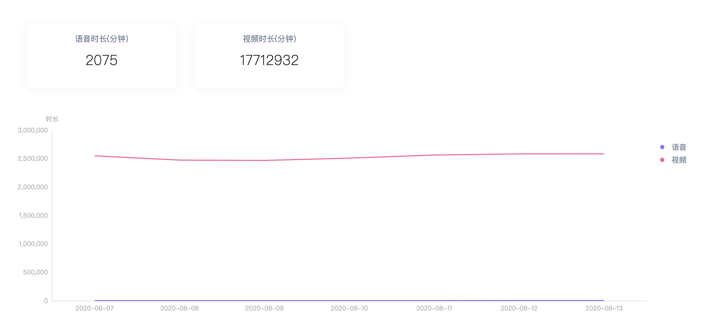
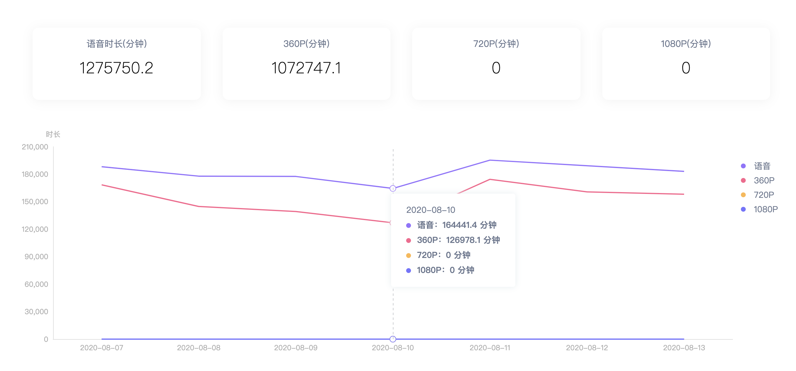

# 产品用量

登录控制台，点击导航数据统计-产品用量页面，这里是您在菊风云平台使用音视频能力后产生的产品用量。

在页面上可以通过筛选应用，你可查看该应用在某一时间段内的一对一通话和多方通话时长。

## 一对一通话

## 多方通话

多方通话时长区别视频清晰度：

1.360P（分辨率 ≤ 360P）

2.720P（360P < 分辨率 ≤ 720P）

3.1080P（分辨率 > 720P）